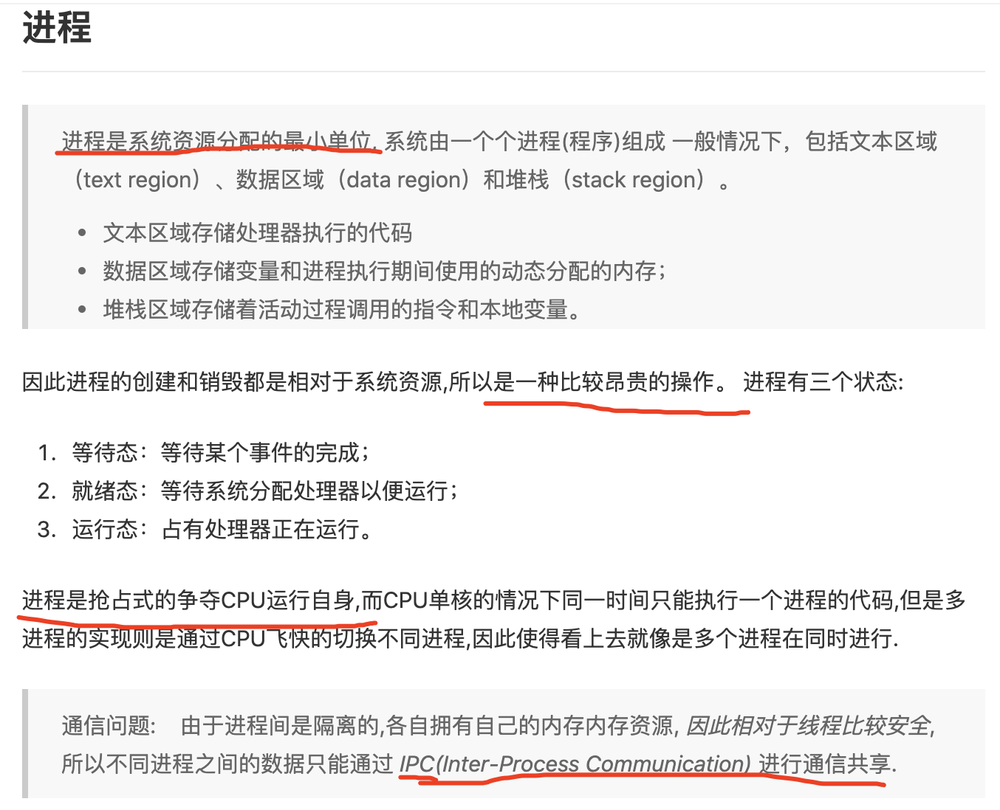

姊妹篇:

[Linux的进程和线程](https://dashen.tech/2016/11/04/Linux%E7%9A%84%E8%BF%9B%E7%A8%8B%E5%92%8C%E7%BA%BF%E7%A8%8B/)

[多进程与多线程](https://dashen.tech/2020/07/04/%E5%A4%9A%E8%BF%9B%E7%A8%8B%E4%B8%8E%E5%A4%9A%E7%BA%BF%E7%A8%8B/)

 

相关章节:

[CPU及并发](https://dashen.tech/2020/06/13/CPU%E5%8F%8A%E5%B9%B6%E5%8F%91/)

[读「Linux/UNIX系统编程手册(上)」](https://dashen.tech/2020/05/05/%E8%AF%BB%E3%80%8CLinux-UNIX%E7%B3%BB%E7%BB%9F%E7%BC%96%E7%A8%8B%E6%89%8B%E5%86%8C-%E4%B8%8A-%E3%80%8D/)

[僵尸进程与孤儿进程](https://dashen.tech/2020/07/03/%E5%83%B5%E5%B0%B8%E8%BF%9B%E7%A8%8B%E4%B8%8E%E5%AD%A4%E5%84%BF%E8%BF%9B%E7%A8%8B/)

[使用pstree,查看进程树](https://dashen.tech/2017/03/11/%E4%BD%BF%E7%94%A8pstree-%E6%9F%A5%E7%9C%8B%E8%BF%9B%E7%A8%8B%E6%A0%91/)

[Linux的I/O调度算法](https://dashen.tech/2020/06/16/Linux%E7%9A%84I-O%E8%B0%83%E5%BA%A6%E7%AE%97%E6%B3%95/)

[Linux内核分析与应用](https://dashen.tech/2020/05/17/Linux%E5%86%85%E6%A0%B8%E5%88%86%E6%9E%90%E4%B8%8E%E5%BA%94%E7%94%A8/)

[Linux内核分析与应用2-内存寻址](https://dashen.tech/2020/05/17/Linux%E5%86%85%E6%A0%B8%E5%88%86%E6%9E%90%E4%B8%8E%E5%BA%94%E7%94%A82-%E5%86%85%E5%AD%98%E5%AF%BB%E5%9D%80/)

[Linux内核分析与应用3-进程管理](https://dashen.tech/2020/05/17/Linux%E5%86%85%E6%A0%B8%E5%88%86%E6%9E%90%E4%B8%8E%E5%BA%94%E7%94%A83-%E8%BF%9B%E7%A8%8B%E7%AE%A1%E7%90%86/)

[Linux内核分析与应用4-内存管理](https://dashen.tech/2020/05/17/Linux%E5%86%85%E6%A0%B8%E5%88%86%E6%9E%90%E4%B8%8E%E5%BA%94%E7%94%A84-%E5%86%85%E5%AD%98%E7%AE%A1%E7%90%86/)

 

进程最早出现,但因为 [进程间通信(IPC)](https://dashen.tech/2020/06/16/Linux%E8%BF%9B%E7%A8%8B%E9%97%B4%E9%80%9A%E4%BF%A1-IPC-%E7%9A%84%E5%87%A0%E7%A7%8D%E6%96%B9%E5%BC%8F/) 成本较高, 进而有了协程的概念.但实现起来比较困难,后来更易实现的*线程*出现并得以广泛应用.

协程相比线程轻量多了..每次创建操作系统层级的线程,都会消耗系统资源,在
<阿里巴巴Java开发手册>中明确要求,使用线程池,而不允许自己在代码里新建一个线程

协程是用户自定义的线程,不需要进入内核态进入申请计算资源.(这里的用户就是指应用程序及编程语言了..)

---

参考:

[进程、线程和协程之间的区别和联系](https://blog.csdn.net/daaikuaichuan/article/details/82951084)

[进程、线程和协程的概念](https://juejin.im/post/5b0014b7518825426e023666)

[进程、线程、轻量级进程、协程和go中的Goroutine](https://note.youdao.com/web/#/file/recent/note/3DF4EE32A56A43409D7773793299A6C7/?search=%E8%BF%9B%E7%A8%8B)