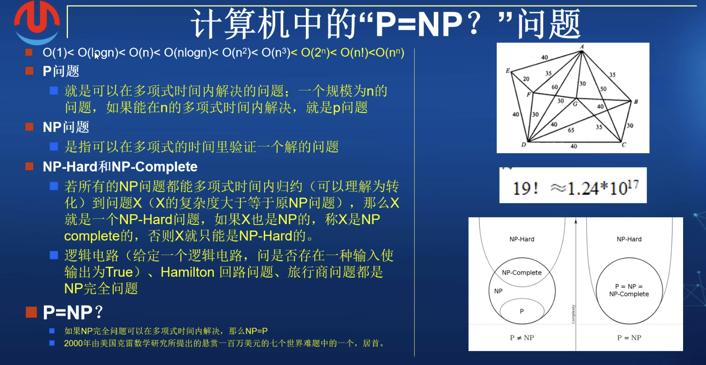

> 千禧年大奖难题(Millennium Prize Problems), 又称世界七大数学难题， 是七个由美国克雷数学研究所(Clay Mathematics Institute,CMI) 于2000年5月24日公布的数学猜想。

拟定这7个问题的数学家之一是怀尔斯，费马大定理这个有300多年历史的难题没被选入的唯一理由就是已经被他解决了。还有19年去世的[迈克尔·阿蒂亚](https://dashen.tech/2019/03/07/%E6%98%9F%E9%99%A8-2019/#font-color-8B7E66-%E8%BF%88%E5%85%8B%E5%B0%94%C2%B7%E9%98%BF%E8%92%82%E4%BA%9A-1929-4-22-2019-1-11-font)

这些难题是呼应1900年德国数学家大卫·希尔伯特在巴黎提出的23个数学问题

 

### NP完全问题

 

大多数倾向于P != NP，但都证明不了

NP完全问题： 逻辑电路问题，汉密尔顿回路问题，旅行商问题

 

[谈谈计算机中的NP，NP-Hard，NP完全以及"NP=P？"问题](https://www.bilibili.com/video/BV1Wz4y1d7wb)

[代码验证斯特林公式的准确性](https://dashen.tech/2015/11/29/%E4%BB%A3%E7%A0%81%E9%AA%8C%E8%AF%81%E6%96%AF%E7%89%B9%E6%9E%97%E5%85%AC%E5%BC%8F%E7%9A%84%E5%87%86%E7%A1%AE%E6%80%A7/)

> P类问题是可以在多项式时间内解决并验证的一类问题，NP类问题是可以多项式时间验证但是不确定能否在多项式时间内解决的一类问题。

[什么是 P = NP 问题？](https://mp.weixin.qq.com/s/0m1-YCy1tVIX4cZNhppn6Q)

[逻辑大结局——直觉、复杂度和终极悖论，统治一切的程序](https://mp.weixin.qq.com/s/Bn3RNJSBgW6737w-vf9VSQ)

 

在编译器优化领域，理论上已经表明有一些代码优化存在NP难题，这意味着随着代码增加，优化的难度将越来越大，需要花费的时间呈指数增长。 因为这些原因，编译器无法进行最佳的优化，故而通常需要采用一种折中方案

 

---

 

### 霍奇猜想

 

---

 

### 庞加莱猜想 

 

---

 

### 黎曼假设

 

---

 

### 杨-米尔斯存在性和质量缺口

 

---

 

### 纳维-斯托克斯方程

 

---

 

### BSD猜想

 

---

 

 

参考：

[世界七大数学难题](https://mp.weixin.qq.com/s/cJuA6E3P-RgOcd-SS2W9CQ)

[千禧年大奖难题之始与未终](https://mp.weixin.qq.com/s/CbcC6RxAo8lz1H7tQ9bBnw)