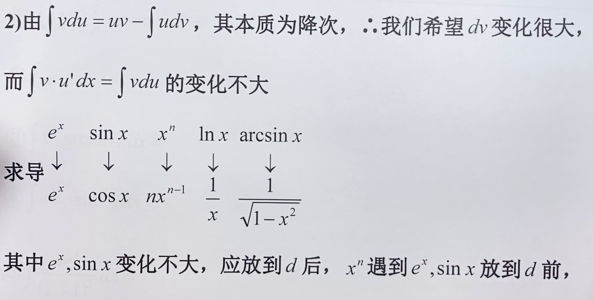
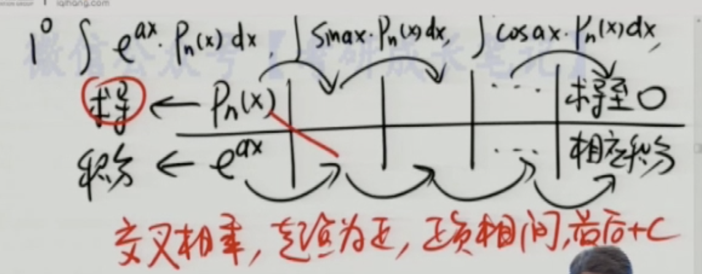

 

使用分部积分法前,一般要先 凑微分

 按照 **反对幂指三**的次序,将这部分 置于前面作为u,剩下的部分作为v **(越往右,越放在右边)**

[带你学分部积分](https://www.bilibili.com/video/BV1FK4y1y7EL?t=636)

还有一种**表格法**,再算多项式积分时(即x乘以什么,或(x的三次方加x的平方)再乘以什么什么,必须带一个多项式,因为这样才能求导算到0), 非常直观,正式题目里不能用..

[分部积分～表格法简单又快捷](https://www.bilibili.com/video/BV1U4411R773)

故而,有多项式的,用表格法;

没有多项式的,老老实实用分部积分

 

有时还要用到 **换元积分法**

研究生考试出大题的话,一般要 先凑积分,再分部积分,往往分部积分计算过程中,还需要用到换元积分

考研数学,第11题填空题,经常考这类问题.可能是反常积分~

