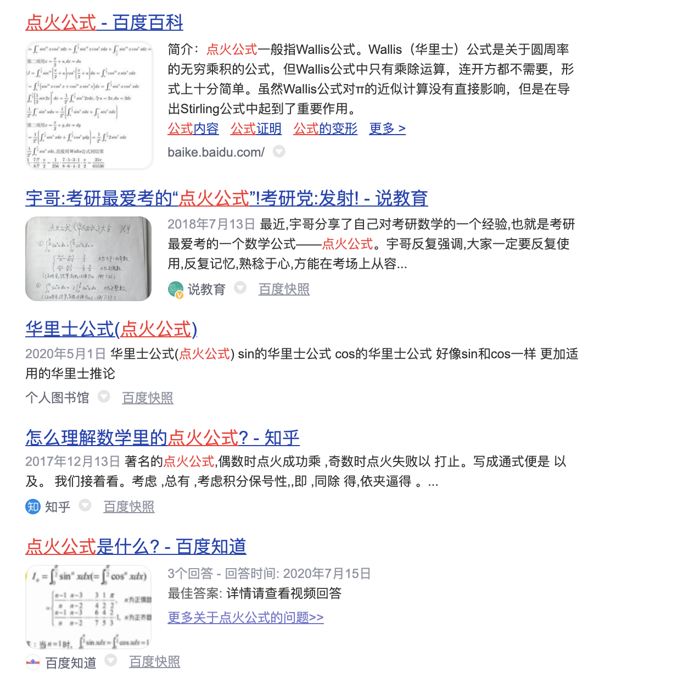

~~比较高级,但~~记住在遇到相关问题时,可以极为大量简化计算~

 

也称"点火公式","火箭发射公式"(源自张宇..)

[宇哥讲“点火公式”（华里士公式）](https://www.bilibili.com/video/BV1A541147Us)

 

---

 

[推导](https://zhuanlan.zhihu.com/p/149630471)

[华莱士公式的证明](https://zhuanlan.zhihu.com/p/161935965)

