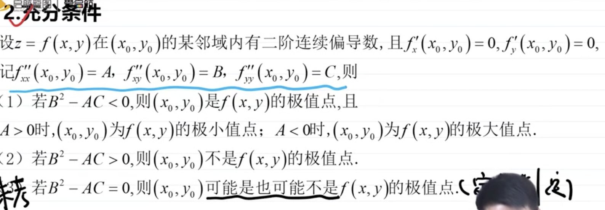

### 无条件极值

 

求解步骤为:

1. 对x求偏导,对y求偏导, 令它们为0,得出x,y的值;  算二阶导,并分别记为A,B,C

2. (1)当B的平方-AC<0,才有极值点:若A>0,为极小值点;若A<0,为极大值点;(2)当B的平方-AC>0,不是极值点;(3)当B的平方-AC=0,可能是,也可能不是极值点

 

无条件极值 的套路如此.这类问题并不困难

 

---

 

### 条件极值

 

拉格朗日乘数法, 构造辅助函数

例:

将长为2m的铁丝分成三段,依次围成圆,正方形和正三角形,三个图形的面积之和是否存在最小值?若存在,求出最小值.

