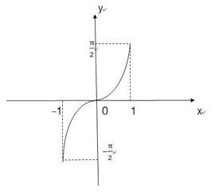
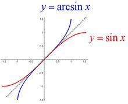
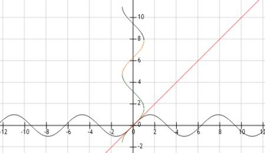
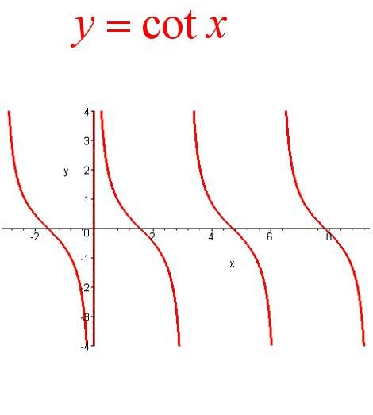
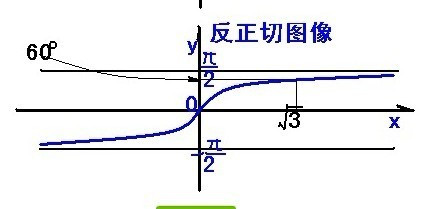
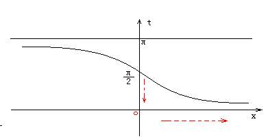
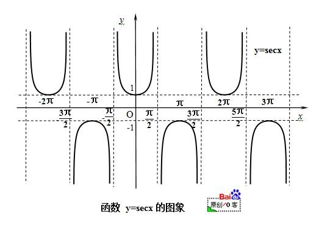
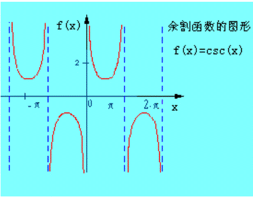

 

### arcsinx

 

 

---

 

### cotx

 

 

---

### arctanx

 

反正切函数的图像如下:

即,对于tanx的图像,将x轴/y轴作为y轴/x轴,即是其反函数arctanx的图像~

 

---

### arccotx

 

反余切函数的图像如下:

即,对于tanx的图像,将x轴/y轴作为y轴/x轴,即是其反函数arctanx的图像~

 

---

### secx

 

正割函数的图像如下:

 
 
---

### cscx

 

余割函数的图像如下:

[三角函数及其之间的关系](https://blog.csdn.net/qq_41601836/article/details/104262663)