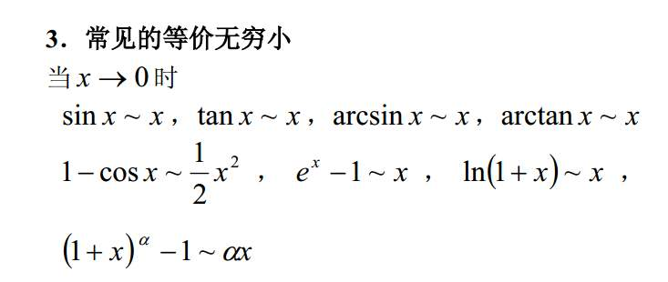
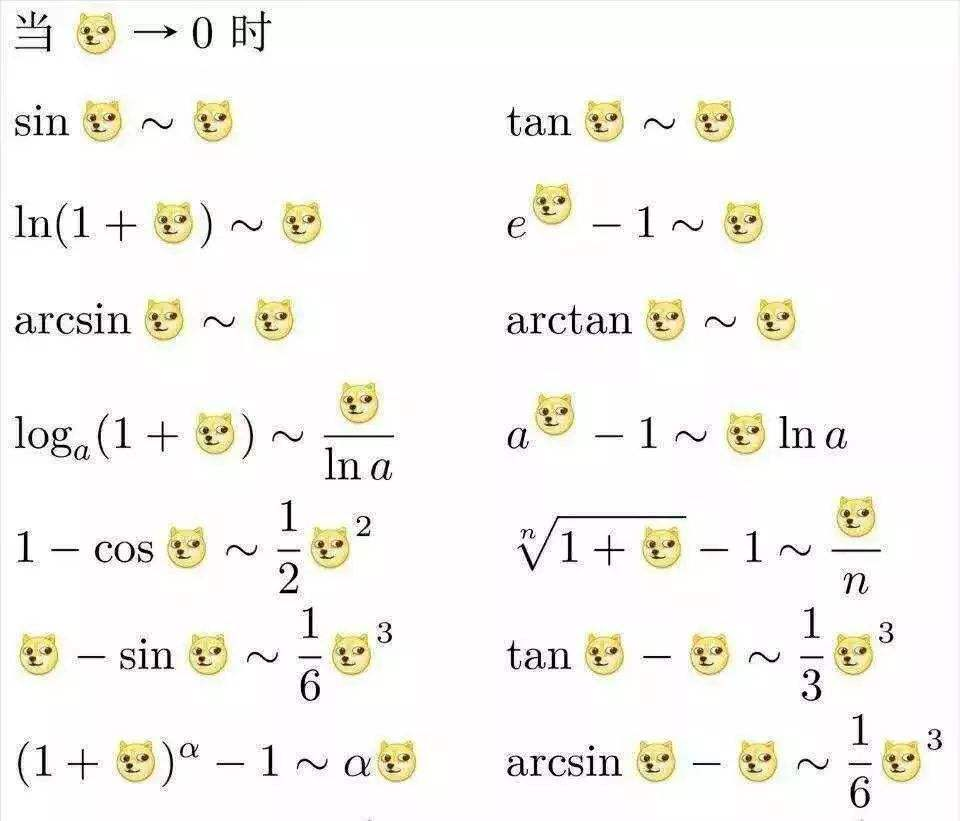
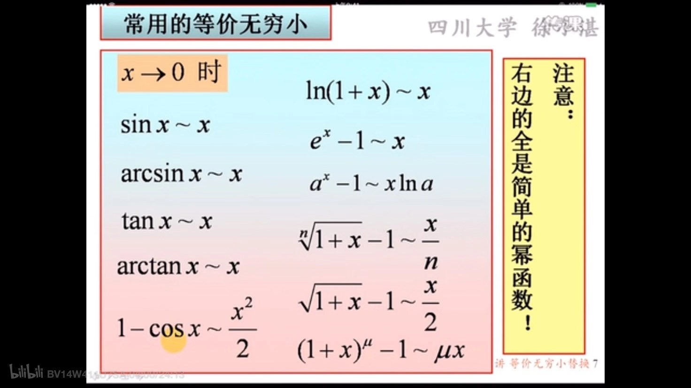
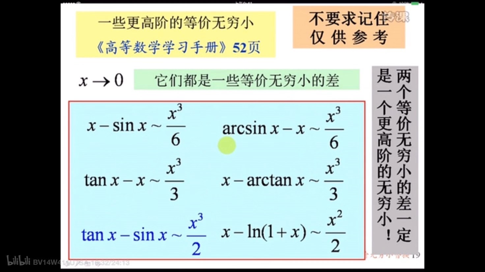
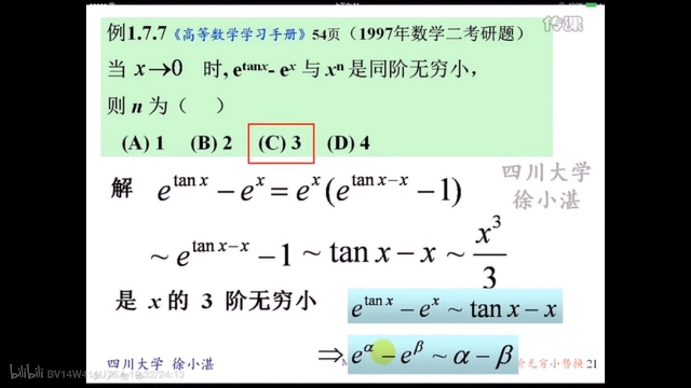
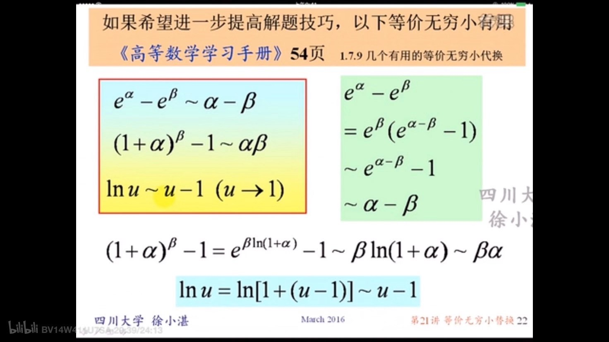

[积分变限函数](https://baike.baidu.com/item/%E7%A7%AF%E5%88%86%E5%8F%98%E9%99%90%E5%87%BD%E6%95%B0/339961)

先求导,将**变限积分**化为初等函数

一般还会配合使用 洛必达法则,即分子分母分别求导

等价无穷小替换:

 

 

**两个等价无穷小的差,一定是一个更高阶的无穷小!**

