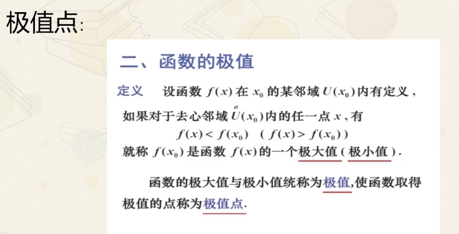
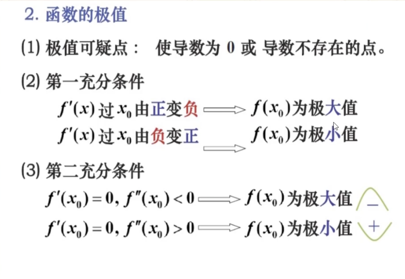
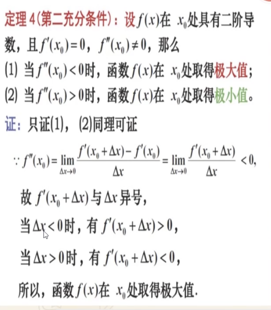
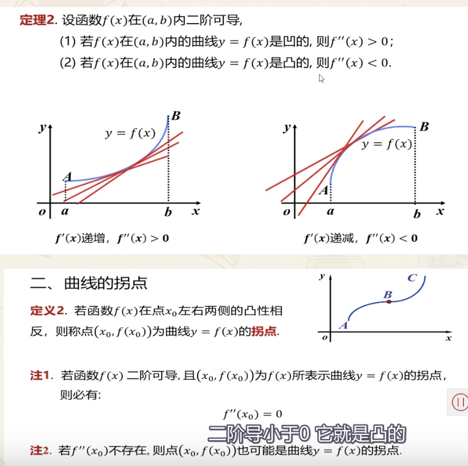

[驻点、拐点与极值点精讲](https://www.bilibili.com/video/BV167411V7H2)

### **驻点: 导数为0的点**

驻点（Stationary Point）又称为平稳点、稳定点或临界点（Critical Point）

### **极值点** (extreme  point)

驻点和不可导点,称为函数的可疑极值点

驻点不一定都是极值点,如果倒数在此处两侧没有变号,则不会出现极值点(单调性没变)

极值点也不一定都是驻点

证明充分条件二 如下:

### **凹凸性与拐点**

在某点凹凸性相反,则该点即为拐点(inflection point)

- 如果f(x)二阶可导,且(x0,f(x0))为曲线f(x)的拐点,则必有x0处的二阶导数为-(定义如此)

- 某点处二阶导数不存在,但该点也有可能是其拐点(如正好在该点断开了,但两侧凹凸性变了)
