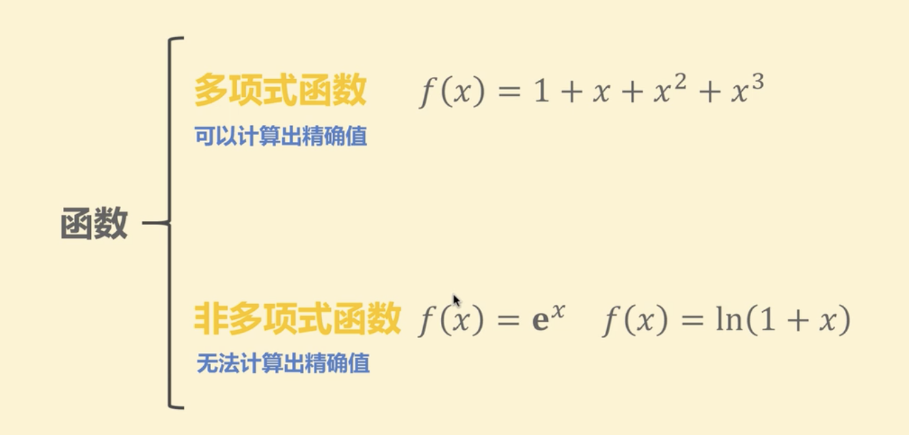
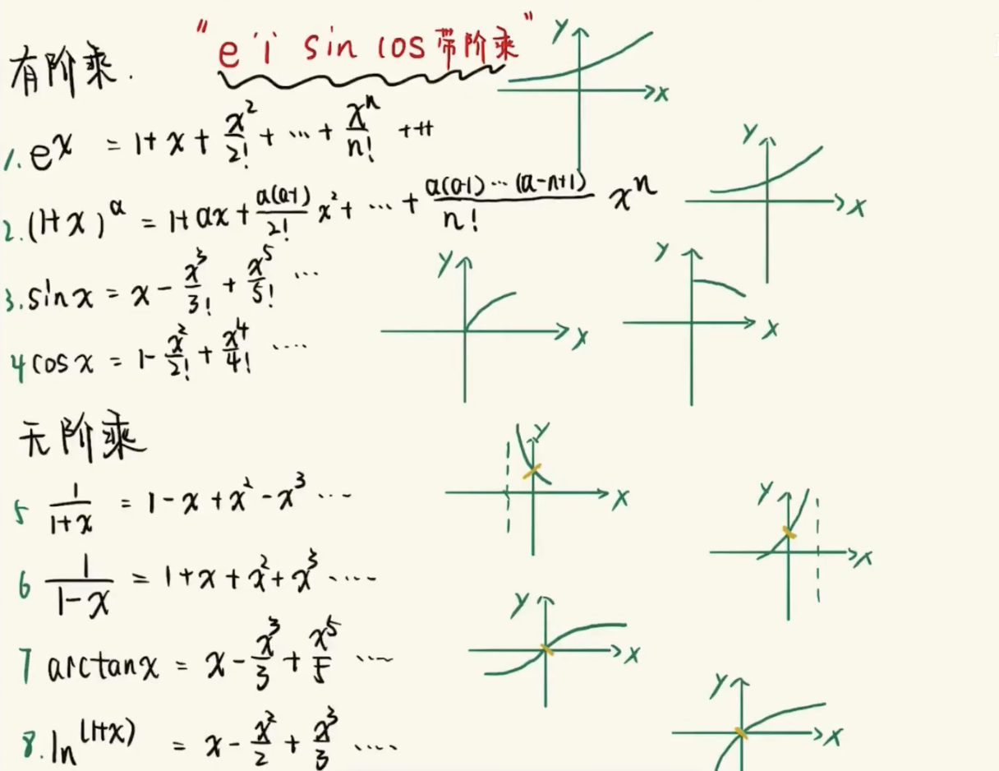

 

 

图片来自:

[给我俩分钟，还你泰勒公式记忆一片天空](https://www.bilibili.com/video/BV1bC4y1H7cp?t=105)

 

---

图片来自:

[一个方法/八个泰勒公式/永久记忆](https://www.bilibili.com/video/BV1c7411Z7bt)

 

### 本质:

 

计算机无法对三角函数，对数函数，直接计算，而泰勒公式可以将所有的复杂函数转化为简单的加减乘除的近似运算，从而利用计算机进行计算，减少了人工计算的复杂度，进而在物理，化学，材料，航天等工程领域广泛应用

 

### 常见的泰勒公式及其记忆:

 

 

