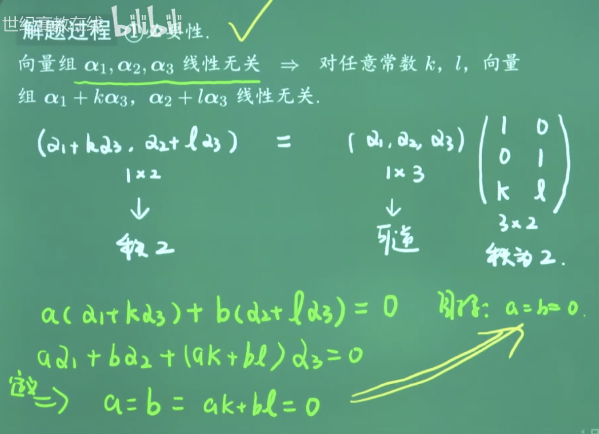
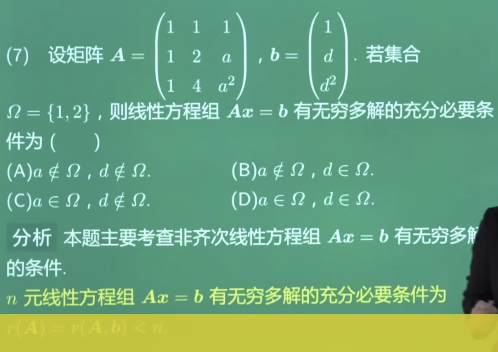

<2011.8>


<br>

**对矩阵A作初等行变换,等价于对矩阵左乘相应的初等矩阵**

<br>


常见初等矩阵的逆

```
第一种初等矩阵Tij的逆是自己Tij
第二种初等矩阵Ti(m)的逆是Ti(1/m)
第三种初等矩阵Tij(m)的逆是Tij(-m)
```


D


C


可以用特殊值法


---

<br>


<2011.8>


A的秩与其伴随矩阵的秩之间的关系


D


C

这个行列式的计算,可以装模作样算一算,因为选项有提示~


---

<br>


<2012.7>

**线性相关**


---

<br>


<2012.8>


<br>


B


思路二:矩阵的相似对角化


可以使用两种方法来做


<br>


<2012.14>


---


注意求三阶行列式的两种办法:

- 直接计算——对角线法

- 任何一行或一列展开——代数余子式(这时候要注意正负符号,根据下标奇偶决定)


---

<br>

<2013.7>


可逆,则满秩

<br>


<2013.8>


两矩阵相似,一定具有相同的特征多项式和特征值;但反之不一定成立.


但是 对于实对称矩阵,也可以推回去,完美


<br>

<2013.14>


 


还漏了一条,即 **|A的转置| = |A|**


 


---

 <br>


<2014.7>


 

 比较简单,必须满分~

B


 
D

<br>


 <2014.8>


 


**向量组线性无关** ,

一个向量组是线性无关的,其中一定不含零向量





充分性可考虑特例法,举反例


A


<br>

如果线性无关,至少里面不能存在0向量..存在0向量的一定线性相关


C
<br>


因为（α1-α2）+（α2-α3）+（α3-α1）=0，所以α1-α2，α2-α3，α3-α1线性相关

A
此题应该可以特殊值法

<br>


 <2014.14>


二次型的负惯性指数,是其标准型中的负系数的个数

<font size=1>
标准型和规范型都是只含平方项的二次型
标准型的系数可以为任意常数，而规范型的系数只专能为属-1，0，1

同一实对称矩阵A化为的标准型可以有多个，但规范型是唯一的，标准型可以经过正交变换化为规范型

（在规范型书写时，系数为1的平方项放在前面，系数为-1的平方项放在后面，系数为0的在最后，所以规范型唯一）
</font>

<br>

- 配方

- 正交变换法


当年这题考生普遍认为很难,难度系数0.22

其实不难啊


---

<br>

<2015.7>





**n元线性方程组Ax=b有无穷多解的充分必要条件为: r(A)=r(A,b) < n**


A为三阶范德蒙德行列式,有较快的计算方法


其实很简单~


<br>

<2015.8>


方法1,利用初等行列变换


方法2,利用特征值


<br>

<2015.14>


(实在不行就特殊值)


行列式=特征值之乘积


发现α也是B的特征向量


<br>


直接特殊值,简单粗暴~

