<2016.22>

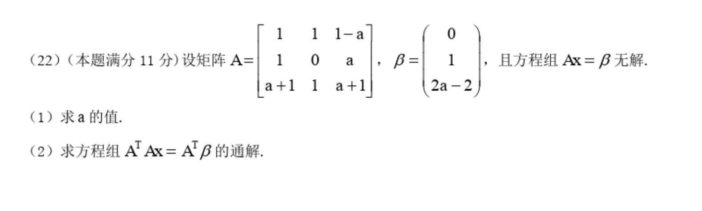

 

<2016.23>

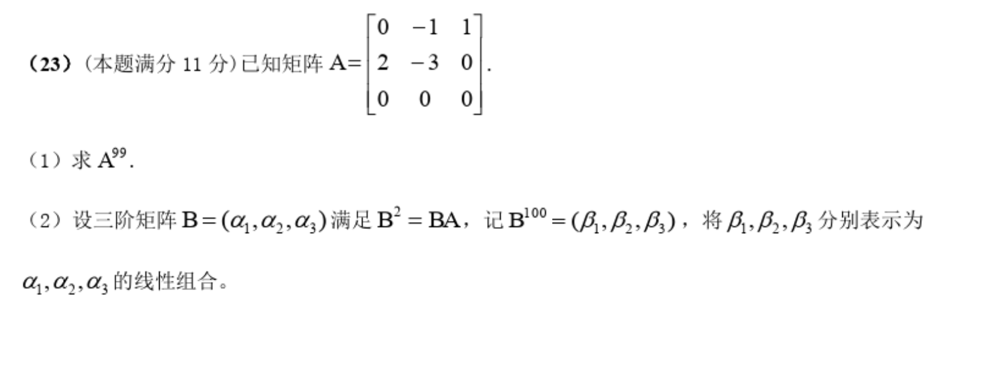

 

---

<2017.22>

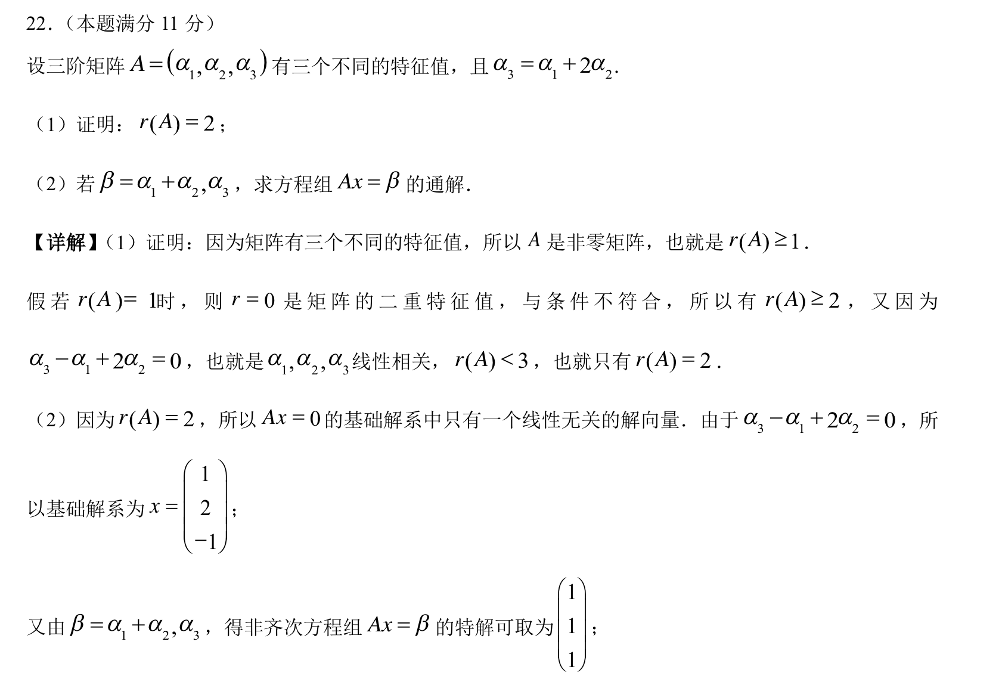

 

<2017.23>

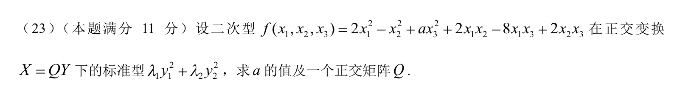

 

---

<2018.22>

难度系数为0.248,难分率不高...

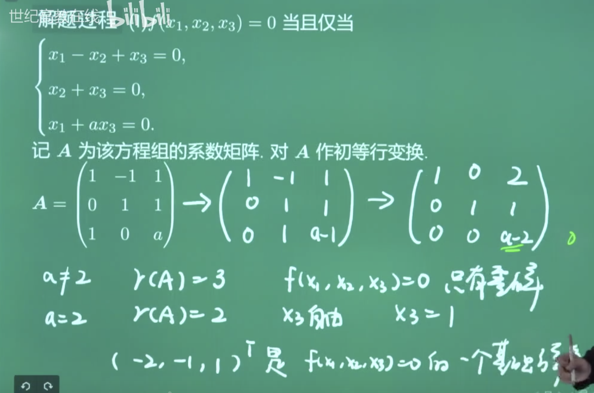

需要考虑线性变换是否可逆~

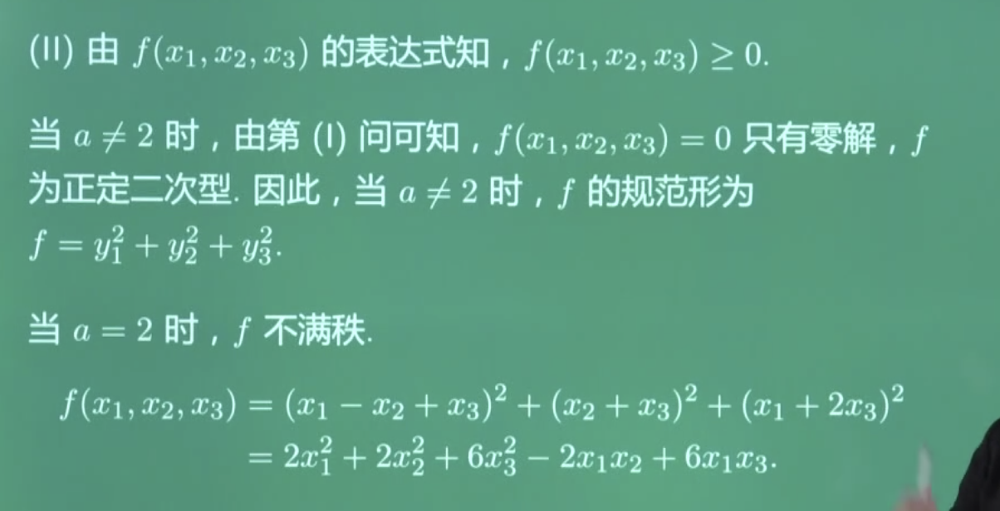

 

<2018.23>

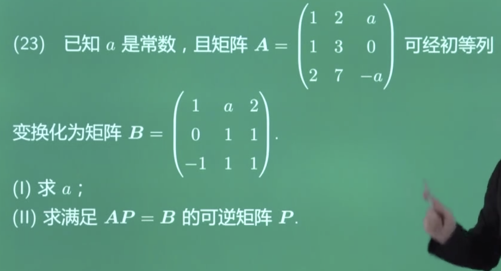

 

 

---

<2019.22>

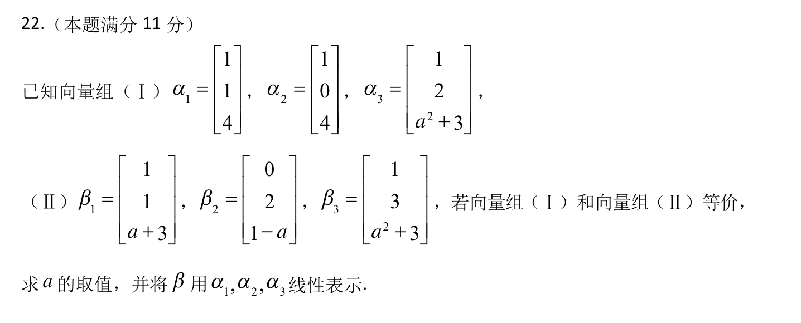

 

<2019.23>

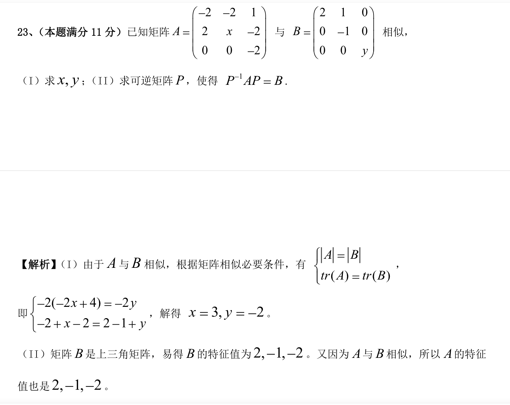

 

---

<2020.22>

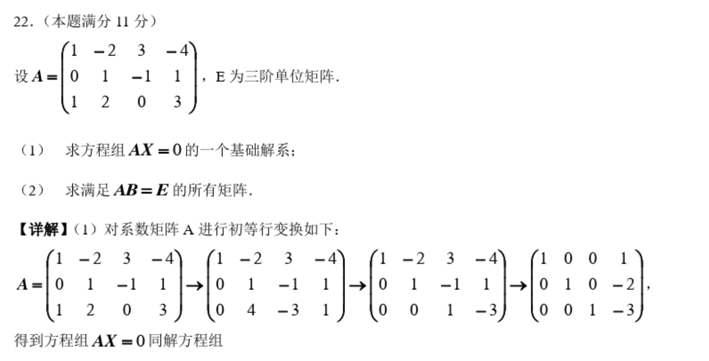

 

<2020.23>

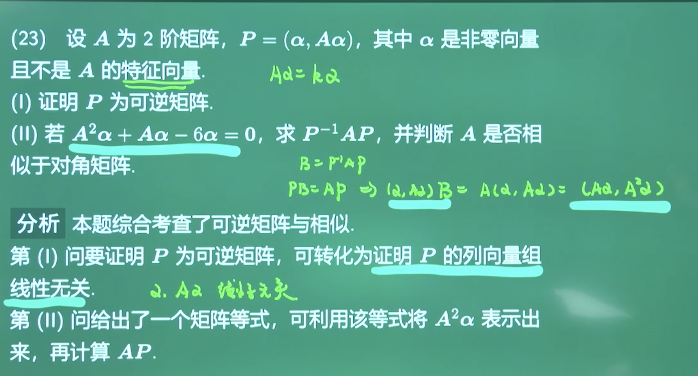

