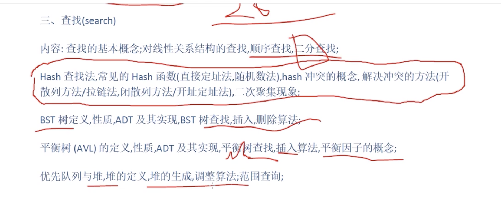
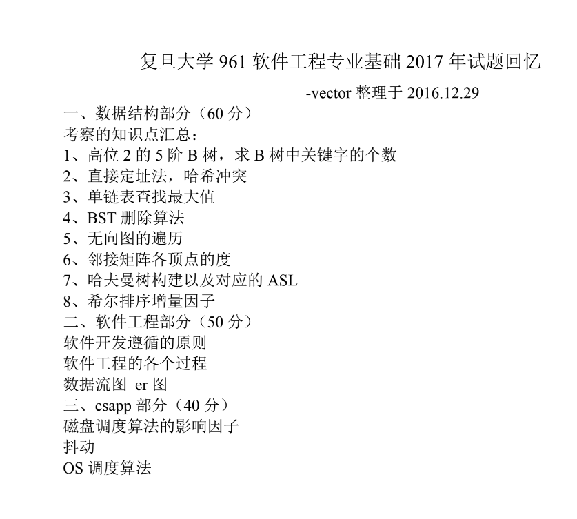

大纲如下:

复旦大学2021年硕士研究生招生考试自命题科目考试大纲

科目代码961

科目名称  软件工程专业基础综合

## 一、考试内容范围

### 第一部分数据结构与算法

 

#### 一、栈（Stack）、队列（Queue）和向量（Vector）内容：

单链表,双向链表,环形链表,带哨兵节点的链表;

栈的基本概念和性质,栈ADT及其顺序,链接实现(爽哥注:即数组实现与链表实现);栈的应用;栈与递归;

队列的基本概念和性质,队列ADT及其顺序,链接实现;队列的应用;

向量基本概念和性质;向量ADT及其数组、链接实现;

#### 二、树内容：

树的基本概念和术语;树的前序,中序,后序,层次序遍历;

二叉树及其性质;普通树与二叉树的转换;

树的存储结构,标准形式;完全树(complete tree)的数组形式存储;

树的应用,Huffman树的定义与应用;

#### 三、查找(search)内容：

查找的基本概念;

对线性关系结构的查找,顺序查找,二分查找;Hash查找法,常见的Hash函数(直接定址法,随机数法),hash冲突的概念,解决冲突的方法(开散列方法/拉链法,闭散列方法/开址定址法),二次聚集现象;

BST树定义,性质,ADT及其实现,BST树查找,插入,删除算法;

平衡树(AVL)的定义,性质,ADT及其实现,平衡树查找,插入算法,平衡因子的概念;

优先队列与堆,堆的定义,堆的生成,调整算法;范围查询;

#### 四、排序内容：

排序基本概念;插入排序,希尔排序,选择排序,快速排序,合并排序,基数排序等排序算法基本思想,算法代码及基本的时间复杂度分析

#### 五、图内容：

图的基本概念;图的存储结构,邻接矩阵,邻接表;

图的遍历,广度度优先遍历和深度优先遍历;

最小生成树基本概念,Prim算法,Kruskal算法;

最短路径问题,广度优先遍历算法,Dijkstra算法,Floyd算法;拓扑排序

 

---

### 第二部分软件工程

 

一、软件过程

软件过程的概念；[经典软件过程模型的特点](https://blog.csdn.net/dengdun6257/article/details/102283300)（瀑布模型、增量模型、演化模型、统一过程模型）；过程评估与CMM/CMMI的基本概念；敏捷宣言与敏捷过程的特点。

 

二、软件需求

软件需求的概念；需求工程的基本过程；分层数据流模型；用例和场景建模及其UML表达（用例图、活动图、泳道图、顺序图）；数据模型建模及其UML表达（类图）；行为模型建模及其UML表达（状态机图）。

 

三、软件设计与构造

软件体系结构及体系结构风格的概念；设计模式的概念；模块化设计的基本思想及概念（抽象、分解、模块化、封装、信息隐藏、功能独立）；软件重构的概念；软件体
系结构的UML建模（包图、类图、构件图、顺序图、部署图）；接口的概念；面向对象设计原则（开闭原则、Liskov替换原则、依赖转置原则、接口隔离原则）；内聚与耦合的概念、常见的内聚和耦合类型。

 

四、软件测试

软件测试及测试用例的概念；单元测试、集成测试、确认测试、系统测试、回归测试的概念；调试的概念、调试与测试的关系；测试覆盖度的概念；白盒测试、黑盒测试的概念；代码圈复杂度的计算方法；白盒测试中的基本路径测试方法；黑盒测试中的等价类划分方法。

 

---

### 第三部分计算机系统基础

 

#### 一、处理器体系结构内容：

CPU中的时序电路、单周期处理器的设计、流水线处理器的基本原理、Data Hazard的处理、流水线设计中的其他问题

#### 二、优化程序性能内容：

优化程序性能、优化编译器的能力和局限性以及表示程序性能、特定体系结构或应用特性的性能优化、限制因素、确认和消除性能瓶颈

#### 三、存储器结构及虚拟存储器内容：

局部性、存储器层级结构、计算机高速缓存器原理、高速缓存对性能的影响、地址空间、虚拟存储器、虚拟内存的管理、翻译和映射、TLB、动态存储器分配和垃圾收集

#### 四、链接、进程及并发编程内容：

静态链接、目标文件、符号和符号表、重定位和加载、动态链接库、异常和进程、进程控制和信号、进程间的通信、进程间信号量的控制、信号量，各种并发编程模式，共享变量和线程同步，其他并行问题

#### 五、系统级I/O和网络编程内容：

I/O相关概念、文件及文件操作、共享文件、网络编程、客户端-服务器模型，套接字接口、HTTP请求，Web服务器

---

 

## 二、试卷结构试卷总分：

150分

### 第一部分数据结构与算法（总分：60分）

考试题型：问答、分析、编程

### 第二部分软件工程（总分：60分）

考试题型：概念问答题、实践案例题

### 第三部分计算机系统基础（总分：30分）

考试题型：问答、分析、编程

---

 

## 三、参考书目 作者书名 出版社 出版时间版次 备注Mark    

Allen Weiss数据结构与算法分析--Java语言描述（英文版·第3版）机械工业出版社2013年3月第三版

Roger Pressman软件工程：实践者的研究方法（英文版，第7版）机械工业出版社2010年10月第七版

RandalBryant;DavidO’Halloran深 入 理 解 计 算 机 系 统（英文版·第二版）机械工业出版社2011年1月第二版

---

以下内容参考自[复旦大学961考纲解析](https://www.bilibili.com/video/BV1BZ4y1p7Hc)

 

---

---

 

---

 

---

 

参考:

[初试经验分享，961专业课126分！
](https://zhuanlan.zhihu.com/p/70233715)

