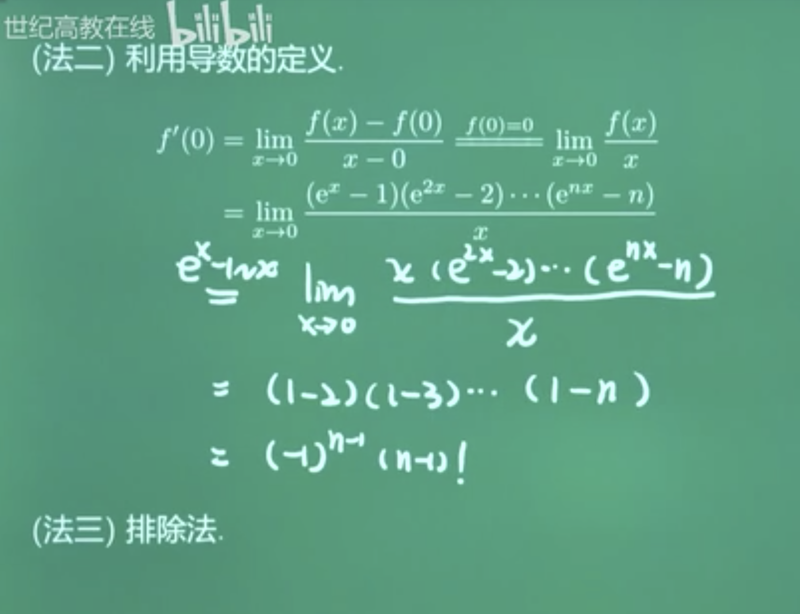
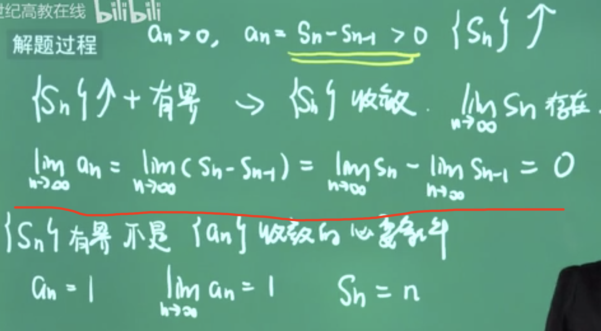
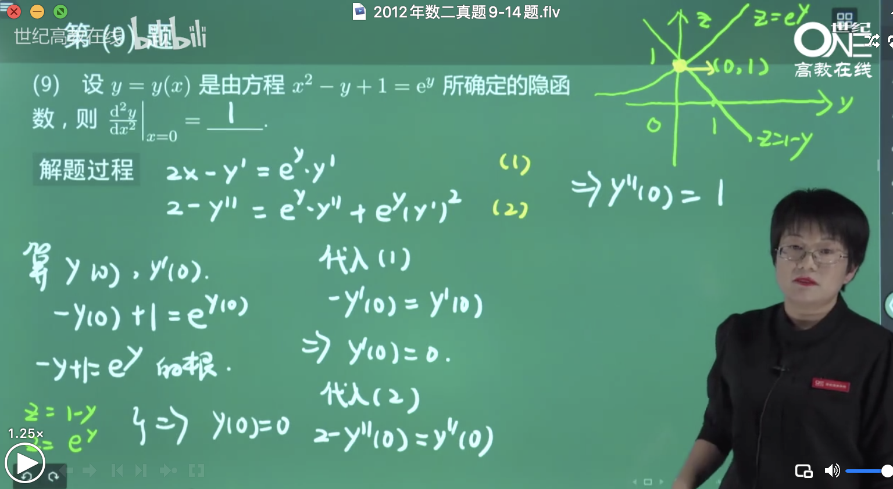
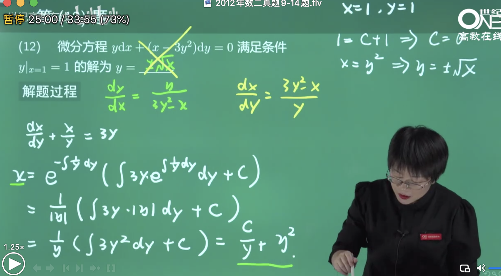
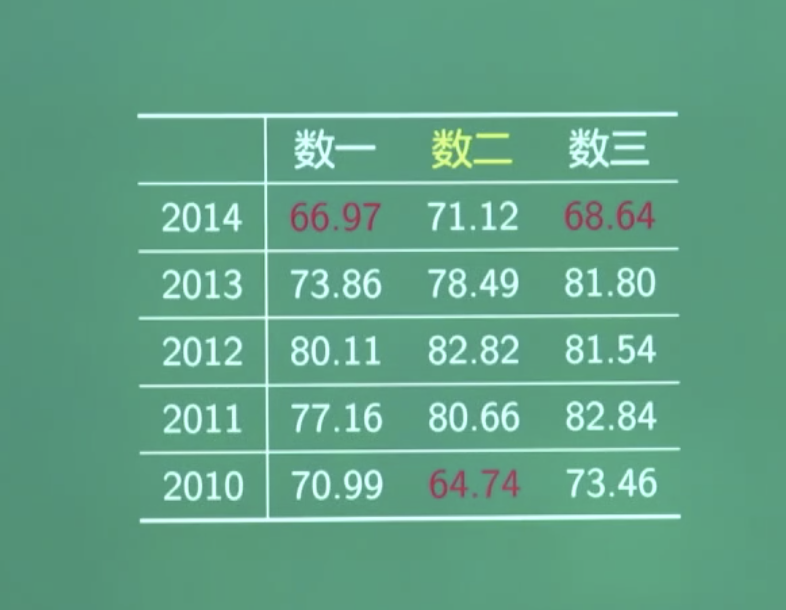
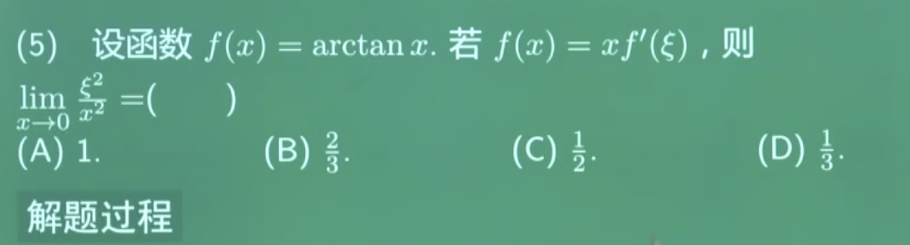
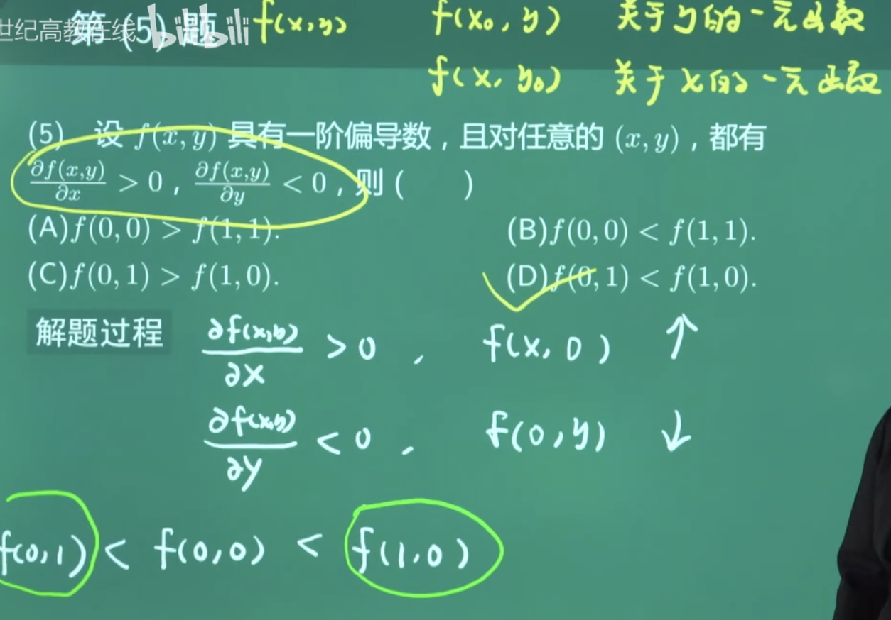
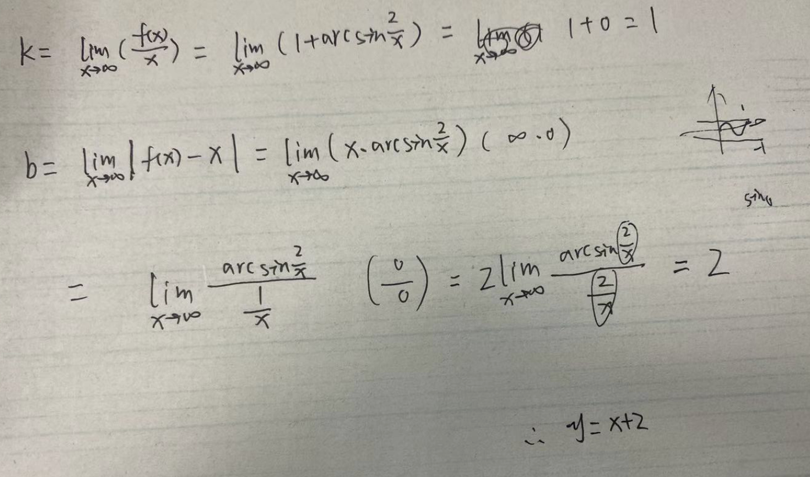
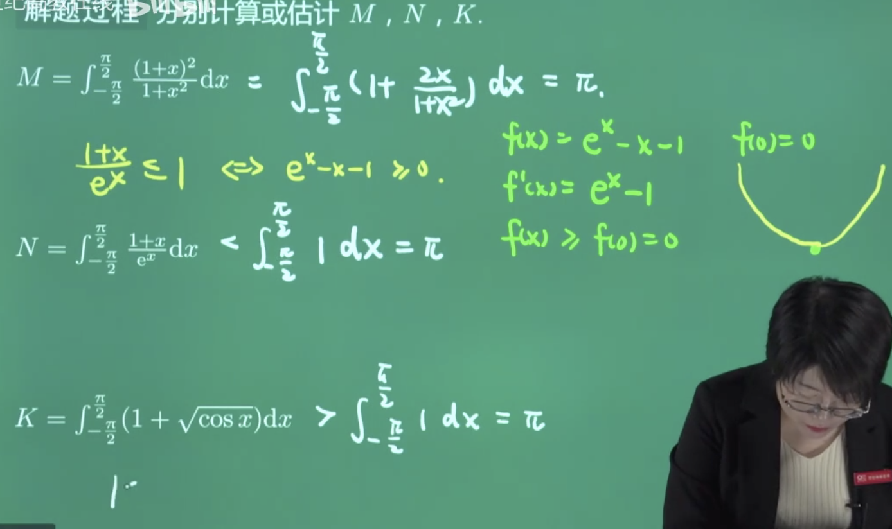
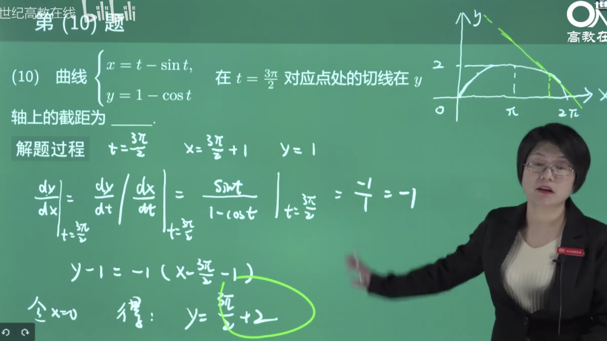

<br>


<2010.1>


[无穷间断点](https://dashen.tech/2015/11/19/%E9%97%B4%E6%96%AD%E7%82%B9%E7%9A%84%E7%B1%BB%E5%9E%8B/),即趋于x0正,或x0负时,f(x)趋于无穷,则x0为f(x)的无穷间断点.


B


在x=0处是跳跃间断点,即左右极限都存在但不相等


x=1是可去间断点

x=-1是无穷间断点


是间断点的一个前提,是函数在x0处不连续,故而09年题目D选项错误


<br>


---


<br>


<2010-2>


微分方程的解的概念


<br>


---


<br>


<2010-3>


C

<br>


---


<br>


<2010-4>


反常积分的审敛,一般有两种做法:

- 当被积函数简单时,当成定积分来算,再取计算

- 当被积函数较复杂时,用反常积分审敛法


可作为结论记住


D


<br>


---


<br>


<2010-5>


B

了解隐函数偏导数的计算方法,则中规中矩比较简单..

<br>


---


<br>


<2010-6>


D


<br>


---


<br>


<2010-9>


高阶常系数线性齐次微分方程的通解   


- 先写出特征方程

- 解出特征方程的根,根据根的情况写出微分方程的解

<br>


小蓝书第79页


<br>


---


<br>


<2010-10>


<br>

求渐近线三步走:


该函数处处都有定义,所以没有铅直渐近线


当x趋于正/负无穷,函数极限趋于正/负无穷,所以也没有水平渐近线


渐近线数二经常经常考

<br>


---


<br>


<2010-11>


不是求积分的 牛顿-莱布尼茨公式,而是求导数的莱布尼茨公式


15年的这个可用莱布尼茨公式,

16年的这个可用逐次求导~

<br>


---


<br>


<2010-12>


平面曲线的弧长公式


<br>


---


<br>


<2010-13>


导数的应用


<br>

<br>

---


<br>


<2011.1>


等价无穷小量的定义


泰勒公式,展开到3 阶


C


<br>


<2011.2>


B


其实不用这么复杂,选择题 用特殊值法,设f(x)=x,一分钟搞定


<br>


<2011.3>


驻点即导数为0的点


<br>

---

<br>

<2011.4>


二阶常系数非齐次微分方程

考点1,怎样设特解


 
 考点2, **线性微分方程解的叠加原理**


考研一般都不太会只考一个考点,都会两个甚至更多合在一起考


<br>

---

<br>


<2011.5>

二元函数取极值的充分条件


A

不难


<br>


---


<br>


<2011-6>

积分区间相同,被积函数不同-->转化为被积函数的大小


lnx 单调递增,也就变成了比较sinx,cotx,cosx在(0,π/4)上的大小关系


很显然这个区间内,cosx>sinx,

而cotx = cosx/sinx, 且该区间内`0<sinx<1`, 所以cotx>cosx,

B

太简单了

<br>


这个题稍微难一些~


<br>


---


<br>


<2011-9>


[七种未定式](https://dashen.tech/2015/11/01/%E4%B8%83%E7%A7%8D%E6%9C%AA%E5%AE%9A%E5%BC%8F/)


极限计算题,1的无穷次方类型


这种类型的未定式有两种做法:


- 取对数

- 凑重要极限


<br>

1的无穷次方型大题小题都非常爱出


可以不洛必达法则,而用等价无穷小替换


<br>


---


<br>


<2011-10>


微分方程


一阶非齐次线性微分方程的求解~


如果记住公式,也非常简单


<br>


---


<br>


<2011-11>


利用定积分来求弧长


记住公式,又是送分题


secx=1/cosx, 它的积分看来还是得记住...不是特别好临场推导


曲线方程 由极坐标 给出


<br>


---


<br>


<2011-12>


也不难

无界区间上的反常积分,热门考点


<br>


---


<br>


<2011-13>


二重积分的计算


数二每年都考,要么大题,要么小题.2011还考过一道11分的大题..

也就是说11年考了二重积分相关的考了15


通过配方,确定圆的圆心和半径


这种题**一定要画图**

与圆有关,不妨考虑极坐标系


y轴在极坐标系对应π/2

将二重积分写为二次积分


<br>

<br>


---


<br>


<2012-1>

渐近线的定义及求法


在选择/填空中 出现频率很高


三步走:


沿着正无穷和负无穷方向的水平渐近线重合了,都是y=1

沿着同一个方向如果有了水平渐近线,就不会再有斜渐近线


C


算渐近线非常基础,应该要满分


<br>


---


<br>


<2012-2>

导数的计算




```
常数项是零次方项。任何除0以外的数的0次方都是1 。如3的0次方是1，-1的0次方也是1，0的0次方没有意义。

注：-1⁰=-1，但是(-1)⁰=1。前者是用0减1求零次方，后者是对整个-1求零次方。
```


```
0！=1
```


其实特殊值法就可以,令n=1,可排除B,D

n=2,可排除C

所以A


<br>

计算乘积形式的函数,在零点处的导数


<br>


---


<br>


<2012-3>

概念题


难度系数0.283, 区分度0.99...考研中低于0.3的都被称为区分度不好的题目,

考的好的坏的做的都不好


可以特值啊

令an=1,有界;而sn显然无界,可以排除A,C

靠直觉盲猜就是B




<br>


---


<br>


<2012-4>


定积分比较大小,有两种类型:

- 积分区间相同

- 被积函数相同


这道题是被积函数一样, 积分区间不同


<br>

其实不用这么麻烦..


画图可知,`I2<I1<I3`

D


---


<br>

<2012-5>


很简单啊...


D


<br>


---


<br>

### <2012-6>


即区域D的面积的相反数


看成X型区域


<br>


更简单的做法:


割补之后, 就成了求这个矩形的面积的负值


<br>


---


<br>

<2012-9>


基础的计算题,隐函数的导数计算..一定要保证计算速度和正确率

对方程两边关于x求导


因为让求二阶导在x=0处的值,所以继续求导





并不难


<br>


---


<br>

### <2012-10>


求极限,n项和式的极限,利用定积分来求


利用定积分的定义来求极限,非常常规的题型,经常考到


凑定积分的定义,再来算这个定积分


<br>


---


<br>

<2012-11>


利用链式法则来计算偏导数,基础题


送分题
 


<br>


---


<br>

<2012-12>


微分方程的求解题

先整理一下


 
把y作为自变量,x作为因变量





一阶微分方程有了一个初始条件后,其解是唯一的


题面比较新颖~y作为自变量,x作为因变量


<br>


---


<br>

<2012-13>


基础题...曲率的计算公式,只要知道公式,题目没有任何难度


<br>

<br>


---


<br>

<2013-1>


等价替换


C


<br>


---


<br>

<2013-2>


极限的计算

求隐函数的导数,即对方程两端同时关于x求导


狄利克雷函数,处处不连续,自然也就处处不可导


<br>


平行考题,都是利用导数的定义来求极限~


<br>


---


<br>

<2013-3>


间断点

[间断点的类型](https://dashen.tech/2015/11/19/%E9%97%B4%E6%96%AD%E7%82%B9%E7%9A%84%E7%B1%BB%E5%9E%8B/)


x=π为f(x)的跳跃间断点, 但f(x)显然可积,故而F(x)是连续的,所以A,B全错了


如果f(x)有跳跃间断点,则F(x)在跳跃间断点处不可导

C

只要了解变限积分的性质,这道题非常容易做出来~

补充:


<br>


---


<br>

<2013-4>


反常积分


0的0次幂及负数次幂无意义


<br>


换元:


D


<br>


---


<br>

<2013-5>


A

比较简单...送分题


<br>


---


<br>

<2013-6>


二重积分


B


<br>

二期知道I4<0, I1,I3=0

轮换对称性:


<br>


---


<br>

<2013-9>


求极限

1的无穷次方型 未定式,

这种类型的处理办法有两个:

1. 取对数,再求极限

2. 凑重要极限


在此用凑重要极限的方法:


求最后这个极限时,不一定用泰勒公式,用洛必达一样很简单


<br>

法二:


<br>


---


<br>

<2013-10>


<br>


---


<br>

<2013-11>


定积分的几何应用,用来求平面图形的面积

其实不用关心图形长啥样


记住公式,会非常简单...记不住,就没法做了...

封闭曲线围成的图形面积~


<br>


---


<br>

<2013-12>


由参数方程确定的函数的求导

法线方程的计算


同一点处法线与切线相互垂直,即其斜率的乘积为-1


<br>


---


<br>

<2013-13>


线性微分方程解的结构


带条件,确定C1,C2的值


利用解的结构,来求方程的解


平行考题


<br>

<br>


---


<br>

<2014-1>





从15年开始,一年简单一年难..16年很难,17年简单,18年又难


无穷小量阶的比较...老朋友了


B


等价无穷小量替换


<br>


---


<br>

### <2014-2>


<br>


C


---


<br>

<2014-3>


特殊值法:
比如f(x)=x²,则g(x)计算可得为x

排除A,C


<br>


凹凸曲线的性质


D


<br>


---


<br>

<2014-4>


<br>


---


<br>

<2014-5>





极限运算,


在加减法里,是不能随便用*等价无穷小量替换*的!

但乘除是可以的


利用泰勒公式,展开到3阶.

或者用 洛必达法则(0/0型)


也可以一开始就洛必达,但计算量可能很大,可以试试


<br>


---


<br>

<2014-6>


有界闭区域上连续函数的性质,以及取极值的结论


A


<br>


---


<br>

<2014-9>


有理函数的反常积分,用配方法变形,用arctanx的导数=xxx


<br>


---


<br>

<2014-10>


1

**奇函数在x=0处的值为0**,这一点是奇函数的隐藏条件!

知道这点就很简单了~


<br>


---


<br>

<2014-11>


隐函数全微分的计算,即偏导数的计算,基础题

<br>

方法1: 对方程两端分别对x,对y求偏导数,然后带进全微分即可~


方法2: 隐函数存在定理,直接微分算全微分


用方法二:


这种题是送分题,一定要计算正确


<br>


---


<br>

<2014-12>


阿基米德螺线


极坐标系与直角坐标系的转换.

切线的斜率


<br>


阿基米德螺线与对数螺线:


对数螺线在各种变化下可以保持形状不变~非常好的性质


鹦鹉螺就是对数螺线

雅各布.伯努利,非常喜欢对数螺线,要求墓碑上刻上,并且写一句话

"纵使改变,依然如我",

但工匠不太懂或者偷懒,刻成了阿基米德螺线


伯努利双纽线,对数螺线,伯努利微分方程,伯努利概形,伯努利大数定律


约翰.伯努利自己发现的法则卖给了洛必达..他有个儿子叫丹尼尔.伯努利,这三个是伯努利家族最著名的

<br>


---


<br>

<2014-13>


记住公式就是送分题


<br>


<br>


---


<br>

<2015-1>


<br>


---


<br>

<2015-2>


算这个极限时,要把x看作常量~

1的无穷次方型,凑重要极限,或取对数


<br>


---


<br>

<2015-3>


<br>


---


<br>

<2015-4>


---


<br>

<2015.5>


还行,不难


<br>

<2015.6>


主要考察直角坐标系与极坐标系之间的转化,利用**极坐标变换公式直接推导即可**

<br>

在极坐标系下,x=cosθ, y=sinθ


不要忘记这个r

将二重积分,写成直角坐标系下的二次积分,或极坐标系下的二次积分,或者它们之间的相互转换,是数二中很喜欢的问题


---


<br>

<2015-9>


<br>


---


<br>

<2015-10>


<br>


---


<br>

<2015-11>


<br>


---


<br>

<2015-12>


比较简单


---


<br>

<2015-13>


计算二元函数的全微分


<br>

<br>


---

<br>


<2016.1>


这一年数二平均分只有60分


无穷小量的比较

等价无穷小替换~


<br>

<2016.2>

<br>


<br>

连续,就要求左极限=右极限=这一点的函数值


<br>

<2016.3>

<br>

反常积分的敛散性


<br>

<2016.4>

<br>


驻点 即导数为0的点


---

<br>

<2016.5>

<br>


画图即可

A

不用这么正式


---


<br>

<2016.6>

<br>


非常简单的一道多元微分计算题

送分题


---


<br>

<2016.9>

<br>


渐近线的计算~


分别求出k,b

y=kx+b即斜渐近线方程

不难,斜渐近线经常考.送分题


---


<br>

<2016.10>

<br>


利用定积分的定义来求极限~

和2012年的类似


分部积分法凑微分,

反对幂指三,所以把sinx放到后面


---


<br>

<2016.11>

<br>


不难


一阶非齐次方程的两个特解之差,为其对应其次方程的解.利用这点就可以求出p(x)


知道这一点就是送分题


 


 


 


---


<br>

<2016.12>

<br>

高阶导数的计算:

- 逐次求导,归纳

- 莱布尼兹公式


 

  

---


<br>

<2016.13>

<br>

导数的应用


复合函数求导(链式法则)


<br>

---

<br>

<2017.1>

<br>


一个函数在某点连续的充要条件是它在该点左右都连续

A

使用了一个无穷小量替换
[无穷小量比阶](https://dashen.tech/2015/11/01/%E6%97%A0%E7%A9%B7%E5%B0%8F%E9%87%8F%E6%AF%94%E9%98%B6/),
即 **1-cosx~1/2x²**


送分题


<br>

---

<2017.2>

<br>


又是送分题


画图一目了然~

y=x²-1即满足条件

B

凹曲线的性质,即任何弦都在其上方,由图易知


<br>

---

<2017.3>

<br>


数列极限的概念


举特例,设{Xn}为xxx

A: 令{Xn}为(π+1/n),对于sinxn,收敛(在
n->无穷时,等于特定值),但对于xn,n->无穷时,为π!=0


或者为nπ, 对于sinxn,n趋于无穷时sinxn=0,而当n趋于无穷时nπ也趋于无穷


B/C: 令Xn恒等于-1


<br>


---

<2017.4>

<br>


二阶常系数非齐次线性微分方程


<br>

可以直接设特解的只有两种形式:


解的叠加原理


<br>


---

<2017.5>

<br>





送分题

D


<br>


---

<2017.6>

<br>

理解了含义,也是送分题

定积分的物理意义


<br>


---

<2017.9>

<br>


求斜渐近线~

爱考




<br>


 


<br>


---

<2017.10>

<br>

基础题,由参数方程确定的函数求导


<br>

**求由参数方程确定的二阶导, 这两步一定要记住:**


<br>


---

<2017.11>

<br>

基础题,反常积分的计算


分部积分法(反对幂指三)算积分,

洛必达法则 求极限


<br>


---

<2017.12>

<br>


求原函数

全微分 告诉了我们f(x,y)关于x的偏导数,关于y的偏导数


<br>


---

### <2017.13>

<br>


tanx/x的定积分非常不好求~

交换积分次序~


交换二次积分的积分次序,是个相对比较难的地方.什么时候交换呢?按给定的次序算,算不出来时~

怎么换呢?先把原二次积分的积分区域先找到,然后改写,写成一个新的二次积分..需要准确写出边界的曲线


一般出二次积分的题,都是要考虑交换积分次序~


<br>

<br>


---

### <2018.1>

<br>


又是较难的一年


<br>

极限中未知参数的确定


1的无穷次方型 未定式, 

凑重要极限/或取对数再算


<br>


两个重要极限:


算极限时用到了e的x次方的泰勒公式,写到二阶即可

第一题就不好做


B


<br>


---

### <2018.2>

<br>


分段函数在分界点处 可不可导,根据导数的定义来判断


A:看上去分段,实际上可以写成一个统一的表达式,很显然xsinx在整个实轴上都是可导的.在0处自然也可导~


B: 左右导数都存在且相等.


C: 偶函数,即为cosx


D:等价无穷小替换
1-cos狗 ~ 1/2狗²


<br>


---

### <2018.3>

<br>


D


分段函数的连续性


<br>


---

### <2018.4>

<br>


利用导数,来分析函数性质


D

做法较多,画图最简单

也可用排除法~


<br>


---

### <2018.5>

<br>

比较定积分的大小~


- 积分区间相同,被积函数不同

- 被积函数相同,积分区间不同


<br>




<br>


---

### <2018.6>

<br>


二次积分的计算题~


<br>


---

### <2018.9>

<br>


求极限


拉格朗日中值定理的结论,


夹逼准则


<br>


---

<2018.10>

<br>

曲线拐点及切线方程的计算~


因为lnx的定义域需要是x>0,故而舍掉x=-1


y=4x-3


<br>


---

 <2018.11>

<br>

反常积分的计算题~

被积函数为有理分式,且分母可以分解


不能先拆算计算,


<br>


---

<2018.12>

<br>

由参数方程确定的曲线的曲率,

第n次出现了~


**星形线**,2016年也出现过~

这样就成了一道 **隐函数求导的题目**


<br>


---

<2018.13>

<br>

隐函数的偏导数的计算


对x求偏导


<br>

<br>


---

 <2019.1>

<br>


直接看出答案


[无穷小量比阶](https://dashen.tech/2015/11/01/%E6%97%A0%E7%A9%B7%E5%B0%8F%E9%87%8F%E6%AF%94%E9%98%B6/)

C

不知道链接里的结论,就得用泰勒公式,展开到三阶..


<br>


---

 <2019.2>

<br>


拐点,即二阶导数为0的点


现在只能排除C/D,还要利用是否该点两侧二阶导是否变号,来甄别A/B


B

<br>


---

<2019.3>

<br>

反常积分,判断敛散性


<br>


---

### <2019.4>

<br>


二阶常系数线性微分方程的解


<br>


---

<2019.5>

<br>

二重积分的题


积分区域相同,被积函数不同.

可转化为比较被积函数的大小~


当 0<狗<π/2时, 有 sin狗<狗

1-cos狗 < sin狗


或者画图~


<br>


---

<2019.6>

<br>


又需要用到泰勒公式(其实就数一明确考)


曲率相等,只能推出两个函数在该点的二阶导的绝对值相等..曲率只反映弯曲程度,不能反映凹凸性~


<br>

即 由曲率相等,推不出二阶导相等~

<br>

---

<2019.9>

<br>

基础的极限计算题,1的无穷次方的型未定式,可以

- 凑重要极限,

- 先取对数,再来求极限


对数恒等式:


<br>

---

<2019.10>

<br>

算切线方程的截距,要先知道切线方程,就要知道切线斜率,也就是要算一个由参数方程确定的函数的导数


摆线~知道形状对做题有所帮助


只需要求一阶导,很简单了...





<br>

---

<2019.11>

<br>

基础题


多元复合函数


<br>


---

<2019.12>

<br>

曲线弧长的计算

弧长公式为:


根号下(1+tan²x) = secx


<br>


---

<2019.13>

<br>

分部积分,或者交换积分次序~


负号不能漏

<br>


<br>

<br>


---

<2020.1>


这年的随便看看,正常不会这么难

<br>


基础题,无穷小量比阶

[无穷小量比阶](https://dashen.tech/2015/11/01/%E6%97%A0%E7%A9%B7%E5%B0%8F%E9%87%8F%E6%AF%94%E9%98%B6/)


<br>


---

<2020.2>

<br>

间断点

[间断点的类型](https://dashen.tech/2015/11/19/%E9%97%B4%E6%96%AD%E7%82%B9%E7%9A%84%E7%B1%BB%E5%9E%8B/)


C

<br>


---

<2020.3>

<br>


定积分的计算


变量代换


<br>


---

<2020.4>

<br>

高阶导数的计算~


- 逐次求导,归纳

- 莱布尼茨公式(适用于乘积形式的函数)


(还可以用高阶泰勒级数)


<br>

莱布尼茨公式:


这肯定不是最好的办法...


莱布尼茨公式的使用


<br>


---

<2020.5>

<br>


要逐个判断...


二重极限和累次极限...


聚点不用管


三种记法都可以~


<br>


<br>


---

<2020.6>

<br>


看到 *导数>函数*,可以敏锐的想起 用e的2x次方


也可以正面硬刚,但这不该是选择题的解法..


<br>


---

<2020.9>

<br>


基本计算题,由参数方程确定的函数求导~


<br>


---

<2020.10>

<br>


基本计算题,交换积分次序~


这几个都是交换次序的


<br>


---

<2020.11>

<br>

计算全微分.

也是基础题


<br>


---

<2020.12>

<br>

定积分的物理应用,考的不多,上次考是2011年(做功问题)

这次是压强问题


<br>


---

<2020.13>

<br>

微分方程与反常积分的综合应用


法一: 更简单一些的办法


<br>


法二: 更自然的做法


