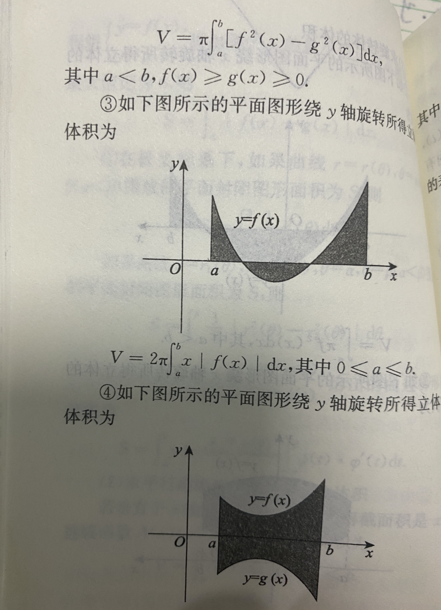
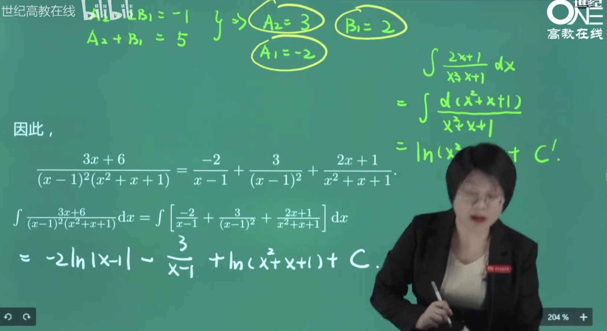
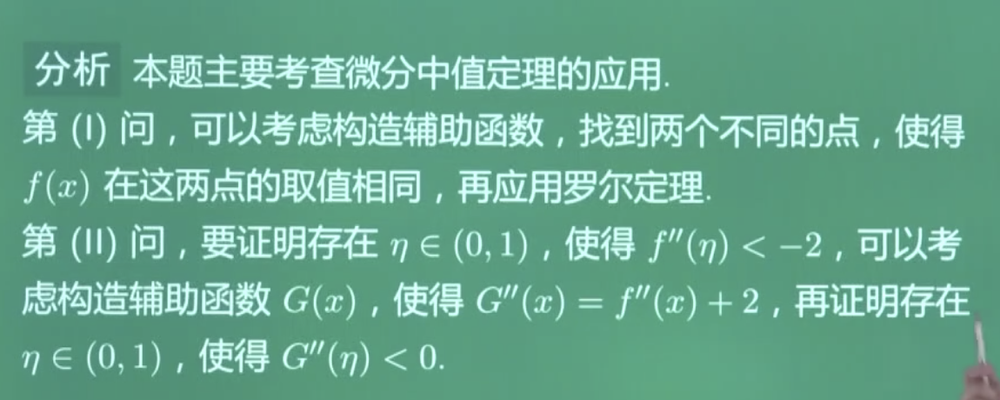
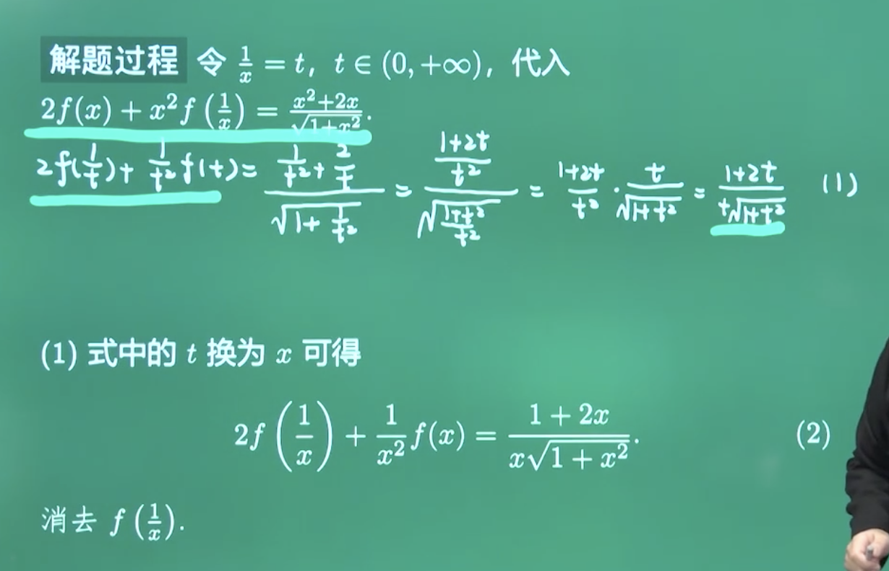

 

<2010.1>

用[泰勒公式](https://dashen.tech/2015/10/28/%E6%B3%B0%E5%8B%92%E5%85%AC%E5%BC%8F/),展开到三阶

-1/6x的四次方没有了,被吸收进o(x的三次方)里面去了

 

 

---

 

<2015.16>

这类题,记住公式一点不难,只需要基本的计算

此处也可以用[华莱士公式](https://dashen.tech/2015/11/02/%E5%8D%8E%E8%8E%B1%E5%A3%AB%E5%85%AC%E5%BC%8F/)即所谓的**点火公式**,大为减轻计算量

两个算出来,然后一等~

旋转体的**体积**和表面积公式

 

---

 

<2015.17>

积分,确定f(x,y)的表达式,

算出来后,就比较常规了(二元函数极值存在的必要条件)

 

---

 

<2015.18>

积分区域关于y轴对称 

利用奇偶性,简化计算

 

常见的三种三角换元之一

 

---

 

<2015.19>

 

---

 

<2015.20>

一道应用题

微分方程的物理应用现在出的不多了.几何应用考的较多

 

---

 

<2015.21>

现在二阶导>0这个条件 还没有使用

拉格朗日中值定理

借助拉格朗日中值定理,构建不等式

 

 

---

 

<2019.15>

 

---

 

<2019.16>

不定积分的计算

有理分式不定积分的计算

 

---

 

<2019.17>

微分方程 & 求旋转体的体积

一阶非齐次线性微分方程,用求解共识即可

 

 

---

 

<2019.18>

二重积分的计算

 

 

 

---

 

<2019.19>

 

 

---

 

<2019.20>

 

 

 

  
 
 

 主要就是考计算..算偏导数

  

---

 

<2019.21>

 

 

法1:

法2:反证法:

 

 

法1:

法2:

 

 

---

 

<2020.15>

斜渐近线

凑重要极限:

对于1的无穷型未定式,凑重要极限,或者取对数,就这两种办法

无穷-无穷 型未定式, 倒代换(令t=1/x),转换为0/0,然后洛必达

 

---

 

<2020.16>

 

---

 

<2020.17>

基础题,最简单的一道大题了...

先求驻点.

 

---

 

<2020.18>

写成x=g(y)的形式

三角换元

 

---

 

<2020.19>

二重积分,老朋友了~

转换为*极坐标*来做

这个积分是分部积分法的一个典型应用

 

---

 

<2020.20>

证明题

 

零点定理:

罗尔定理:

 

柯西中值定理:

 

---

 

<2020.21>

 
 

 

