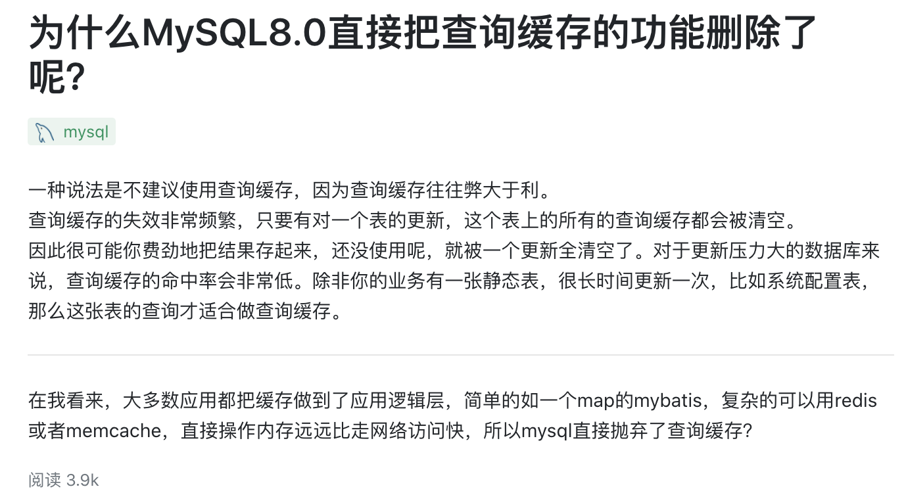
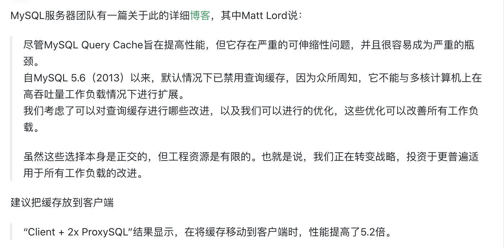
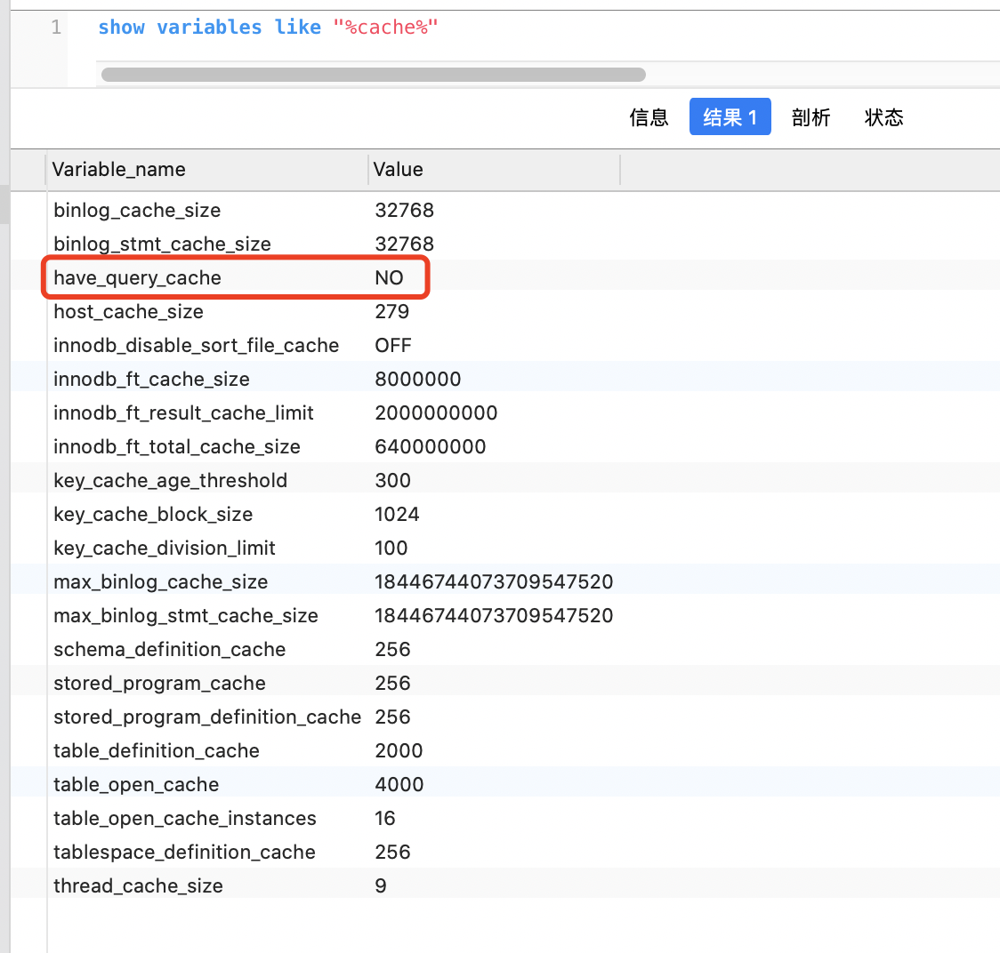

根据 **局部性原理**,  `MySQL Query Cache` (QC) 会缓存select 查询( 默认开启),以减少下次查询需用的时间. 

但如果对表进行 *INSERT, UPDATE, DELETE, TRUNCATE, ALTER TABLE, DROP TABLE, DROP DATABASE* 等操作, 则之前的缓存会失效且删除. 这样一定程度上也会影响数据库的性能, 故而对一些频繁变动的表, 开启缓存并不好; 另外在测试数据库性能时,也需要关闭QC,以避免其对测试结果的影响.

<br>


QC 有较大的弊端,无胜于有, 故而在MySQL 8.0中,移除了查询缓存的相关功能:

**<font color="#40E0D0">The query cache is deprecated as of MySQL 5.7.20, and is removed in MySQL 8.0.**</font>


<font color="#006400">现在缓存更多是做在应用逻辑层, 或使用一些NoSQL型数据库如Redis</font>


<font size=1>
8.0以下的*查询缓存*相关设置,可参考:

 [MySQL关闭查询缓存（QC）的两种方法](https://note.youdao.com/web/#/file/WEB511ced6263aae866775462fd7ba0faf3/note/WEB54496f019008f06bd140bf4d3a3ed0e7/)
</font>

<br>

> select version();

```sql
8.0.21
```

<br>






<br>


> show variables like "%cache%"




<br>

---


<br>

更多可参考:

[MySQL查询缓存简介](https://note.youdao.com/web/#/file/WEB511ced6263aae866775462fd7ba0faf3/note/WEB063f6c8ce753e24d9df0dd23036bca2c/)

[MySQL 8.0: Retiring Support for the Query Cache](https://mysqlserverteam.com/mysql-8-0-retiring-support-for-the-query-cache/)


[8.10.3.3 查询缓存配置](https://www.docs4dev.com/docs/zh/mysql/5.7/reference/query-cache-configuration.html)

[Mysql高级之查询缓存(Mysql8.0已废弃此功能)](https://note.youdao.com/web/#/file/WEB511ced6263aae866775462fd7ba0faf3/note/WEB066650d2c1aabbd42a63061a6c734ef6/)

---

