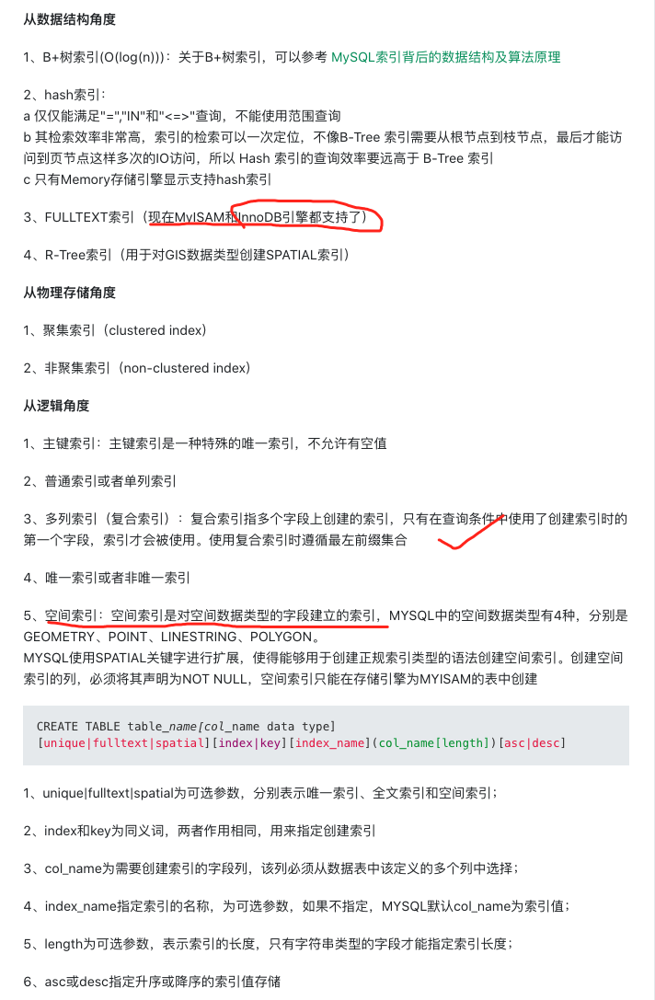

 

### b-tree

### hash

### full-text

### r-tree(用的非常少)

 

 

---

 

参考:

[mysql中的索引类型有哪些，可以从哪些角度来看？](https://segmentfault.com/q/1010000003832312)

[MySQL 索引优化 btree hash rtree](https://www.cnblogs.com/sunxucool/archive/2013/07/16/3193251.html) (部分内容已经不准确)

[备份地址](http://note.youdao.com/s/BCGVBdLg)

