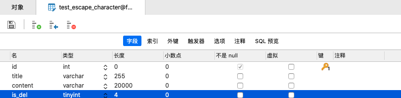
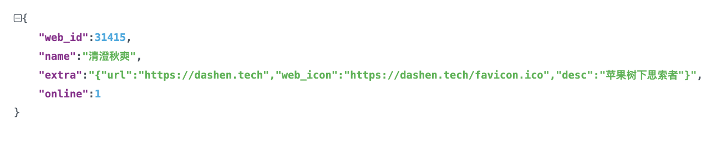
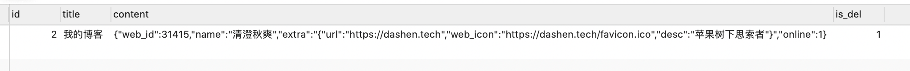
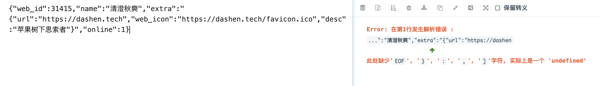

<br>


### <font color="orange">表象</font>


<br>


**表结构如下:**



<br>

其中 *content* 字段存放json之后的数据,这个json数据里面 *extra* 字段的内容又是一段json,如下:





```sql
INSERT INTO `future`.`test_escape_character`

( `id`, `title`, `content`, `is_del` )

VALUES
	( 2, 
	'我的博客',
    '{"web_id":31415,"name":"清澄秋爽","extra":"{\"url\":\"https://dashen.tech\",\"web_icon\":\"https://dashen.tech/favicon.ico\",\"desc\":\"苹果树下思索者\"}","online":1}',
	1 );
```




<br>


写入之后,复制 *content*字段,发现*extra* 无法解析了





<br>


而将 *content*字段`{"web_id":31415,"name":"清澄秋爽","extra":"{\"url\":\"https://dashen.tech\",\"web_icon\":\"https://dashen.tech/favicon.ico\",\"desc\":\"苹果树下思索者\"}","online":1}`直接在navicat中写入, 则可成功解析.


<br>


对比发现,能成功解析的`extra`,多了`\`.(这是json中的json必须要有的,起转义`"`的作用)

但为何insert进去的数据,就少了这个`\`?

<br>

即我们想要保存的是`{"web_id":31415,"name":"清澄秋爽","extra":"{\"url\":\"https://dashen.tech\",\"web_icon\":\"https://dashen.tech/favicon.ico\",\"desc\":\"苹果树下思索者\"}","online":1}`, insert写进去之后,却成了

`{"web_id":31415,"name":"清澄秋爽","extra":"{"url":"https://dashen.tech","web_icon":"https://dashen.tech/favicon.ico","desc":"苹果树下思索者"}","online":1}`

<br>

### <font color="orange">原由</font>

<br>


这个问题是因为 MySQL的字符串转义 导致.

MySQL中,特殊字符用 `反斜线(‘\’)`开始, 从而导致**\"url\"** 被转义为`"url"`,进而使保存的数据json解析失败.


<br>


### <font color="orange">解决</font>


<br>

解决办法也非常简单,将用在转义起始的`\`也进行转义即可.

MySQL用`\\`来转义 `反斜线(‘\’)字符`,即在insert时,将 *content* 字段改为:

```sql
'{"web_id":31415,"name":"清澄秋爽","extra":"{\\"url\\":\\"https://dashen.tech\\",\\"web_icon\\":\\"https://dashen.tech/favicon.ico\\",\\"desc\\":\\"苹果树下思索者\\"}","online":1}'
```

这样写入的数据,就符合预期了~


<br>


---

<br>


更多MySQL的转义字符,可参考

[MySql字符转义](https://www.cnblogs.com/end/archive/2011/04/01/2002516.html)


[MySQL中执行sql语句反斜杠需要进行转义否则会被吃掉](https://blog.csdn.net/sunsijia21983/article/details/105530384)