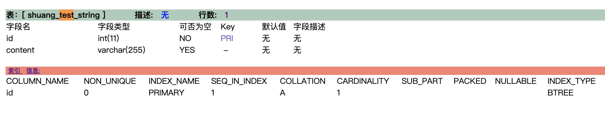
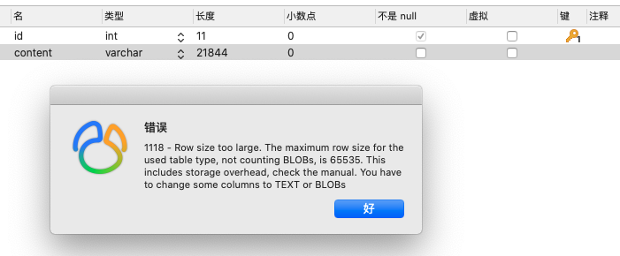
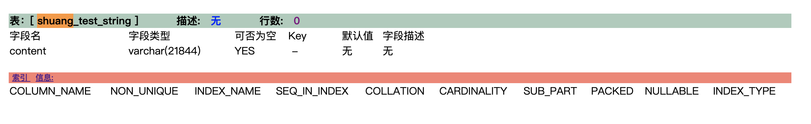
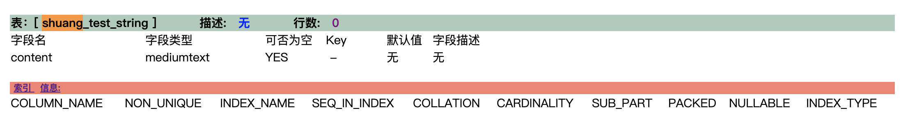
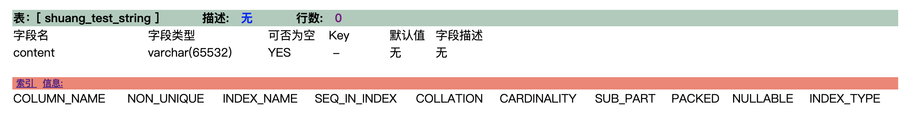
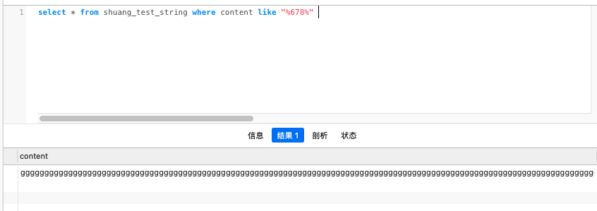
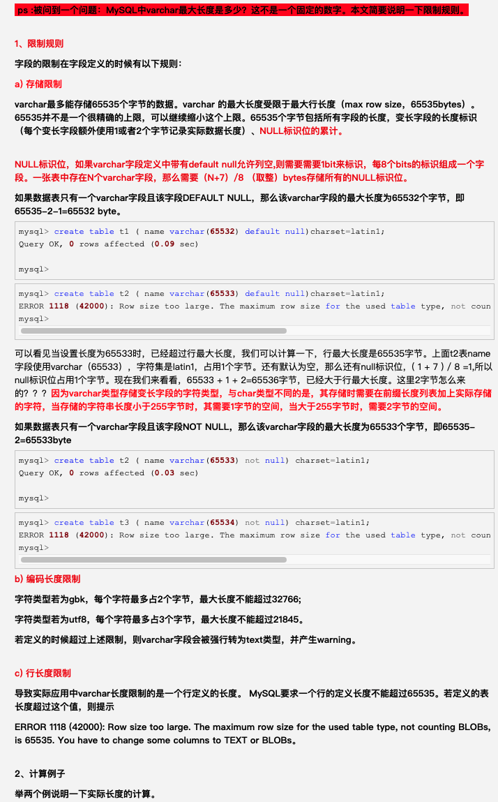

某个字段需要存储 长文本类型的数据,长度可变,范围不清. 


`varchar`最多能存储多大长度呢? 何种情况下用`text`更好?


以下内容就为探究这个问题:


<br>



<br>

<1>.先将content字段设为`varchar(255)`,则此字段只能最多存储255个*字符数*

<br>


```go
package main

import "fmt"

func main() {

	var str string

	for i := 1; i <= 255; i++ {
		str += "a"
	}

	fmt.Println(str)

	fmt.Println(len(str))

}
```


```go
输出为:
aaaaaaaaaaaaaaaaaaaaaaaaaaaaaaaaaaaaaaaaaaaaaaaaaaaaaaaaaaaaaaaaaaaaaaaaaaaaaaaaaaaaaaaaaaaaaaaaaaaaaaaaaaaaaaaaaaaaaaaaaaaaaaaaaaaaaaaaaaaaaaaaaaaaaaaaaaaaaaaaaaaaaaaaaaaaaaaaaaaaaaaaaaaaaaaaaaaaaaaaaaaaaaaaaaaaaaaaaaaaaaaaaaaaaaaaaaaaaaaaaaaaaaaaaaaaaaa

255
```

<br>

将生成的255位的str,写入content字段,成功保存. 且与文本是 数字,英文 还是中文,全角还是半角无关.(自MySQL 5.0之后)

<br>

**但如果写入更长的数据,则会从第255位开始,之后的都舍弃.**

即 `baaaaaaaaaaaaaaaaaaaaaaaaaaaaaaaaaaaaaaaaaaaaaaaaaaaaaaaaaaaaaaaaaaaaaaaaaaaaaaaaaaaaaaaaaaaaaaaaaaaaaaaaaaaaaaaaaaaaaaaaaaaaaaaaaaaaaaaaaaaaaaaaaaaaaaaaaaaaaaaaaaaaaaaaaaaaaaaaaaaaaaaaaaaaaaaaaaaaaaaaaaaaaaaaaaaaaaaaaaaaaaaaaaaaaaaaaaaaaaaaaaaaaaaaaaaaaa` (还是255位,舍弃最后一个a) 可以写入,

而

`aaaaaaaaaaaaaaaaaaaaaaaaaaaaaaaaaaaaaaaaaaaaaaaaaaaaaaaaaaaaaaaaaaaaaaaaaaaaaaaaaaaaaaaaaaaaaaaaaaaaaaaaaaaaaaaaaaaaaaaaaaaaaaaaaaaaaaaaaaaaaaaaaaaaaaaaaaaaaaaaaaaaaaaaaaaaaaaaaaaaaaaaaaaaaaaaaaaaaaaaaaaaaaaaaaaaaaaaaaaaaaaaaaaaaaaaaaaaaaaaaaaaaaaaaaaaaaac` (256位),无法写入


<br>


<2>.`varchar`类型的上限是 **最多能存储65535个字节的数据**(而不是字符; 即64KB),因而其上限和字符集有关,如果是`latin1`,则可以表示65532长度的字符数 (变长字段额外使用1或2个字节来记录实际数据长度、以及是否为NULL标识位,如果数据表只有一个varchar字段且该字段DEFAULT NULL，那么该varchar字段的最大长度为65532个字节，即65535-2-1=65532 byte)


字符集为`utf-8`时,则最多存 $65532/3=21844$个字符数,

尝试将content自动改为varchar(21844),报错如下:


```sql
ERROR 1118 (42000): Row size too large. The maximum row size for the used table type, not counting BLOBs, is 65535. You have to change some columns to TEXT or BLOBs。
```




这是因为不仅受 *存储限制*,*编码长度限制*,还受到mysql*单行长度限制*,mysql一行记录所有长度不得超过65535。若定义的表中各字段长度超过这个值，则提示如上错误.


因为这张表还有一个`int(11)`类型的id,故而达不到21844这个长度.

<br>


将id字段删掉,只保留content这一个字段,在`utf-8`下,可成功设置为 `varchar(21844)`,

如改为`varchar(21845)`,则会继续报如上错误.





<br>

<3>.如果继续以较大幅度提供后面的值,如 `varchar(70000)`,则不会报错而将自动转为`mediumtext`类型.





<br>


如将该字段字符集(及其相应的排序规则)改为`latin1`,则可成功设置为`varchar(65532)`





如再提高至`varchar(65533)`,则会报上面*行大小太大*的错误.


在`latin1`字符集下,存储英文大小写,数字,都没有问题,但用来存储汉字,则会因为不能识别而被记录为`?`


<br>


<4.>在在`utf-8`下, 且只有这一个字段,可成功设置为`varchar(21844)`情况下,经实际亲测,可以容纳21844个字符,超出部分将会被舍弃.





<br>


---

<br>

即一般情况下,如果长度小于2万,可用varchar,否则就要用text


<br>





<br>

参考 & 强烈推荐阅读 

[MySQL中varchar最大长度是多少？](https://www.cnblogs.com/gomysql/p/3615897.html)


[MySQL性能优化之char、varchar、text的区别](https://blog.csdn.net/brycegao321/article/details/78038272)

