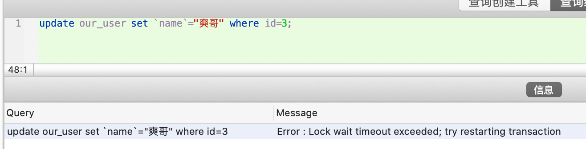

### 综述：


> 共享锁又称为读锁，简称S锁，顾名思义，共享锁就是多个事务对于同一数据可以共享一把锁，都能访问到数据，但是只能读不能修改。<br>
排他锁又称为写锁，简称X锁，顾名思义，排他锁就是不能与其他所并存，如一个事务获取了一个数据行的排他锁，其他事务就不能再获取该行的其他锁，包括共享锁和排他锁，但是获取排他锁的事务是可以对数据就行读取和修改。


---

“如果事务T对数据A加上共享锁后，则其他事务只能对A再加共享锁，不能加排他锁。获准共享锁的事务只能读数据，不能修改数据。即其他用户可以并发读取数据，但任何事务都不能对数据进行修改（获取数据上的排他锁），直到已释放所有共享锁。”

"排他锁又称写锁，如果事务T对数据A加上排他锁后，则其他事务不能再对A加任任何类型的锁。获准排他锁的事务既能读数据，又能修改数据。"


**“对于insert、update、delete，InnoDB会自动给涉及的数据加排他锁（X）；对于一般的Select语句，InnoDB不会加任何锁，事务可以通过“lock in share mode”及“for update”语句给显示加共享锁或排他锁。”**

参考自[MySQL中的共享锁与排他锁](https://www.hollischuang.com/archives/923)


即 

对于一行数据，可以有多个共享锁同时读取；
对于一行数据，只能有一个排他锁进行读写。


<br>


<br>

数据库只有"悲观锁","乐观锁"概念需自行实现(一般是通过增加`version`或`timestamp`字段来实现);

悲观锁分两种,共享锁和排他锁;前者在sql语句后加`lock in share mode`,后者加`for update`

[乐观锁一般会使用版本号机制或CAS算法实现](https://www.cnblogs.com/kismetv/p/10787228.html)

---


[私有笔记-乐观锁与悲观锁](https://note.youdao.com/web/#/file/WEBced87f600c72566085eecd60c34d173f/note/WEB87c32c96504965e0d347770f6954d19e/)


## **乐观锁不是数据库自带的，需要我们自己去实现。** 

<br>

乐观锁是指操作数据库时(更新操作)，想法很乐观，认为这次的操作不会导致冲突，在操作数据时，并不进行任何其他的特殊处理（也就是不加锁），而在进行更新后，再去判断是否有冲突了。

除了自己手动实现乐观锁之外，现在网上许多框架已经封装好了乐观锁的实现，如hibernate，

---

## 悲观锁是由数据库自己实现了的，要用的时候，我们直接调用数据库的相关语句就可以了。

<br>

说到这里，由悲观锁涉及到的另外两个锁概念就出来了，它们就是**共享锁与排它锁**。共享锁和排它锁是悲观锁的不同的实现，它俩都属于悲观锁的范畴。


对于悲观锁，(一般/大多数)数据库都已经实现了.

<br>

**锁必须在事务之中才能生效**

*另: 几种事务 开始/提交/回滚的 命令是完全等效的*

```
事务的开始：
BEGIN或START TRANSACTION 都是显式开启一个事务；

事务的提交：
COMMIT或COMMIT WORK 都是等价的；

事务回滚:
ROLLBACK或ROLLBACK WORK 也是等价的；
```

没有commit,即这个事务还未被提交,会一直锁着选定的资源;分两种锁,共享锁和排它锁

<br>

### 共享锁

共享锁属于悲观锁的一种. 在mysql中通过在执行语句后面加上`lock in share mode`就代表对某些资源加上共享锁了。

> 共享锁【S锁】<br>
又称读锁，若事务T对数据对象A加上S锁，则事务T可以读A但不能修改A，其他事务只能再对A加S锁，而不能加X锁，直到T释放A上的S锁。这保证了其他事务可以读A，但在T释放A上的S锁之前不能对A做任何修改。


<br>

#### 共享锁事务之间的读取


- 更新id=3的会失败,但更新id!=3的可以成功

<font color="red">可见是行级锁,可以更新未加锁的行的记录</font>


- 可以查询这条加锁的记录(如果加的是排它锁,这时select是查不到的,会超时)

正常的sql语句,默认是不加锁的 !


如果用排它锁去查询,则:


#### 共享锁事务之间的修改

在一个窗口中执行
```sql
begin;
SELECT * from our_user where id = 3  lock in share mode;
```


上图中的语句执行后,因为没有commit, 此时这条数据会被一直锁定


再在一个新的窗口执行:

`update our_user set `name`="爽哥" where id=3;`




这时去update这条数据,会报 `锁等待超时错误`.


---


### 结论：

``` 
mysql 共享锁 (lock in share mode)
允许其它事务也增加共享锁读取
不允许其它事物增加排它锁 (for update)

当事务同时增加共享锁时候，事务的更新必须等待先执行的事务 commit 后才行，如果同时并发太大可能很容易造成死锁

在共享锁释放之前,任何方式都无法对其锁住的数据进行写操作

```


---

### 排它锁

**当一个事物加入排他锁后，不允许其他事务加共享锁或者排它锁读取，更加不允许其他事务修改加锁的行。**

> 排他锁【X锁】<br>
又称写锁。若事务T对数据对象A加上X锁，事务T可以读A也可以修改A，其他事务不能再对A加任何锁，直到T释放A上的锁。这保证了其他事务在T释放A上的锁之前不能再读取和修改A。


#### 排他锁事务之间的读取


加排它锁读取后,

这时再有新的读取,只有不加锁才能读取成功,加共享锁或排他锁都会失败:


---

#### 排它锁事务之间的修改

结束之前的事务,进行如下操作:


<br>


即排它锁事务未commit时,不允许有针对该条记录的任何update操作.


### 结论：

```
总结
(排它锁的)事务之间不允许其它排它锁或共享锁读取，修改更不可能
一次只能有一个排它锁执行 commit 之后，其它事务才可执行
不允许其它事务增加共享或排它锁读取。修改是惟一的，必须等待前一个事务 commit，才可
```

---

<br>


a.<br>
`共享锁`和`排它锁`是InnoDB存储引擎的概念.  

对于UPDATE、DELETE和INSERT语句，InnoDB会自动给涉及数据集加排它锁（X)；对于普通SELECT语句，InnoDB不会加任何锁；

b.<br>

表级锁不会产生死锁.

MySQL有三种锁的级别：页级、表级、行级。

- 表级锁：开销小，加锁快；不会出现死锁；锁定粒度大，发生锁冲突的概率最高,并发度最低。`MyISAM存储引擎`
- 行级锁：开销大，加锁慢；会出现死锁；锁定粒度最小，发生锁冲突的概率最低,并发度也最高。`InnoDB存储引擎`
- 页面锁：开销和加锁时间界于表锁和行锁之间；会出现死锁；锁定粒度界于表锁和行锁之间，并发度一般 


所以解决死锁主要还是针对于InnoDB。

```
MyISAM和MEMORY采用表级锁(table-level locking)

BDB采用页面锁(page-level locking)或表级锁，默认为页面锁

InnoDB支持行级锁(row-level locking)和表级锁,默认为行级锁
```


c.<br>

何时会是行级锁,何时会变成表级锁,和where后面的字段有没有加索引有关,可以另开一篇专门讨论


---


延伸阅读:

[一条简单的更新语句，MySQL是如何加锁的？](https://zhuanlan.zhihu.com/p/109758339)

[mysql死锁-产生原因和解决方法](https://blog.csdn.net/tr1912/article/details/81668423)


[mysql的行级锁和表级锁](https://blog.csdn.net/hxpjava1/article/details/79407961)
