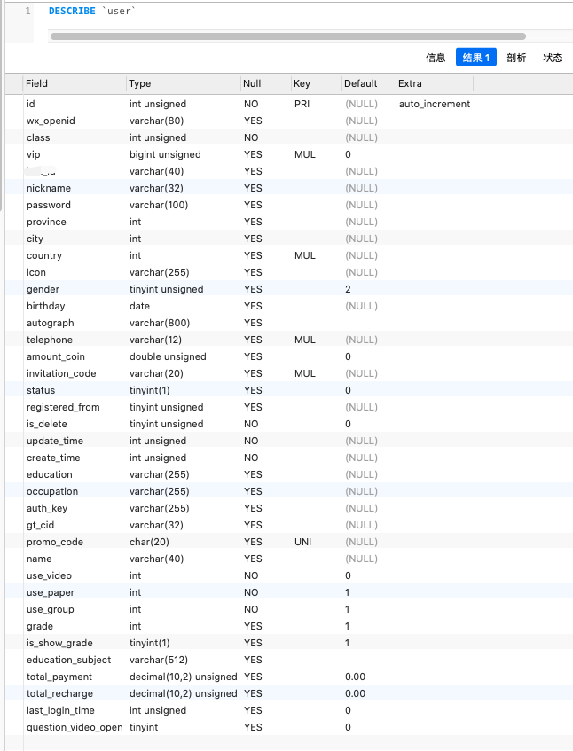
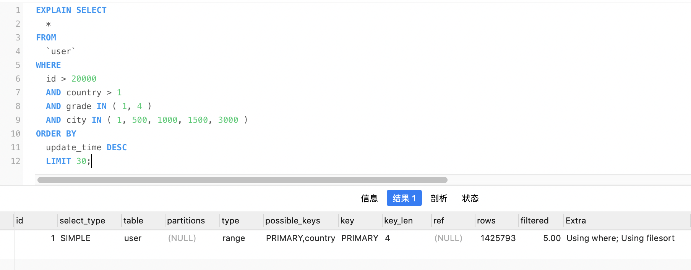
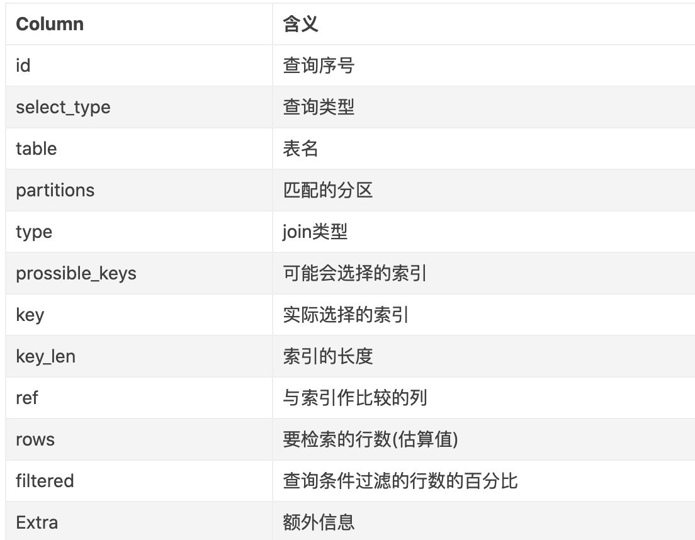
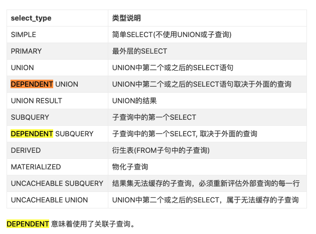
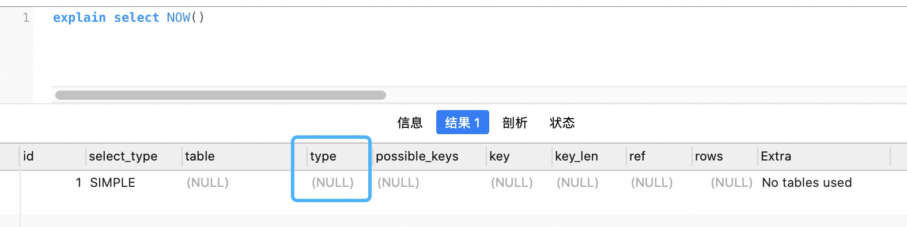

> MySQL 5.6.3以前只能EXPLAIN SELECT; 5.6.3以后就可以EXPLAIN SELECT,UPDATE,DELETE

<br>


**有这样一张`user`表,300多万行记录,表结构及索引信息如下:**

<br>




<br>


对于sql:


```sql

SELECT
	* 
FROM
	`user` 
WHERE
	id > 20000 
	AND country > 1 
	AND grade IN ( 1, 4 ) 
	AND city IN ( 1, 500, 1000, 1500, 3000 ) 
ORDER BY
	update_time DESC 
	LIMIT 30;

```

explain结果如下:




<br>


---

<br>





<br>

---


<br>


### <font color="#4682B4"> 1.id </font>


<br>

SQL查询中的序列号

*id列数字越大越先执行，如果说数字一样大，那么就从上往下依次执行。*


---

<br>


### <font color="#4682B4"> 2.select_type </font>

<br>

查询的类型, 可以是如下的任何一种类型：




---

<br>


### <font color="#4682B4">3.table </font>


<br>

查询的表名. 并不一定是实际存在的表名.

可以为如下的值：

- `<unionM,N>`: 引用id为M和N UNION后的结果。

- `<derivedN>`: 引用id为N的结果派生出的表。派生表可以是一个结果集，例如派生自FROM中子查询的结果。

- `<subqueryN>`: 引用id为N的子查询结果物化得到的表。即生成一个临时表保存子查询的结果。


---

<br>


### <font color="#4682B4"> 4.partitions</font>


<br>

5.7以前，该项是`explain partitions`显示的选项; 5.7以后成为了默认选项. 

该列显示的为分区表命中的分区情况, 非分区表该字段为空（NULL）.


---

<br>


### <font color="#FFD700"> **5.type**</font>


<br>

最重要的一个指标, 显示查询使用了何种类型

除`ALL`之外, 其他type都可以用到索引; 除`index_merge`外, 其他type只可用到一个索引.

<br>


由左到右,性能由差到好:

```sql
ALL,index，range，index_subquery，unique_subquery，index_merge，ref_or_null，fulltext，ref，eq_ref，const，system
```


从上到下,性能由差到好:

<br>


#### <font color="#FF7F50">(1) ALL</font>


<br>

**扫描全表**,性能最差.


`>>>>>>`

<br>


#### <font color="#FF7F50">(2) index</font>


<br>

**扫描全部索引树**


或称"索引全表扫描", 即把索引从头到尾扫一遍. 

包含两种情况：

1. 查询使用了覆盖索引, 那么只需要扫描索引就可以获得数据. 这个效率要比全表扫描快, 因为索引通常比数据表小, 且还能避免二次查询. 这种情况在*extra*中显示**Using index**.

2. 反之, 如果在索引上进行全表扫描,则*extra*字段没有**Using index**.

<br>


如对于`user`表,**telephone**字段建有索引,如果

<1>.

`explain select telephone from user;`,则**type**字段将为*index*

<br>

<2>.

`explain select amount_coin from user;`,

因为*amount_coin*字段没有建索引, 故而**type**字段将为*ALL*

<br>

<3>.

`explain select * from user;`,

如果包含没有建索引的列, **type**字段也将为*ALL*


`>>>>>>`

<br>


#### <font color="#FF7F50">(3) range</font>


<br>

**扫描部分索引**

索引范围扫描, 对索引的扫描开始于某一点, 返回匹配值域的行，常见于 `=, <>, >, >=, <, <=, IS NULL, <=>, BETWEEN, IN()`或者`like`等运算符的查询中


`>>>>>>`


<br>


#### <font color="#FF7F50">(4) index_subquery</font>


<br>

该联接类型类似于下面的`unique_subquery`

适用于非唯一索引, 可以返回重复值.


`>>>>>>`

<br>


#### <font color="#FF7F50">(5) unique_subquery</font>


<br>

用于`where`中`in`形式的子查询. 

子查询返回不重复值唯一值, 可以完全替换子查询, 效率更高.

该类型替换了下面形式的IN子查询的ref：

`value IN (SELECT primary_key FROM single_table WHERE some_expr)`


`>>>>>>`


<br>


#### <font color="#FF7F50">(6) index_merge</font>


<br>

表示查询使用了两个以上的索引, 最后取交集或者并集, 常见`and ，or`的条件使用了不同的索引.

官方排序这个在下面的`ref_or_null`之后, 但实际上由于要读取多个索引,性能可能大部分时间都不如更下面的`range`


`>>>>>>`


<br>


#### <font color="#FF7F50">(7) ref_or_null</font>


<br>

跟下面的**ref**类型类似, 只是增加了null值的比较.

实际用的不多


`>>>>>>`


<br>


#### <font color="#FF7F50">(8) fulltext</font>


<br>

使用**全文索引**时`type`会是这个类型. 

注意,**全文索引**的优先级很高,若**全文索引**和**普通索引**同时存在时, mysql不管代价, 会优先选择使用**全文索引**


`>>>>>>`


<br>


#### <font color="#FF7F50">(9) ref</font>


<br>

使用非唯一索引或非唯一索引前缀进行的查找

对于来自前表的每一行,在当前表的索引中可以匹配到多行.

若连接只用到索引的*最左前缀*或*索引不是主键或唯一索引*时, 使用ref类型(可以理解成可能出现"一对多"时)

ref可用于使用'='或'<=>'操作符作比较的索引列


`>>>>>>`

<br>


#### <font color="#FF7F50">(10) eq_ref</font>


<br>

唯一性索引扫描, 对于每个索引键, 表中只有一条记录与之匹配.

<br>

**eq_ref**和**const**的区别:


eq_ref 出现于多表join时, 对于来自前表的每一行, 在当前表中只能找到一行. 

这是除了下面几种类型之外最好的类型. 当主键或唯一非NULL索引的所有字段都被用作join联接时会使用此类型.


**eq_ref** 可用于使用'='操作符作比较的索引列, 比较的值可以是常量, 也可以是使用在此表之前读取的表的列的表达式.


`>>>>>>`


<br>


#### <font color="#FF7F50">(11) const</font>


<br>

const: 单表中最多有一个匹配行, 例如根据主键或唯一索引查询.
(如 `select * from user where id=100`),
查询起来非常迅速


`>>>>>>`

<br>


#### <font color="#FF7F50">(12) system</font>


<br>

`system`是`const`类型的特例,只会出现在`Myisam`或`Memory`存储引擎, 当查询的表只有一行或空表的情况下,`type`字段将是**system**. 

如果是`Innodb`引擎表, `type`列在这种情况通常都是ALL或者index.

这种类型可以可以忽略不计


`>>>>>>`


<br>


#### <font color="#FF7F50">(13) NULL</font>


<br>


不用访问表或者索引,直接就能得到结果, 如 `explain select NOW() `




<br>


---

<br>


### <font color="#4682B4"> 6.prossible_keys</font>


<br>

**可能使用到的索引**

---

<br>


### <font color="#4682B4"> 7.key </font>


<br>

**真正使用到的索引**

`select_type`为`index_merge`时, 这里可能出现两个以上的索引;

其他的`select_type`这里只会出现一个.


---

<br>


### <font color="#4682B4"> 8.key_len</font>


<br>


**查询用到的索引长度（字节数）**

如果是单列索引, 那就整个索引长度算进去; 

如果是多列索引(即联合索引),那么查询不一定都能使用到所有的列,用多少算多少.

<br>

*可以留意下这个列的值, 算一下多列索引总长度, 就可知有没有使用到所有的列.*


**另:
key_len只计算where条件用到的索引长度, 而排序和分组就算用到了索引,也不会计算到key_len中.**


---

<br>


### <font color="#4682B4"> 9.ref</font>


<br>

如果使用常数等值查询, 这里会显示const;

如果是连接查询, 被驱动表的执行计划这里会显示驱动表的关联字段,

如果是条件使用了表达式或者函数,或者条件列发生了内部隐式转换, 这里可能显示为func


---

<br>


### <font color="#FFD700"> **10.rows**</font>


<br>


**非常重要的一个字段**

<br>

mysql估算的 **需要扫描的行数**（不是精确值）

通过这个值,可以非常直观地显示 SQL 的效率好坏. 

*原则上 rows 越小越好.*

当存在limit时,会对rows字段产生影响. 建议在explain时先去除limit


---

<br>


### <font color="#4682B4"> 11.filtered</font>


<br>

这个字段表示存储引擎返回的数据在server层过滤后, 剩下多少满足查询的记录数量的比例;

注意是百分比,不是具体记录数.


---

<br>


### <font color="#FFD700"> **12.Extra**</font>


<br>

**非常重要的一个字段**

<br>

explain 中的很多额外信息会在 `Extra` 字段显示, 常见的有以下几种内容:

- distinct：在select部分使用了distinc关键字

- <font color="#3CB371">**Using filesort**：</font> 当 Extra 中有 Using filesort 时, 表示 MySQL 需额外的排序操作(优先内存,内存空间不够则会在磁盘排序), 不能通过索引顺序达到排序效果. 一般存在 Using filesort, 都建议通过优化去掉, 因为这样的查询对机器的资源消耗很大.


- <font color="#00FF7F">**Using index**:</font> "覆盖索引扫描", 表示查询在索引树中就可查找所需数据, 不用扫描表数据文件, 往往说明性能不错. 即不需要进行filesort

- Using temporary:  查询有使用临时表, 一般出现于排序, 分组和多表 join 的情况, 查询效率不高, 建议通过优化去掉.

另外还有

- using where：在查找使用索引的情况下，需要回表去查询所需的数据

- using index condition：查找使用了索引，但是需要回表查询数据

- using index & using where：查找使用了索引，但是需要的数据都在索引列中能找到，所以不需要回表查询数据


 using index 好于 using where 好于 using index condition, 不需要回表查询数据，效率最快


<br>

在带有`order by`子句的sql中,要尽可能使extra字段不要出现`Using filesort`,而是`Using index`


<br>


举例如何去掉 **Using filesort**:


[explain结果每个字段的含义说明](https://www.jianshu.com/p/8fab76bbf448)

[mysql 索引type介绍](https://blog.csdn.net/L_ieluil/article/details/62885392)

[MySQL优化：定位慢查询的两种方法以及使用explain分析SQL](https://baijiahao.baidu.com/s?id=1644795692359019265&wfr=spider&for=pc)


<br>

---

<br>

**limit** 会对explain的type产生巨大影响

**关于order by的优化**


具有LIMIT和不具有LIMIT的ORDER BY可能是不同的


file_sort优化器会预先分配固定数量的sort_buffer_size字节。


MySQL 有时会优化具有LIMIT row_count子句而没有HAVING子句的查询：

如果您只选择LIMIT的几行，则在某些情况下，MySQL 通常会选择使用全 table 扫描，而 MySQL 通常会使用索引。

如果将LIMIT row_count和ORDER BY结合使用，MySQL 会在找到排序结果的前* row_count 行后立即停止排序，而不是对整个结果进行排序。如果通过使用索引进行排序，这将非常快。如果必须执行文件排序，则在找到第一个 row_count *之前，将选择与查询匹配的所有行，但不带有LIMIT子句，并对其中的大多数或全部进行排序。找到初始行后，MySQL 不会对结果集的其余部分进行排序。


如果没有为ORDER BY使用索引，但是也存在LIMIT子句，则优化器可能能够避免使用合并文件，并使用内存中filesort操作对内存中的行进行排序。

参考:

[优化 Sequences](https://www.docs4dev.com/docs/zh/mysql/5.7/reference/order-by-optimization.html)

[Orderby 排序优化](https://learnku.com/articles/38925)


[理解mysql的临时表和文件排序](https://plu.one/mysql/2019/02/24/mysql-understand-temporary-and-filesort/)


