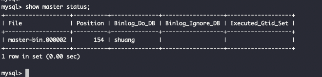
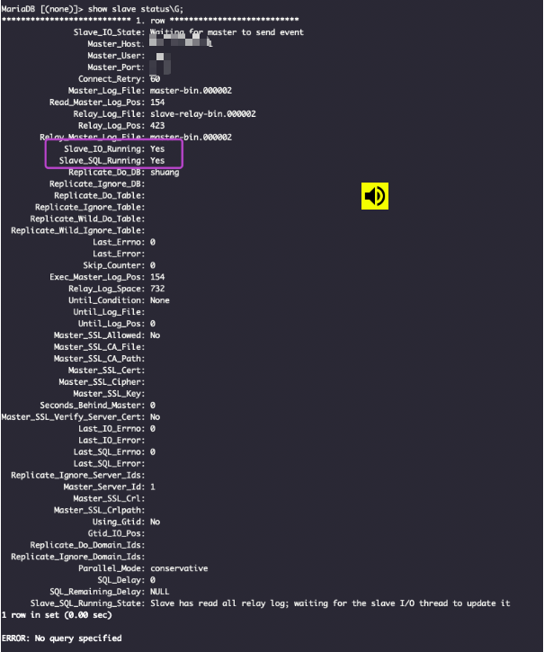
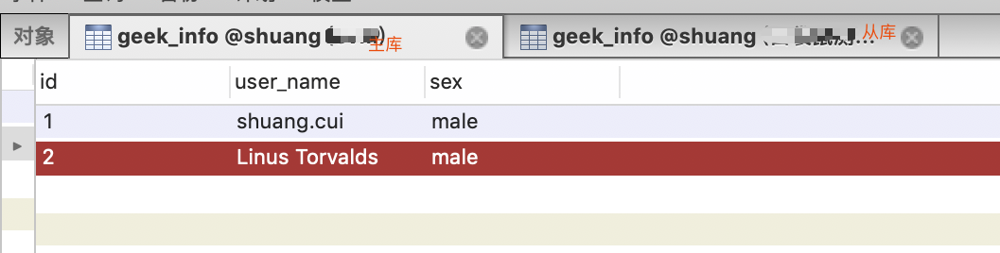

### 主服务器上的操作
#### 1.编辑 master主服务器的 mysql配置文件

vim /etc/my.cnf (或/etc/mysql/my.cnf,看编译安装时选择的路径),添加:

>[mysqld] 
server-id=1 
log_bin=master-bin
log_bin_index=master-bin.index
binlog_do_db=shuang

#备注:
- log_bin 启动MySQL二进制日志，即数据同步语句，从数据库会一条一条的执行这些语句。
- binlog_do_db 指定记录二进制日志的数据库，即需要复制的数据库名，如果复制多个数据库，重复设置这个选项即可。
- binlog_ignore_db 指定不记录二进制日志的数据库，即不需要复制的数据库名，如果有多个数据库，重复设置这个选项即可。
- 其中需要注意的是，binlog_do_db和binlog_ignore_db为互斥选项，一般只需要一个即可。
- shuang为要同步的库名称

#注:
此过程可能会报错,有格式问题,经过vim编辑后会变成utf-8格式,而mysql的配置文件需要是ascii格式.[点此查看更多](https://note.youdao.com/web/#/file/WEB565bbcab44d0b1eb9014cf791ca10609/note/WEB0df8187dd6ba57513492ad3fd4e0bd24/)

---

#### 2.创建从服务器的用户和权限

进入mysql:
>mysql -uroot -p

创建从数据库的masterbackup用户和权限

>mysql> grant replication slave on *.* to masterbackup@'192.168.17.%' identified by '123456';

#备注:
#192.168.17.%通配符，表示0-255的IP都可访问主服务器，正式环境请配置指定从服务器IP\
#若将 192.168.17.% 改为 %，则任何ip均可作为其从数据库来访问主服务器

退出mysql:
>exit;

重启mysql服务:
>service mysql restart

 
#### 3.查看主服务器状态
进入mysql:

>mysql -uroot -p

>mysql> show master status;

---

### 从服务器上的操作

#### 1.编辑从服务器mysql的配置文件:
>[mysqld]
server-id=2
relay-log=slave-relay-bin
relay-log-index=slave-relay-bin.index
replicate-do-db=shuang

#备注：
- server-id 服务器唯一标识。
- log_bin 启动MySQL二进制日志，即数据同步语句，从数据库会一条一条的执行这些语句。
- binlog_do_db 指定记录二进制日志的数据库，即需要复制的数据库名，如果复制多个数据库，重复设置这个选项即可。
- binlog_ignore_db 指定不记录二进制日志的数据库，即不需要复制的数据库名，如果有多个数据库，重复设置这个选项即可。
- 其中需要注意的是，binlog_do_db和binlog_ignore_db为互斥选项，一般只需要一个即可。
- 数据库指定为"shuang",需和主库指定的要同步的库一致

重启mysql服务:
>service mysql restart

 
#### 2.(在从服务器上)连接master主服务器:

进入mysql:

>mysql -uroot -p

连接master主服务器:
>change master to master_host='主库ip',master_port=3306,master_user='主库用户名',master_password='主库密码',master_log_file='master-bin.000002',master_log_pos=154;

#备注:
- master_log_file对应show master status显示的File列：master-bin.000002。(需和上图一致)
- master_log_pos对应show master status显示的Position列：154。(需和上图一致)

 
#### 3.启动slave数据同步:

启动slave数据同步:
>mysql> start slave;
 
停止slave数据同步(如有需要):
>mysql> stop slave;

 
#### 4.查看slave信息:
>mysql> show slave status\G;

Slave_IO_Running和Slave_SQL_Running都为yes，则表示同步成功。

---

### 测试&验证

 

- 经验证,在主库中增删改,会极速影响到从库;在从库中增删改,则不会影响主库,于是实现了主从同步;读写分离可在程序设计中实现:主服务器只用于写,从服务器只用于读

---

### 解决错误

若在主从同步的过程中，出现其中一条语句同步失败报错了，则后面的语句也肯定不能同步成功了。例如，主库有一条数据，而从库并没有这一条数据，然而，在主库执行了删除这一条数据的操作，那么从库没有这么一条数据就肯定删除不了，从而报错了。在此时的从数据库的数据同步就失败了，因此后面的同步语句就无法继续执行。

在此不再多展开.[更多可参见](https://note.youdao.com/web/#/file/WEB511ced6263aae866775462fd7ba0faf3/note/WEB9105fe9d1d208a189a7551d57150d942/)

---

关于截图中MariaDB和MySql,

[点此查看海豚和海豹的渊源](https://blog.csdn.net/liumiaocn/article/details/56665800)\

[两者技术层面对比](https://www.cnblogs.com/DataArt/p/9874934.html)
