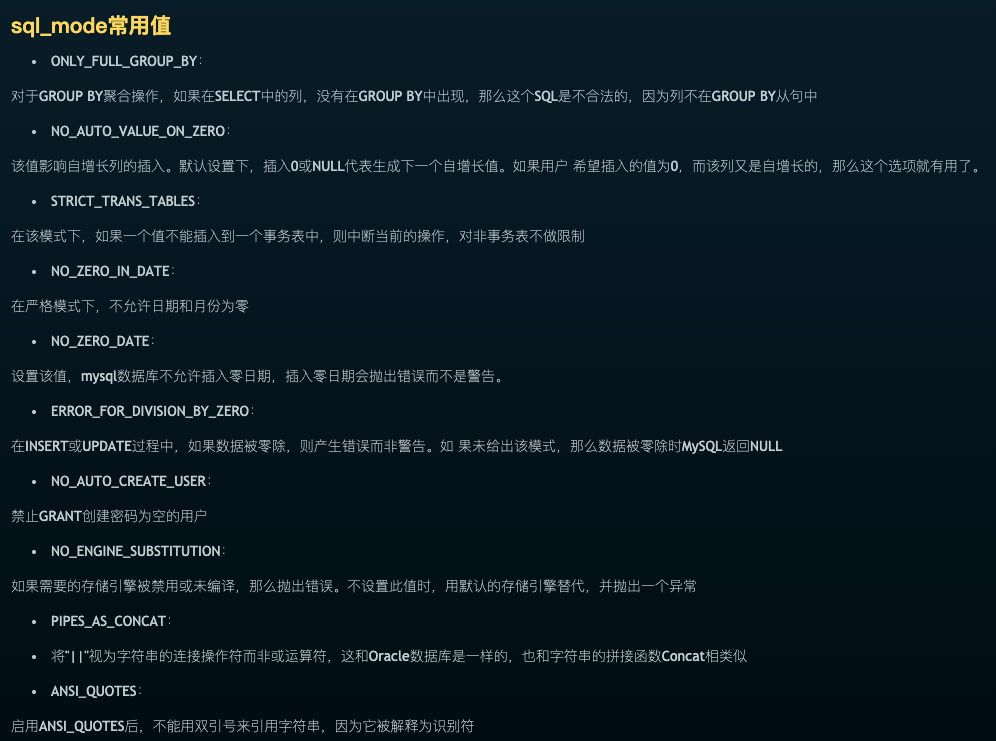

### 疑窦丛生

<br>


**疑惑一:**

在公司的测试数据库, 执行

 `select * from 某张表 group by 某字段 `, 

 居然不会报错??


但我在本地执行类似sql,则会

```
1055 - Expression #1 of SELECT list is not in GROUP BY clause and contains nonaggregated column 'xxx表.id' which is not functionally dependent on columns in GROUP BY clause; this is incompatible with sql_mode=only_full_group_by, Time: 0.036000s

```

(1055-SELECT列表的表达式＃1不在GROUP BY子句中，并且包含未聚合的列'xx表.id'，该列在功能上不依赖于GROUP BY子句中的列； 这与sql_mode = only_full_group_by不兼容，时间：0.036000s)


 <br>

 **疑惑二:**

 从公司的测试数据库,导出部分表结构到本地,竟然有些表无法导下来.

 查看原因,是

 `1067 - Invalid default value for 'ctime', Time: 0.033000s`,
 
 而这个字段的DDL为

 ` ctime timestamp NOT NULL DEFAULT '0000-00-00 00:00:00' COMMENT '创建时间',`

<br>


---

<br>

### 拨云见日

<br>


最初以为是**MariaDB**和**MySQL**的差异导致,最后一搜索,实际是`sql_mode`

<br>


因**sql_mode**而导致的错误,错误码为 *1067*


<br>

测试数据库下执行`select @@sql_mode`:

`NO_AUTO_CREATE_USER,NO_ENGINE_SUBSTITUTION`

<br>

本地数据库下执行`select @@sql_mode`:

`ONLY_FULL_GROUP_BY,STRICT_TRANS_TABLES,NO_ZERO_IN_DATE,NO_ZERO_DATE,ERROR_FOR_DIVISION_BY_ZERO,NO_AUTO_CREATE_USER,NO_ENGINE_SUBSTITUTION`


<br>


可参考
[mysql的sql_mode合理设置](http://xstarcd.github.io/wiki/MySQL/MySQL-sql-mode.html),了解每一项的含义,及设置或取消设置后的影响

<br>

可参考[Mysql 的sql_mode修改](https://www.jianshu.com/p/85b8d38e7ad0),来进行全局的修改(但这种修改方式,在重启mysql服务后会失效,想永久修改,需要去mysql的配置文件中设置)

执行 `set @@global.sql_mode='NO_AUTO_CREATE_USER,NO_ENGINE_SUBSTITUTION';`, 这样本地就和测试环境sql_mode的设置一致了


---

<br>

参考:


[sql_mode相关](https://note.youdao.com/web/#/file/WEB511ced6263aae866775462fd7ba0faf3/note/WEBedfa34689ab3471e3e4f8991599f284c/)


<br>



