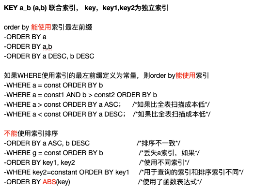

*本篇博客在B站做了内部分享,标题为「排序相关问题」*

<br>

### order by

<br>


[“order by”是怎么工作的？](http://mysql.dashen.tech/mysql45/16.%E2%80%9Corder%20by%E2%80%9D%E6%98%AF%E6%80%8E%E4%B9%88%E5%B7%A5%E4%BD%9C%E7%9A%84%EF%BC%9F%281%29.html)


```sql
https://note.youdao.com/web/#/file/WEB00c9fc9e542b90ea18d0c3cc53e74d96/note/WEBe5cada40f24c94a34f75894edf735ee4/
搜索 ENGINE=InnoDB AUTO_INCREMENT=206207915 DEFAULT CHARSET=utf8 COMMENT=
```


<br>


MySQL的`ORDER BY有`两种排序实现方式： 

- 1. 利用有序索引获取有序数据 
- 2. (不得不进行)文件排序


在explain中分析查询时，利用有序索引获取有序数据显示**Using index**，文件排序显示**Using filesort**。


---

#### Using index

<br>

**能够 利用有序索引获取有序数据 的条件比较苛刻, 以下几种优化方式,可能使order by利用到索引,而无需就行filesort**

<br>


1、ORDER BY的索引优化。如果一个SQL语句形如：
SELECT [column1],[column2],…. FROM [TABLE] ORDER BY [sort];
在[sort]这个栏位上建立索引就可以实现利用索引进行order by 优化。


2、WHERE + ORDER BY的索引优化，形如：
SELECT [column1],[column2],…. FROM [TABLE] WHERE [columnX] = [value] ORDER BY [sort];
建立一个联合索引(columnX,sort)来实现order by 优化。


注意：如果columnX对应多个值，如下面语句就无法利用索引来实现order by的优化
SELECT [column1],[column2],…. FROM [TABLE] WHERE [columnX] IN ([value1],[value2],…) ORDER BY[sort];


3、WHERE+ 多个字段ORDER BY
SELECT * FROM [table] WHERE uid=1 ORDER x,y LIMIT 0,10;
建立索引(uid,x,y)实现order by的优化,比建立(x,y,uid)索引效果要好得多。


<br>



<br>


**MySQL Order By不能使用索引来优化排序的情况:**


* 对不同的索引键做 ORDER BY ：(key1,key2分别建立索引)
SELECT * FROM t1 ORDER BY key1, key2;


* 在非连续的索引键部分上做 ORDER BY：(key_part1,key_part2建立联合索引;key2建立索引)
SELECT * FROM t1 WHERE key2=constant ORDER BY key_part2;


* 同时使用了 ASC 和 DESC：(key_part1,key_part2建立联合索引)
SELECT * FROM t1 ORDER BY key_part1 DESC, key_part2 ASC;


* 用于搜索记录的索引键和做 ORDER BY 的不是同一个：(key1,key2分别建立索引)
SELECT * FROM t1 WHERE key2=constant ORDER BY key1;


* 如果在WHERE和ORDER BY的栏位上应用表达式(函数)时，则无法利用索引来实现order by的优化
SELECT * FROM t1 ORDER BY YEAR(logindate) LIMIT 0,10;


<br>


---


#### Using filesort

<br>


### 全字段排序


<br>

filesort的时候可能在内存中出现**堆排序**或**快速排序**两种方式，具体使用哪一种排序方式是优化器决定的，基本原则如下

快速排序算法：大量排序
堆排序算法：排序量不大


快速排序和堆排序是不稳定的排序算法，对于重复值不能保证顺序。Order by排序不稳定的原因也定位到了

filesort的原理如下:

（1）根据表的索引或者全表扫描，读取所有满足条件的记录。

（2）对于每一行，存储一对值到缓冲区（排序列，行记录指针），一个是排序的索引列的值，即order by用到的列值，和指向该行数据的行指针，缓冲区的大小为sort_buffer_size大小。

（3）当缓冲区满后，运行一个快速排序（qsort）来将缓冲区中数据排序，并将排序完的数据存储到一个临时文件，并保存一个存储块的指针，当然如果缓冲区不满，则不会重建临时文件了。

（4）重复以上步骤，直到将所有行读完，并建立相应的有序的临时文件。

（5）对块级进行排序，这个类似归并排序算法，只通过两个临时文件的指针来不断交换数据，最终达到两个文件，都是有序的。

（6）重复5直到所有的数据都排序完毕。

（7）采取顺序读的方式，将每行数据读入内存（这里读取数据时并不是一行一行读），并取出数据传到客户端，读取缓存大小由read_rnd_buffer_size来指定。


##### 双路排序：(rowid排序)


首先根据相应的条件取出相应的排序字段和可以直接定位行数据的行指针信息，然后在sort buffer 中进行排序。排序后再吧查询字段依照行指针取出，共执行两次磁盘io。

##### 单路排序：MySQL4.1之后新增(全字段排序)

一次性取出满足条件行的所有字段，然后在sort buffer中进行排序。 执行一次磁盘io。代价是对内存占用大


主要通过比较所设定的系统参数 **max_length_for_sort_data**的大小和Query 语句所取出的字段类型大小总和来判定需要使用哪一种排序算法。如果 max_length_for_sort_data更大，则使用第二种优化后的算法，反之使用第一种算法。

所以如果希望 ORDER BY 操作的效率尽可能的高，一定要注意max_length_for_sort_data 参数的设置。


---


### filesort的优化策略


#### 开源

1. 尝试提高 sort_buffer_size

不管使用哪种算法，提高这个参数都会提高效率
要根据系统的自身能力去提高，因为这个参数是针对每个线程的


2. 尝试提高 max_length_for_sort_data

改变 max_length_for_sort_data变量的值可以影响mysql选择的算法，提高这个参数，会增加用改进算法即单路排序的概率。

但如果设置得太高，数据总容量超出sort_buffer_size的概率会增大，超出之后，会创建tmp文件进行合并排序，导致多次的I\O，使用单路排序出现临时文件的风险更大，所以要提高sort_buffer_size

(明显症状是高的磁盘I\O活动和低的处理器使用率)

#### 节流

order by 时，只 query 需要的字段这时取出的字段大小总和更可能小于max_length_for_sort_data(且排序字段不是TEXT｜BLOB类型，此时会使用单路排序算法)


<br>

https://cloud.tencent.com/developer/article/1536886


https://learnku.com/articles/38925

https://plu.one/mysql/2019/02/24/mysql-understand-temporary-and-filesort/


https://blog.csdn.net/weixin_34082854/article/details/93633860

https://blog.csdn.net/shandalue/article/details/51658920


