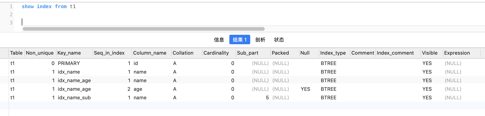
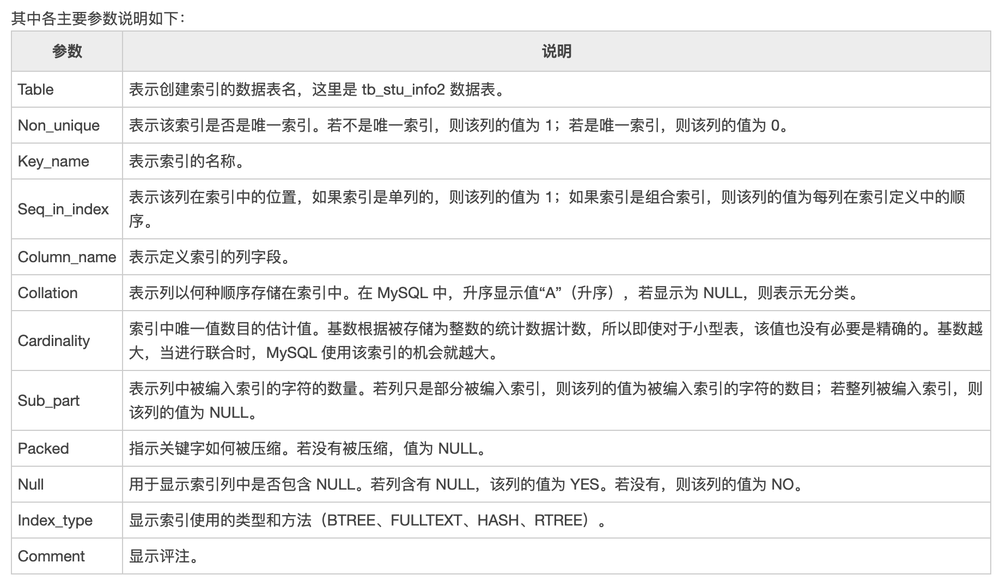
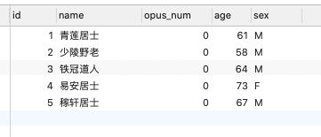
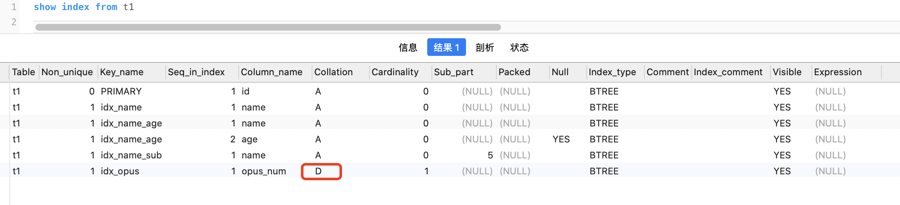

**show index from 表名** 查看某张表的索引情况


<font size=1>

另:
`SELECT * FROM information_schema.STATISTICS  WHERE TABLE_NAME = "t1"` 与 `show index from t1` 作用相似,且会返回更多的字段信息

</font>

<br>


创建一张测试表t1:


```sql
CREATE TABLE `t1` (
	`id` INT ( 11 ) NOT NULL AUTO_INCREMENT,
	`name` CHAR ( 20 ) CHARACTER 
	SET utf8 NOT NULL DEFAULT '',
	`age` INT ( 11 ) DEFAULT NULL,
	`sex` enum ( 'F', 'M' ) CHARACTER 
	SET utf8 DEFAULT NULL,
	PRIMARY KEY ( `id` ),
	KEY `idx_name` ( `name` ),
	KEY `idx_name_age` ( `name`, `age` ),
	KEY `idx_name_sub` (
	`name` ( 5 )) 
) ENGINE = INNODB AUTO_INCREMENT = 6 DEFAULT CHARSET = utf8;
```

<br>


`show index from t1` 结果如下:





写入几条数据:

```sql
INSERT INTO t1 (`name`,age,sex) VALUES ('青莲居士',61,'M'); 
INSERT INTO t1 (`name`,age,sex) VALUES ('少陵野老',58,'M'); 
INSERT INTO t1 (`name`,age,sex) VALUES ('铁冠道人',64,'M'); 
INSERT INTO t1 (`name`,age,sex) VALUES ('易安居士',73,'F'); 
INSERT INTO t1 (`name`,age,sex) VALUES ('稼轩居士',67,'M');
```

<br>

---




<br>


### <font color="#00BFFF"> 1. Table </font>

<br>

表名称

<br>

### <font color="#00BFFF"> 2. Non_unique</font>

<br>

如果是主键索引或唯一索引, 则为0; 如果是普通索引,则为1

着重注意*多列组成的联合索引*,可以设置为*唯一索引*


### <font color="#00BFFF"> 3. Key_name</font>

<br>

索引名称

<br>

### <font color="#00BFFF">4. Seq_in_index</font>

<br>

该列在索引中的序号,从1开始;

只有当存在(多列组成的)**联合索引**时,该字段才可能出现2,3,4等..

<br>

如本例中,对"name"和"age"字段建了一个联合索引`idx_name_age`.在该索引中,name字段排在第一,age字段排在第二,所以age的`Seq_in_index`值为2

<br>


### <font color="#00BFFF">5. Column_name</font>

<br>

列名称

<br>

### <font color="#00BFFF">6. Collation</font>

<br>

<font size=1>

collation	英[kəˈleɪʃn]
美[kəˈleɪʃn]

n.	校对，核对；<b>整理;</b> (对书卷号码、编页等的) 核实，配页; 牧师职务的授予;

[例句]Have you completed the collation of this book?
这本书你校勘完毕没有？

</font>


列以什么方式存储在索引中, 在MySQL 8.0之前, 只有值‘A’（升序,asc）或NULL（无分类）;

8.0之后,增加了对desc的支持


可参考: [InnoDB一棵B+树,可以存放多少行数据](https://dashen.tech/2019/07/29/InnoDB%E4%B8%80%E6%A3%B5B-%E6%A0%91-%E5%8F%AF%E4%BB%A5%E5%AD%98%E6%94%BE%E5%A4%9A%E5%B0%91%E8%A1%8C%E6%95%B0%E6%8D%AE/) ,搜索**降序索引**

<br>

如再新增一个字段**作品数量**,

```sql
-- 在name字段后新增一个opus_num字段,类型为int(11)
alter table t1 add column opus_num INT(11) not null after `name`;
```




<font size=1>

opus	英[ˈəʊpəs]
美[ˈoʊpəs]

n.	(按个别作曲家的创作排列的) 编号乐曲，作品编号; 主要(文学等)作品; (尤指) 大作，巨著;

[例句]This magnum opus took ten years to complete.
这部巨著历时十年始告成。

复数：opuses

</font>

<br>

为该列创建一个普通索引,降序排列

```sql
create index idx_opus on t1(opus_num desc)
```

此时的 索引信息如下:




<br>


### <font color="#00BFFF">7. Cardinality</font>

<br>

<font size=1>

cardinality	

n.	基数；集的势;

[例句]They have the same cardinality.
它们有相同的基数。

</font>

<br>

该字段 估计索引中不重复记录. 如果这个相对值很小,可能就要评估索引是否有意义. 即可以通过该字段,来评估索引是否合理

`cardinality`字段是索引中唯一值的数目的估计值。通过运行ANALYZE TABLE或myisamchk -a可以更新。`cardinality`根据被存储为整数的统计数据来计数，所以即使对于小型表，该值也没有必要是精确的。基数越大，MySQL使用该索引的机会就越大。


如 性别字段、类型字段，其可取值范围很小，称为低选择性.这类字段一般不需要建索引.

<br>

可参考:

[MySQL中Cardinality值的介绍](https://www.cnblogs.com/olinux/p/5140615.html)

<br>


### <font color="#00BFFF">8. Sub_part</font>

<br>

如果列只是一部分被编入索引(即**前缀索引**),则该字段将不为NULL,而为被编入索引的**字符**数目. 如果整列被编入索引, 则为NULL.

<br>

可参考: [前缀索引,一种优化索引大小的解决方案](https://dashen.tech/2019/02/08/前缀索引-一种优化索引大小的解决方案/)

<br>


有些类似git的commit_id,全长有几十位.但仅用前6位或前8位,就可以区别和标识

如本例中,对"name"字段建了一个前缀索引`idx_name_sub`,截取了"name"列的前5个字符作为索引.故而对于该索引 `Sub_part`的值为5

<br>


### <font color="#00BFFF">9. Packed</font>

<br>

指示关键字如何被压缩. 如果没有被压缩,则为NULL.

<br>


### <font color="#00BFFF">10. Null</font>

<br>

如果该列含有NULL值, 则为YES.

<br>


### <font color="#00BFFF">11. Index_type</font>

<br>

使用的索引类型（BTREE, FULLTEXT, HASH, RTREE之一）

可参考 [MySQL的四种索引类型](https://dashen.tech/2010/03/20/MySQL%E7%9A%84%E5%9B%9B%E7%A7%8D%E7%B4%A2%E5%BC%95%E7%B1%BB%E5%9E%8B/)

绝大多数情况下都是 BTREE

<br>


### <font color="#00BFFF">12. Comment</font>

<br>


相关评注

<br>

---

<br>

(以下字段为新增)


<br>


### <font color="#00BFFF">13. Index_comment</font>

<br>


<br>


### <font color="#00BFFF">14. Visible</font>

<br>


<br>


### <font color="#00BFFF">15. Expression</font>

<br>


