### 先导篇


<br>


可使用**brew install redis**安装redis服务，安装完成后通过`redis-server`启动redis服务


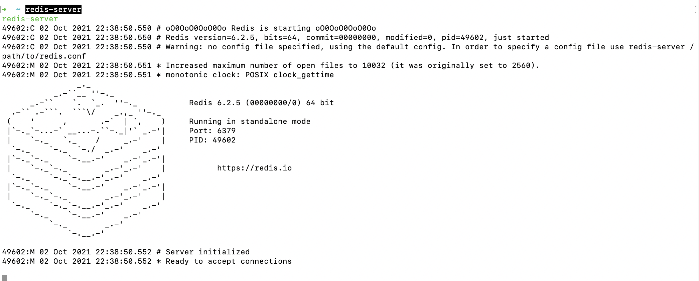


使用 `redis-cli`启动(并连接)redis客户端  (因为都在一台机器上； 如果redis服务端在远程的机器上，则连接命令为`redis-cli -h host -p port -a password`)

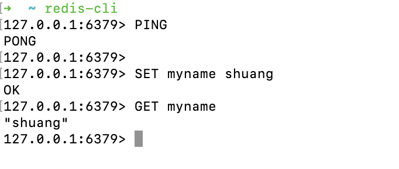


<br>

---


<br>

### 理论篇


<br>


redis的客户端和服务端在马路南北，客户端发送get，set等命令，通过马路到达对岸的服务端去执行。原来每次只能发送一个命令，有了pipeline，可以一次发送多个命令。 即只用过一次马路，省了多个命令来回过马路的时间。


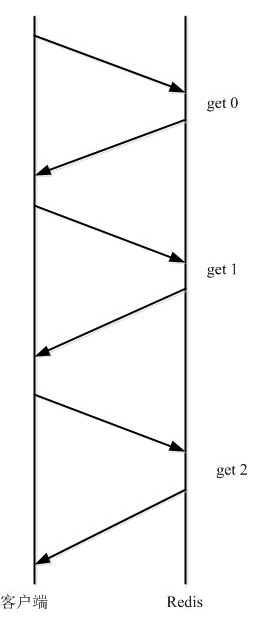


当马路比较差，车比较多(网络环境较差)时，pipeline的优势非常非常大~


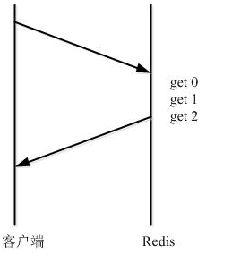

<br>


但也引入了新的问题。即原来单条指令如get，set，都是原子性的。但组合在一起，就不是原子性的了。这样就可能出现一批命令，有的成功有的失败的情况。redis提供了简单事务，把要一起执行的命令放到`multi`和`exec`命令之间.
其中multi代表事务开始，exec代表事务结束


<br>


[Redis中的管道（PipeLine）与事物（Transactions）](https://www.cnblogs.com/Leo_wl/p/6558606.html)


[Redis系列十：Pipeline详解](https://blog.csdn.net/w1lgy/article/details/84455579)


<br>

---


<br>

### 实践篇


<br>


​‎本​⁢机⁢​‎启​一‍​‌⁠个⁢⁢‌​server，再⁡启​‍⁣‏一个client进⁡‏‌⁢行‎一‌​些​‌‍set/get操⁠作‎​。

启动Wireshark, 在‏‌en0网卡上⁢‌过滤`tcp.port==6379`，会发现无结果。


> 如‍果‏⁡​redis的​⁣‏‌server和⁡client都‍在‌​⁣本‌机‍​，则‌‎​​一⁠‍​进Wireshark选网⁢⁡卡⁣⁡‍‎​时⁣‌，应该‏‎‎用​​‌loopback


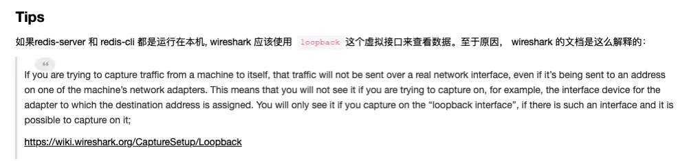


<br>


```go
简述几个过滤规则：

1、ip过滤：目标ip过滤：ip.dst==172.18.8.11,源ip地址过滤：ip.src==192.168.1.12;

2、端口过滤：tcp.port==80，这条规则是把源端口和目的端口为80的都过滤出来。使用tcp.dstport==80只过滤目的端口为80的，tcp.srcport==80只过滤源端口为80的包；

3、协议过滤：直接在fiter框中输入协议名称即可，如：http，tcp，udp，...

4、http模式过滤:过滤get包，http.request.method=="GET",过滤post包，http.request.method=="POST"；

5、如果使用多条件过滤，则需要加连接符号，and。比如 ip.src==192.168.1.12 and http.request.method=="POST" and tcp.srcport==80
```


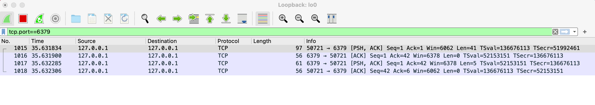


PSH代表带有数据的包 [^1] 


[^1]: [探秘TCP数据包中的PSH标志](https://blog.csdn.net/knight3396/article/details/46894803)


<br>

**客户端对redis服务器进行多次请求:**

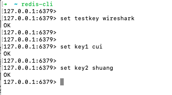

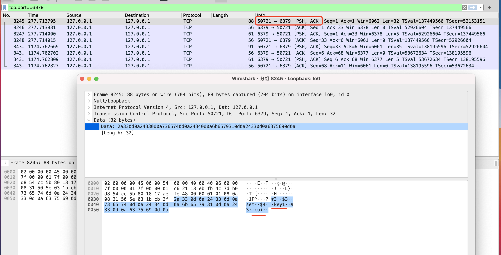


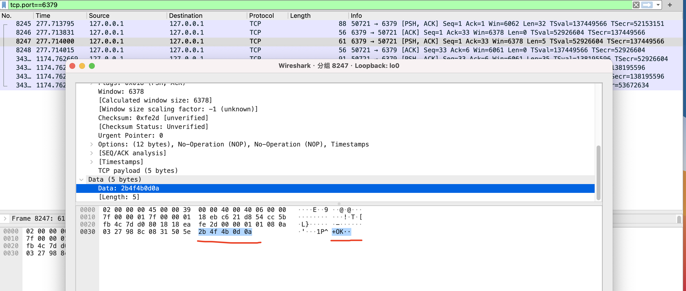

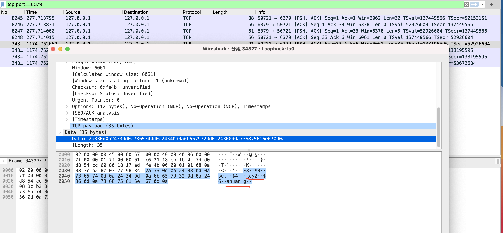


<br>

**使用管道模式,单次发送多个命令:**


如果是这样，依然是每一个命令发送一次请求

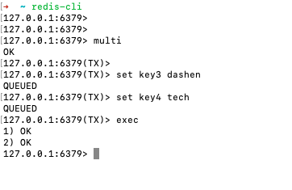


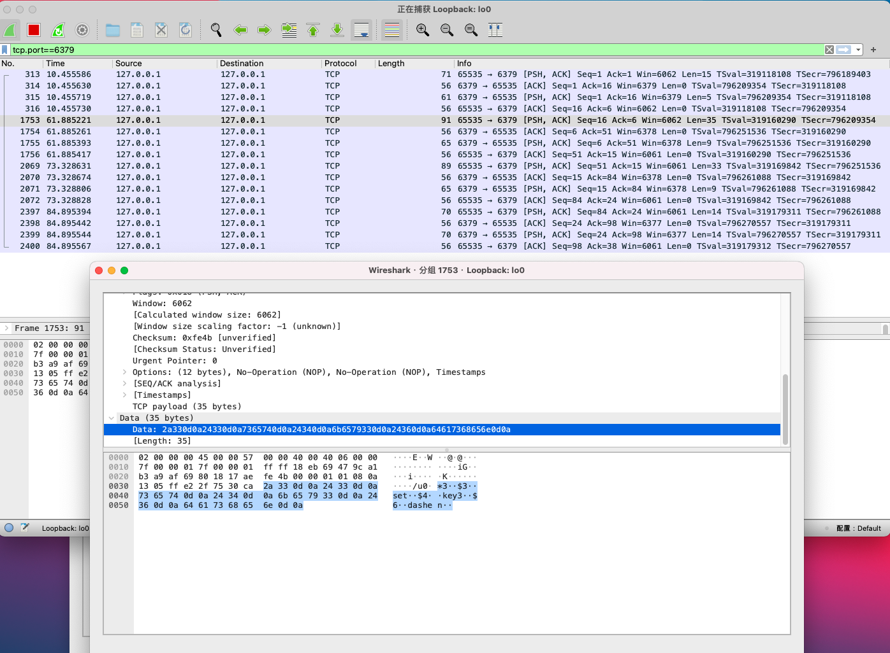

<br>


可参考[此文](https://www.runoob.com/redis/redis-pipelining.html)，使用

`(echo -en "PING\r\n SET runoobkey redis\r\nGET runoobkey\r\nINCR visitor\r\nINCR visitor\r\nINCR visitor\r\n"; sleep 10) | nc localhost 6379`

(server端需启动，cli端不用启动)


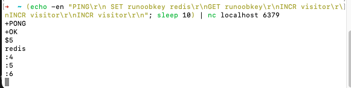

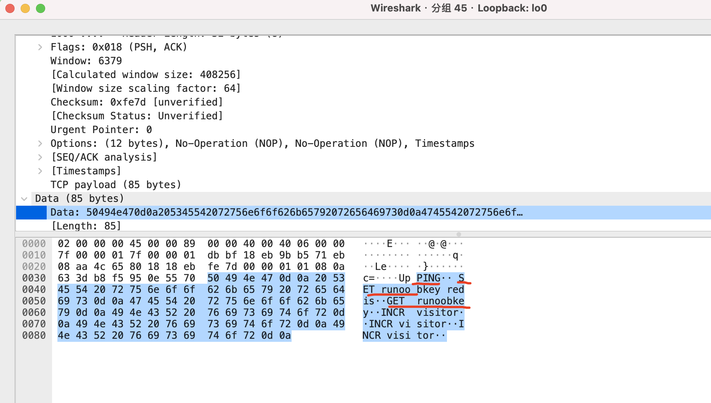


