### <font color="DarkOrchid">分页查询问题</font>

<br>

user表 有300多万行记录,现在想要获取从 第300万起之后的50行,如果直接

```sql
select * from `user` limit 3000000,50
```

需用时近4s

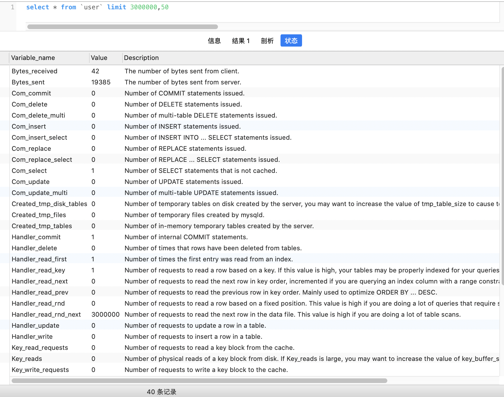

<br>

而改用如下写法:

```sql
select * from `user` where id >= (SELECT id FROM `user` WHERE id LIMIT 3000000,1) LIMIT 50
```

用时1s


<br>


[这是许多年前,小菜鸟 爽哥第一次出去面试,遇到的一个还算比较有质量的问题](https://note.youdao.com/web/#/file/WEB430adb09933e2f84622f0394c5cf2c66/note/WEB40385a2f9a36b5acf09e2976366c2a42/?search=where)


---

<br>

#### <font color="CD5B45">limit与offset</font>

<br>
 
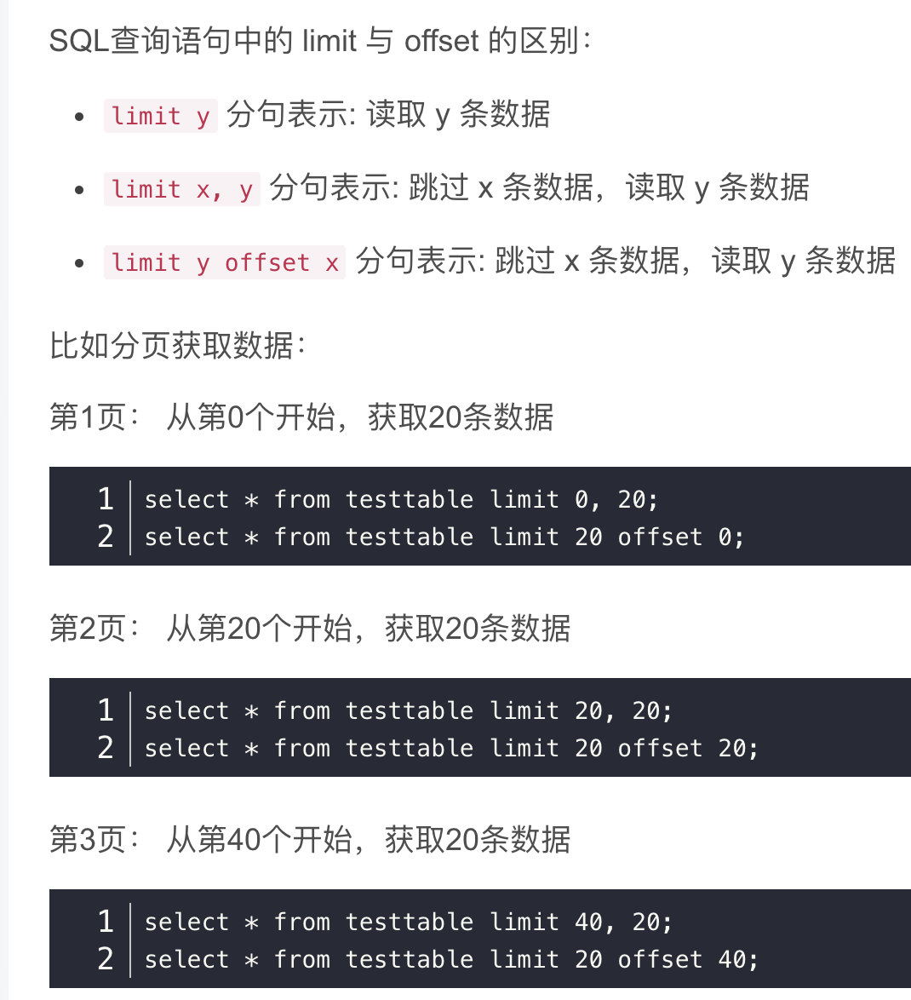


**limit x, y**  表示跳过前x条记录,读取其后的y条数据,等效于  **limit y offset x**


<br>

<HR style="border:1 dashed #987cb9" width="100%" color=DeepSkyBlue SIZE=1>

<br>


### <font color="DarkOrchid">left join之后记录数 是变多还是变少?</font>

<br>


**left join就是以当前from的这张表为主表,右表对其进行关联;<br>
right join是当前from的这张表为辅表,对右表进行关联**

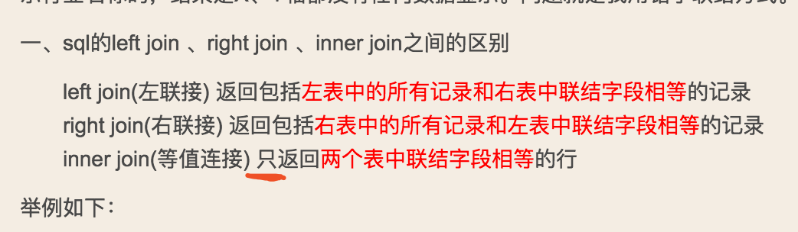


<br>

两张表关联,<br>
如果关联的字段是一对一,不可能出现记录变多的情况;<br>
如果关联字段是一对多, `left join`后一定会变多.

<br>

以left join为例，<br>
如果左表（即主表）和右表为一对多，则关联得到的新表的记录数一定多于左表即主表；<br>
如果是多对一，则得到的新表的记录数与左表即主表记录数相同<br>
（仅指初步关联后的，尚且不带where条件的原始新表）


<br>

<font size=1>

另:
*join*等同于*inner join*,<br>
mysql中没有*full join*

</font>

<br>

[sql解冻必看](https://note.youdao.com/web/#/file/recent/note/WEB4d601ea68c03988f7c667d5ef7584e93/?search=left%20join)

[数据库大神之路](https://note.youdao.com/web/#/file/WEBd29493c0a8462a14103bc06cddcbeb76/note/WEB2d41d5bb8daaecc1b1180d1c2fcfd25a/)

<br>

<HR style="border:1 dashed #987cb9" width="100%" color=DeepSkyBlue SIZE=1>


<br>


### <font color="DarkOrchid">group by一个字段和多个字段,哪个得到的记录数多?</font>

<br>

**group by** a字段, 即以a字段为纲,把那些和a字段相同的行记录 合为一行;

**group by** a,b字段, 是以(a,b)为纲,把那些和(a,b)相同的行记录 合为一行;

<br>

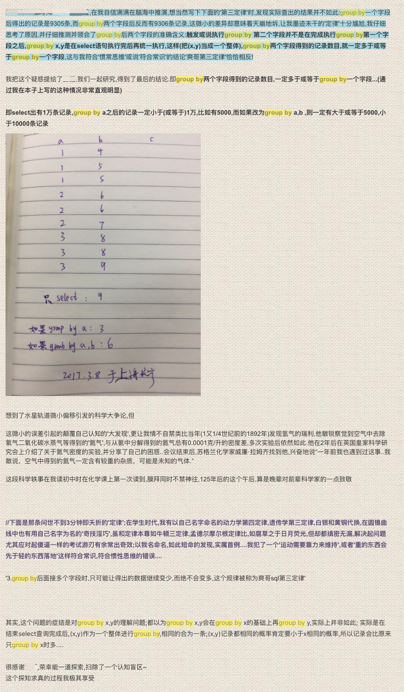


参见上图,当年研究的明明白白.


<br>

*举例加深印象:*

1. 有一张姓名和户籍表,共10000行记录. 因为有重名现象存在,执行*group by `name`*,即把姓名相同的人合为一行, 所以得到的结果,肯定小于等于10000,也许只有7000;

2. 而如果是多个字段, 如*group by `name`,province*,则是把*姓名和省份*都相同的合为一行,相当于条件更苛刻了(比如有两个张三,一个山东,一个广西,那这两条无法合为一行了),能合为一行的数量变少,故而得到的记录数比1这种条件会多,会大于等于7000,小于等于10000.

<br>


[峥嵘岁月](https://note.youdao.com/web/#/file/recent/note/WEBa796435662e713528d76ffcf85dae11a/?search=group%20by)

---


<br>

#### <font color="CD5B45">借助count(1), 可将按某个字段*group by*后的分组的数量, 由高到低进行排序</font>

<br>

如有 一张订单表如下, 现想获取每个用户的下单数量,并按由高到低排序

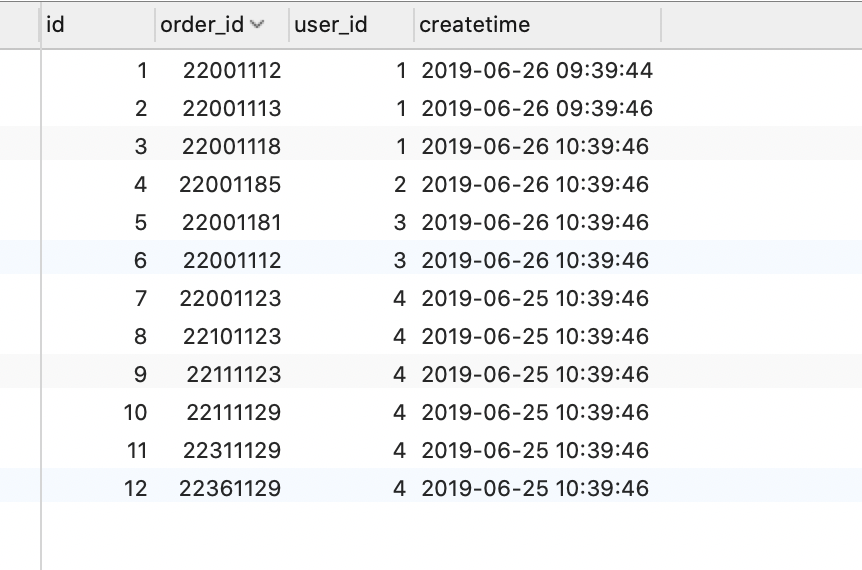

<br>

```sql
select user_id as "用户",count(1) as "下单次数" from ali_order group by user_id order by count(1) desc
```

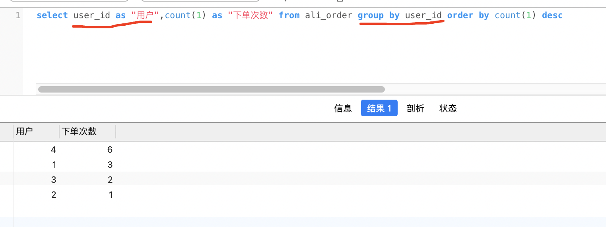


含有`group by`子句的sql,  *select* 后面可以出现各种聚合函数(如count,sum,max,min,avg等);  如果*select*后出现了表中的某个字段,只能是*group by*后面的字段,其他字段会报错

<br>


<HR style="border:1 dashed #987cb9" width="100%" color=DeepSkyBlue SIZE=1>


<br>

### <font color="DarkOrchid">以下内容供参考:</font>

<br>


#### <font color="CD5B45">主键(或唯一索引键/唯一的联合索引键)重复相关</font>

<br>

参见 [有则更新,无则插入](https://dashen.tech/2015/08/20/%E6%9C%89%E5%88%99%E6%9B%B4%E6%96%B0-%E6%97%A0%E5%88%99%E6%8F%92%E5%85%A5/)

<br>

---

<br>

#### <font color="CD5B45">带条件的update语句</font>

<br>

有这样一个场景, 用户参加活动,可以获得抽奖机会.可以多次参与活动获得抽奖机会,但总数量不能超过设定的一个值(如为33,该值运营可能会调整).

用户A参加活动,获得了一些抽奖机会. 之后该用户又参加活动,又获取了一些抽奖机会(如为20),现需要更新其抽奖机会字段. 在不获取其现有抽奖机会的前提下,可以一条update语句实现更新,且不会超过总数

<br>

```sql
update 表 set drawCnt = case when (drawCnt + 20 > 33) then 33 else drawCnt + 20 end

where uid = xxxxx 

```

<br>

一些不讲求性能的场景可以这样写. 但大多数情况下,在项目中应避免复杂sql


<br>

---

<br>

#### <font color="CD5B45">union和union all</font>

<br>

用于两张或多张表之间的(竖直)连接.

<br>

**union all**只是简单的拼在一起,如果两张表数据没啥重复,用**union all**性能更好<br>

**union**在此基础上,还会进行排序,去重等操作;

<br>

只要几张表字段数一致且数据类型一致即可,不需要名字也一样, 后面的表会用第一张表的字段名


有如下三张表:

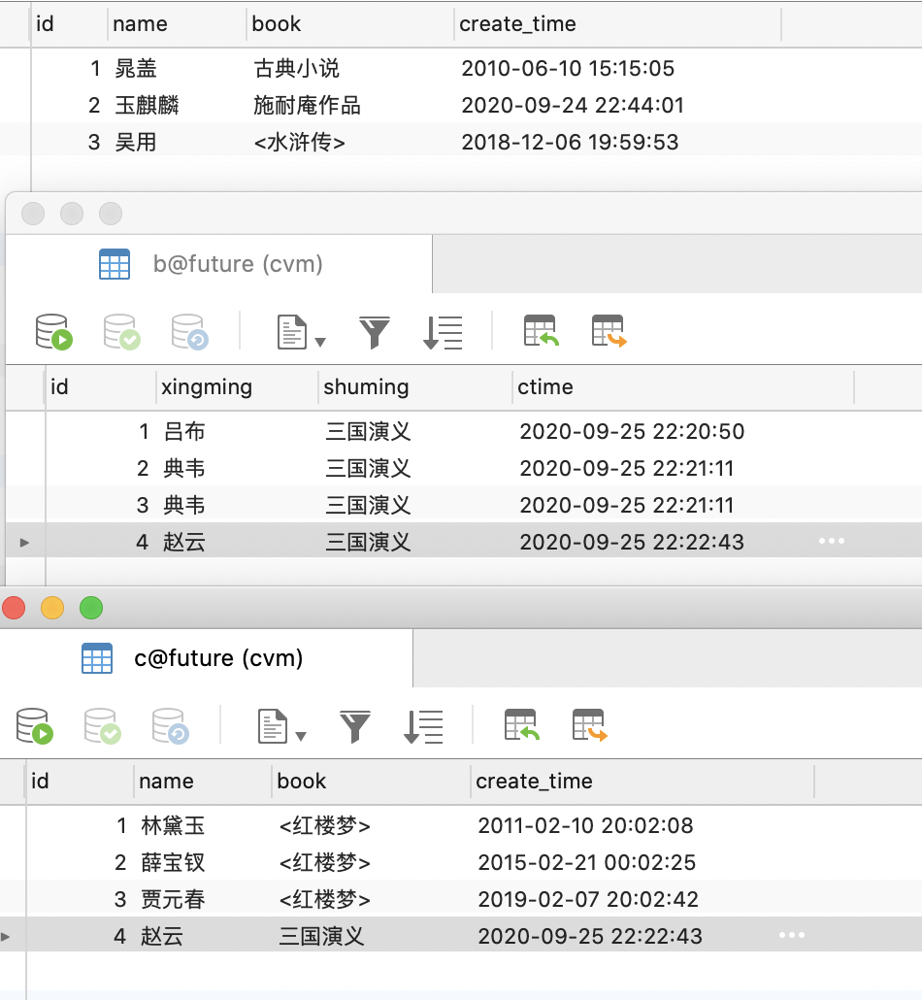


如果执行

```sql
select * from a 

union all 

select * from b

union all 

select * from c
```

结果如下:

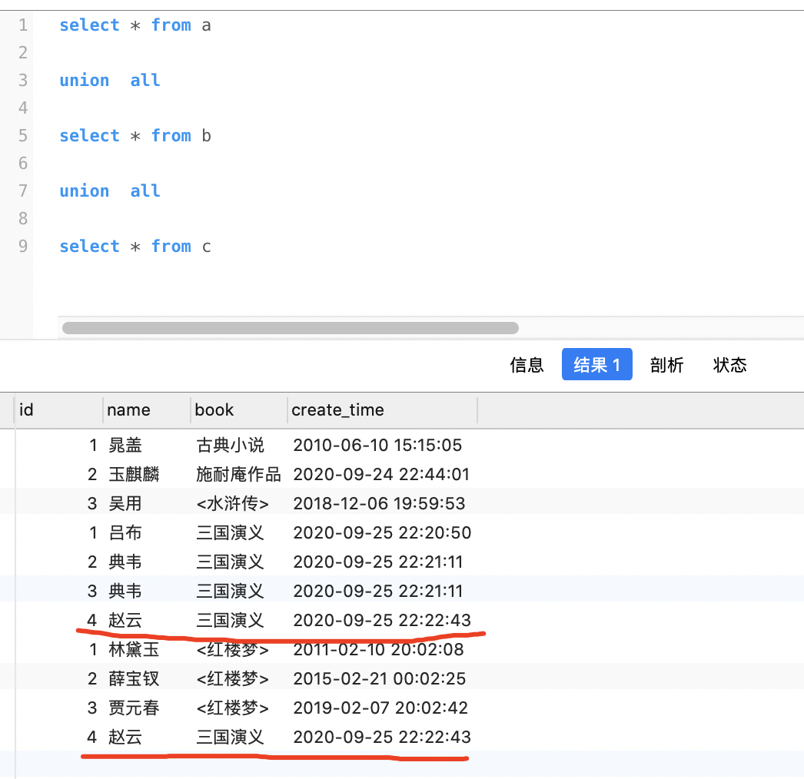

<br>

而如果用**union**,则

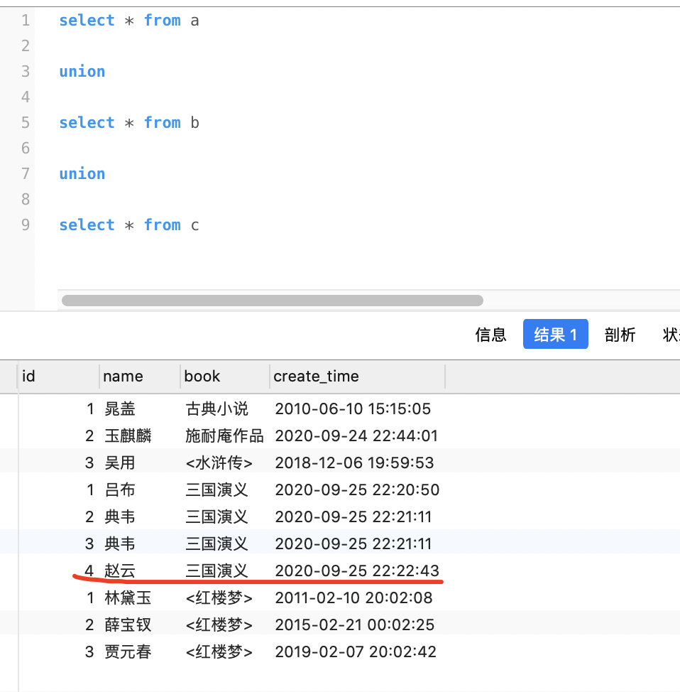


可见在使用*union*进行多表连接时,对于同一张表中 完全相同的字段(如表b中的典韦),不会进行去重, 对于不同表中 值 **完全**相同的字段,则会进行去重(如表b和表c中的赵云,最后只保留了表b中的记录).


<br>

---

<br>

#### <font color="CD5B45">根据时间段分组</font>

<br>


按小时分组,统计每个小时段内的数据


```sql
SELECT
	count(123),
	date_format(ctime,'%Y-%m-%d %H') as time
FROM
	t1 
WHERE
	xxx = 3 
GROUP BY
	time 
ORDER BY
	count(123) DESC

```

<br>


参考:

[MYSQL按时间段(按小时分组)分组查询当天小时内数据](https://blog.csdn.net/zuihongyan518/article/details/93980085)

<br>


---

<br>

#### <font color="CD5B45">有用的时间计算</font>

<br>


1. 计算两个日期之间相隔的天数

`SELECT DATEDIFF("2021-06-09","2020-08-11") AS "进站时长"`

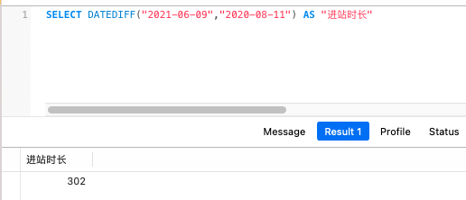


<br>

2. 计算某个日期 过一些天后 的日期

`SELECT DATE_ADD("2020-08-11",INTERVAL 1000 day) AS "进站1000天"`

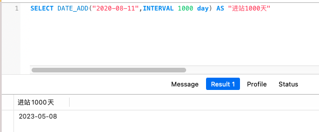


