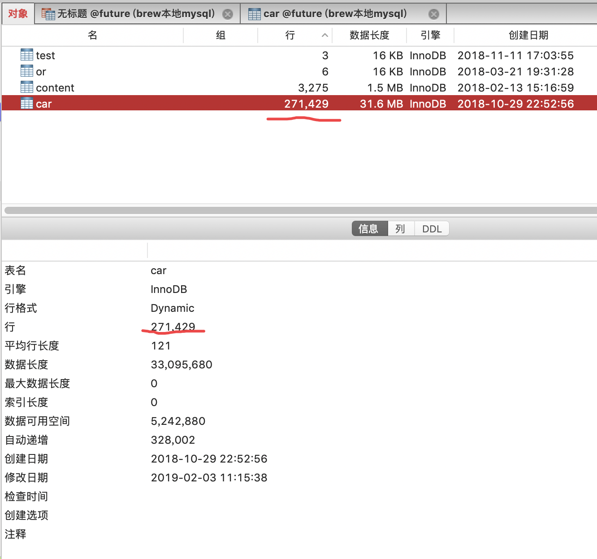
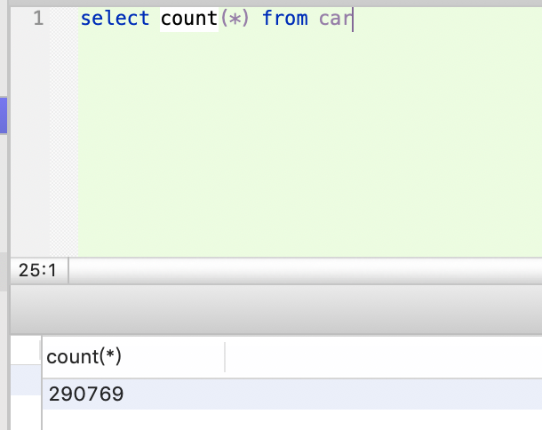

> 那为什么InnoDB不跟MyISAM一样，也把数字存起来呢？

> 这是因为即使是在同一个时刻的多个查询，由于多版本并发控制（MVCC）的原因，InnoDB表“应该返回多少行”也是不确定的

[count(*)这么慢，我该怎么办？](http://mysql.dashen.tech/mysql45/14.count%28%C3%97%29%E8%BF%99%E4%B9%88%E6%85%A2%EF%BC%8C%E6%88%91%E8%AF%A5%E6%80%8E%E4%B9%88%E5%8A%9E%EF%BC%9F.html)

## 高性能MySQL——Count(1) OR Count(*)？

  

 - 如果问一个程序员MySQL中SELECT COUNT(1)和SELECT COUNT(`*`)有什么区别，会有很多人给出这样的答案“SELECT COUNT(`*`)”最终会转化成“SELECT COUNT(1)，而SELECT COUNT(1)省略了转换的这一步，所以SELECT COUNT(1)效率更高“，甚至有一些面试官也会给出类似的答案。最近在看一些历史遗留代码，绝大多数统计数量的SQL都在用SELECT COUNT(1)，觉得有必要搞清楚这个问题。
 
 首先，以我们最常见的两种数据库表引擎MyISAM和Innodb来讲。

  

 可先参阅:[MySQL查看修改存储引擎总结](https://www.cnblogs.com/kerrycode/p/6571868.html)

 ### MyISAM

  

 MyISAM在统计表的总行数的时候会很快，但是有个大前提，**不能加有任何WHERE条件**。这是因为：MyISAM对于表的行数做了优化，具体做法是有一个变量存储了表的行数，如果查询条件没有WHERE条件则是查询表中一共有多少条数据，MyISAM可以做到迅速返回，所以也解释了如果加WHERE条件，则该优化就不起作用了。细心的同学会发现，innodb的表也有这么一个存储了表行数的变量，但是很遗憾这个值是一个估计值，没有什么实际意义。
 
  

 
 **Innodb的这个行数并不准确**
 
 
 
 
 ### Innodb&原理
 
 如果该表只有一个主键索引，没有任何二级索引的情况下，那么COUNT(`*`)通过主键索引来统计行数。如果该表有二级索引，则COUNT(`*`)会通过占用空间最小的字段的二级索引进行统计 .
 
目前基于磁盘的数据库或者搜索引擎（比如Lucene）的性能瓶颈主要都是在IO阶段，相比于CPU和RAM，IO操作实在太慢了，所以这类系统的优化方向也都都是类似的——尽一切可能减少IO的次数（所以很多用ES的程序在性能优化到极限的时候选择直接上SSD）。这里统计行数的操作，查询优化器的优化方向就是选择能够让IO次数最少的索引，也就是基于占用空间最小的字段所建的索引（每次IO读取的数据量是固定的，索引占用的空间越小所需的IO次数也就越少）。而Innodb的主键索引是聚簇索引（包含了KEY，除了KEY之外的其他字段值，事务ID和MVCC回滚指针）所以主键索引一定会比二级索引（包含KEY和对应的主键ID）大，也就是说在有二级索引的情况下，一般COUNT()都不会通过主键索引来统计行数，在有多个二级索引的情况下选择占用空间最小的。
     
如果说有张Innodb的表只有主键索引，而且记录还比较大（比如30K），则统计行的操作会非常慢，因为IO次数会很多（这里就不做实验截图了，有兴趣可以自己试一下）。一个优化方案就是预先建一个小字段并建二级索引专门用来统计行数，极端情况下这种优化速度提高上千倍也是正常的。