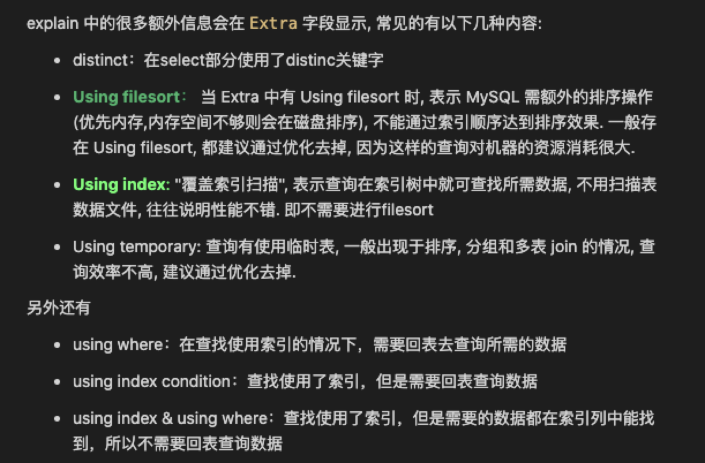
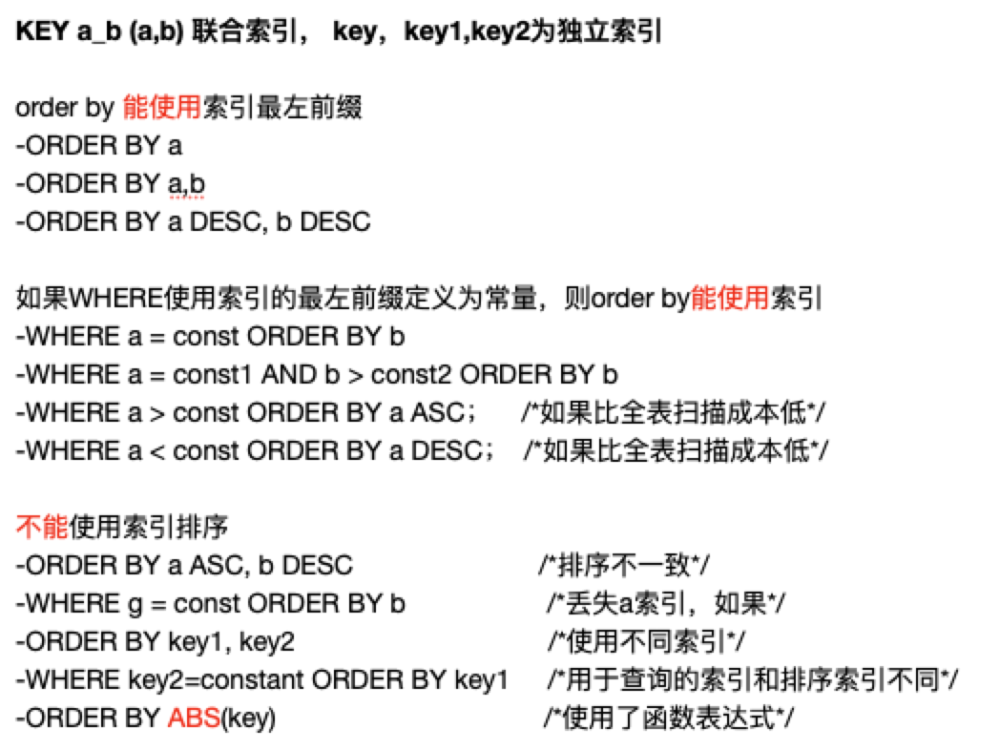
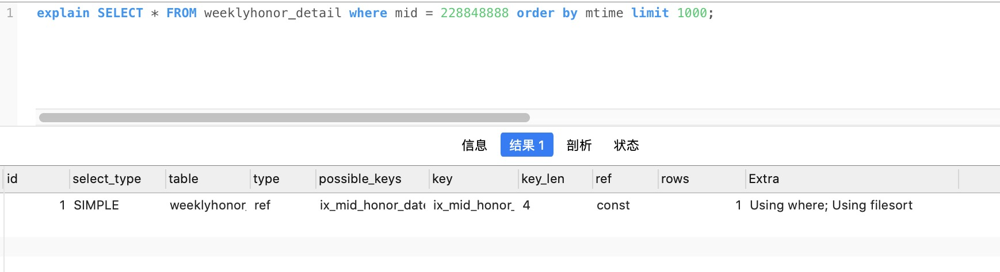
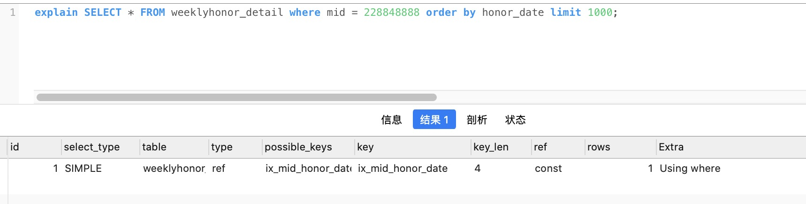
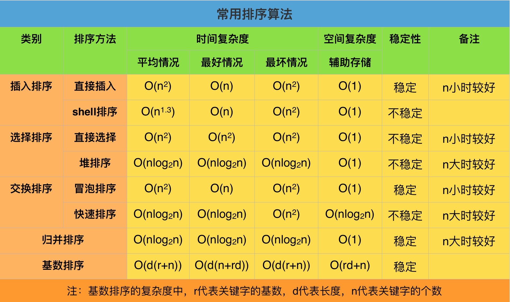
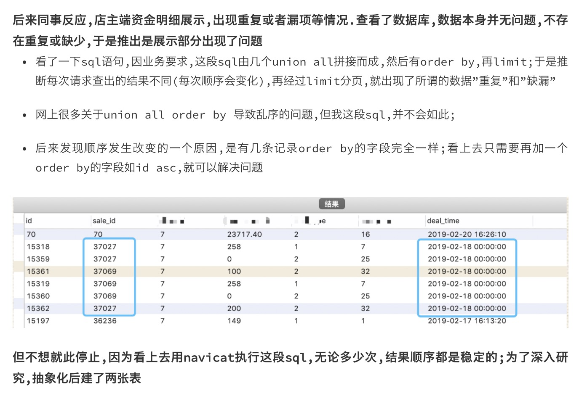
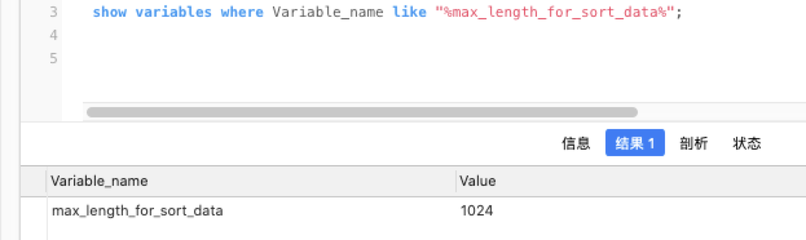
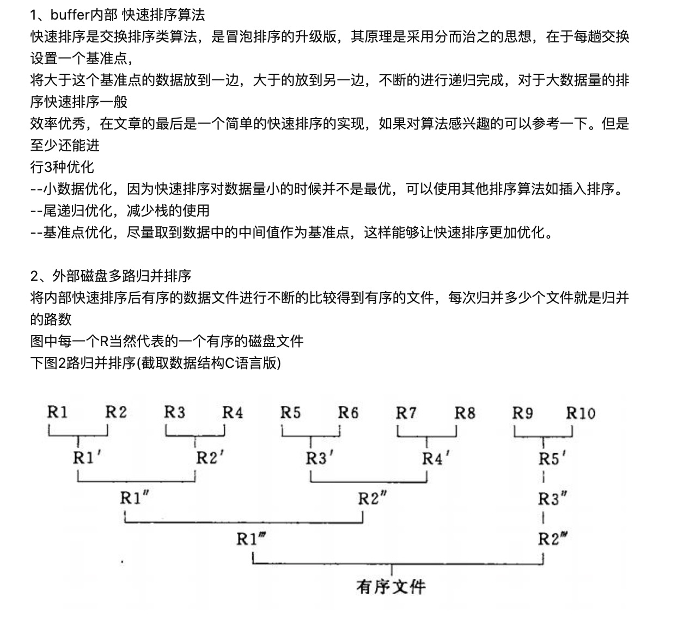
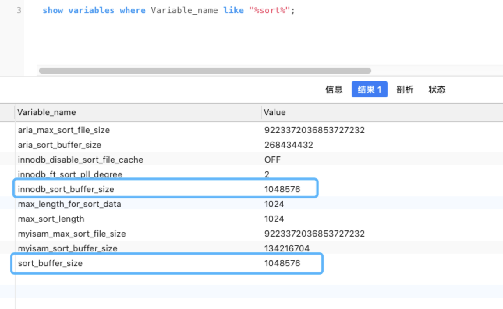

*本篇博客在B站做了内部分享,标题为「排序相关问题」*


MySQL的ORDER BY有两种排序实现方式：

1. 利用有序索引获取有序数据
2. (不得不进行)文件排序


在explain中分析时，利用有序索引获取有序数据显示**Using index**，文件排序显示**Using filesort**。





<br>

---


<br>


## <font color="orange">1. 能够 利用有序索引获取有序数据 的条件比较苛刻</font>


<br>


**以下几种优化方式,可能使order by利用到索引,而无需进行filesort：**


```sql
1、ORDER BY的索引优化。如果一个SQL语句形如：
SELECT [column1],[column2],…. FROM [TABLE] ORDER BY [sort];
在[sort]这个栏位上建立索引就可以实现利用索引进行order by 优化。
 
2、WHERE + ORDER BY的索引优化，形如：
SELECT [column1],[column2],…. FROM [TABLE] WHERE [columnX] = [value] ORDER BY [sort];
建立一个联合索引(columnX,sort)来实现order by 优化。
 
注意：如果columnX对应多个值，如下面语句就无法利用索引来实现order by的优化
SELECT [column1],[column2],…. FROM [TABLE] WHERE [columnX] IN ([value1],[value2],…) ORDER BY[sort];
 
3、WHERE+ 多个字段ORDER BY
SELECT * FROM [table] WHERE uid=1 ORDER x,y LIMIT 0,10;
建立索引(uid,x,y)实现order by的优化,比建立(x,y,uid)索引效果要好得多。
```





<font size=3>Order By不能使用索引来优化排序的情况:</font>

- 对不同的索引键做 ORDER BY ：(key1,key2分别建立索引)

&nbsp;&nbsp;&nbsp;&nbsp;&nbsp;&nbsp;`SELECT * FROM t1 ORDER BY key1, key2;`

- 在非连续的索引键部分上做 ORDER BY：(key_part1,key_part2建立联合索引;key2建立索引)

&nbsp;&nbsp;&nbsp;&nbsp;&nbsp;&nbsp;`SELECT * FROM t1 WHERE key2=constant ORDER BY key_part2;`

- 同时使用了 ASC 和 DESC：(key_part1,key_part2建立联合索引)

&nbsp;&nbsp;&nbsp;&nbsp;&nbsp;&nbsp;`SELECT * FROM t1 ORDER BY key_part1 DESC, key_part2 ASC;`

- 用于搜索记录的索引键和做 ORDER BY 的不是同一个：(key1,key2分别建立索引)

&nbsp;&nbsp;&nbsp;&nbsp;&nbsp;&nbsp;`SELECT * FROM t1 WHERE key2=constant ORDER BY key1;`

- 如果在WHERE和ORDER BY的栏位上应用表达式(函数)时，则无法利用索引来实现order by的优化

&nbsp;&nbsp;&nbsp;&nbsp;&nbsp;&nbsp;`SELECT * FROM t1 ORDER BY YEAR(logindate) LIMIT 0,10;`


```sql
CREATE TABLE `weekxxxxxnor_detail` (
  `id` int(11) unsigned NOT NULL AUTO_INCREMENT COMMENT '主键id',
  `mid` int(11) NOT NULL DEFAULT '0' COMMENT '用户ID',
  `hid` int(11) NOT NULL DEFAULT '0' COMMENT '荣誉ID',
  `word` varchar(10) NOT NULL DEFAULT '' COMMENT '字',
  `text` varchar(20) NOT NULL DEFAULT '' COMMENT '文案',
  `description` varchar(40) NOT NULL DEFAULT '' COMMENT '说明',
  `xxxxx_date` date NOT NULL DEFAULT '0000-00-00' COMMENT 'xx生成日期(每周日)',
  `ctime` timestamp NOT NULL DEFAULT CURRENT_TIMESTAMP COMMENT '创建时间',
  `mtime` timestamp NOT NULL DEFAULT CURRENT_TIMESTAMP ON UPDATE CURRENT_TIMESTAMP COMMENT '更新时间',
  PRIMARY KEY (`id`),
  KEY `ix_mtime` (`mtime`),
  KEY `ix_mid_honor_date` (`mid`,`honor_date`)
) ENGINE=InnoDB AUTO_INCREMENT=149628474 DEFAULT CHARSET=utf8 COMMENT='xxxxxx详情记录'


详细参见 https://note.youdao.com/web/#/file/WEB00c9fc9e542b90ea18d0c3cc53e74d96/note/WEBcb79302cc9f9cadb9d543963f9793baf/

搜索 ENGINE=InnoDB AUTO_INCREMENT=149628474 DEFAULT CHARSET=utf8 COMMENT=

```








<br>

---


<br>


## <font color="orange">2. filesort</font>


<br>


### <font color="33ccff">2.1 在内存中可能用 堆排序或快速排序，</font>


<br>


**具体使用哪一种排序方式是优化器决定的，基本原则如下**

快速排序算法：大量排序</br>
堆排序算法：排序量不大


快速排序和堆排序都是不稳定的排序算法，对于重复值不能保证顺序。这就是Order by排序可能会不稳定的原因





之前遇到的坑：





<br>


#### <font color="33ccff">2.1.1 在把数据加载到BUFFER内部时有两种方式：</font>


<br>


- 双路排序：(rowid排序/二次访问排序/回表排序模式)

> 首先根据相应的条件取出相应的排序字段和可以直接定位行数据的行指针信息，然后在sort buffer 中进行排序。排序后再把查询字段依照行指针取出，共执行两次磁盘io。

- 单路排序：MySQL4.1之后新增(全字段排序/一次访问排序)

> 一次性取出满足条件行的所有字段，然后在sort buffer中进行排序。 执行一次磁盘io。代价是对内存占用大


<br>


使用哪种方式，取决于设定的系统参数**max_length_for_sort_data(默认为1K)** 和Query 语句所取出的**字段<font color="red">类型</font>大小总和**的大小关系， 来判定是使用双路排序还是单路排序。

如果单行的长度超过**max_length_for_sort_data的值**，MySQL就认为单行太大，使用双路排序方式；

如果 **max_length_for_sort_data**更大，则使用第二种优化后的算法。

<br>

所以如果希望 ORDER BY 操作的效率尽可能的高，一定要注意max_length_for_sort_data 参数的设置。





<br>


### <font color="33ccff">2.2 在外部使用多路归并排序算法：</font>


<br>





<br>


### <font color="33ccff">2.3 整个filesort的过程如下:</font>


<br>


（1）根据表的索引或者全表扫描，读取所有满足条件的记录。

（2）对于每一行，存储一对值到缓冲区（排序列和行记录指针，或者是排序列和查询需要的所有列），缓冲区的大小为sort_buffer_size大小(默认为1M)。

（3）当缓冲区满后，运行一个快速排序（qsort； 数据量不大时也可能用堆排序）来将缓冲区中数据排序，并将排序完的数据存储到一个临时文件，并保存一个存储块的指针，当然如果缓冲区不满，则不会重建临时文件了。

（4）重复以上步骤，直到将所有行读完，并建立相应的有序的临时文件。

（5）对块级进行排序，使用归并排序算法，通过对几个临时文件的指针来不断交换数据，最终达到几个文件，都是有序的。

（6）重复5直到所有的数据都排序完毕。

（7）采取顺序读的方式，将每行数据读入内存（这里读取数据时并不是一行一行读），并取出数据传到客户端，读取缓存大小由read_rnd_buffer_size来指定。





<br>


### <font color="33ccff">2.4 对比Go中排序算法的实现：</font>


<br>


参考：

https://dev.mysql.com/doc/refman/5.7/en/order-by-optimization.html#order-by-filesort-in-memory


