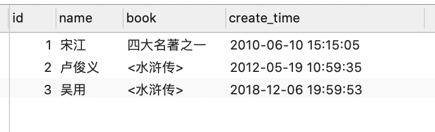
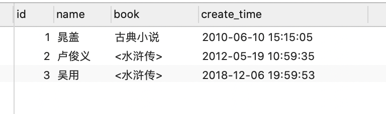
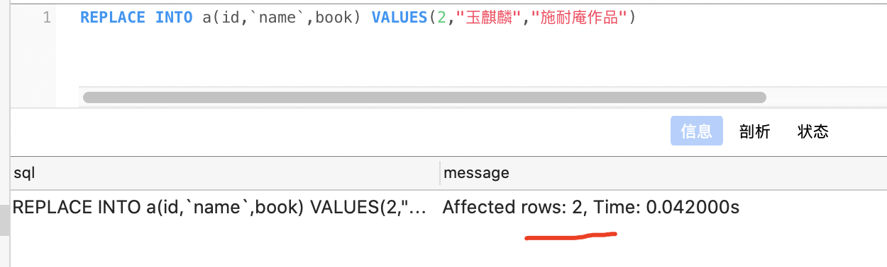
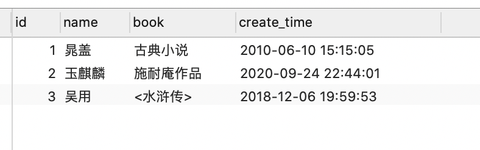
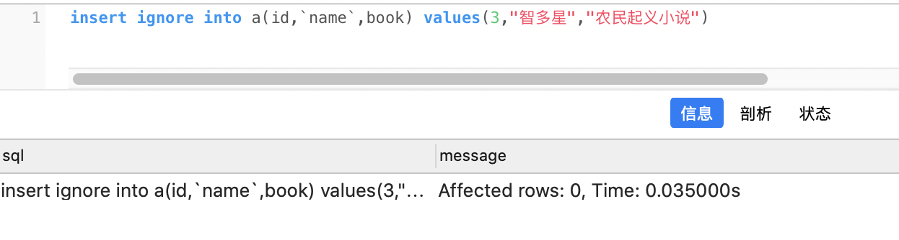
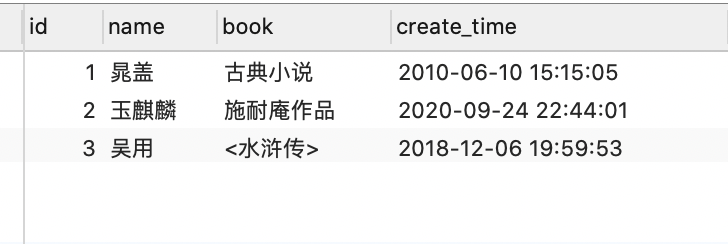

```sql
SET NAMES utf8mb4;
SET FOREIGN_KEY_CHECKS = 0;

-- ----------------------------
-- Table structure for a
-- ----------------------------
DROP TABLE IF EXISTS `a`;
CREATE TABLE `a` (
  `id` int(11) NOT NULL AUTO_INCREMENT,
  `name` varchar(255) DEFAULT '',
  `book` varchar(255) DEFAULT NULL,
  `create_time` datetime DEFAULT CURRENT_TIMESTAMP,
  PRIMARY KEY (`id`)
) ENGINE=InnoDB AUTO_INCREMENT=4 DEFAULT CHARSET=utf8;

-- ----------------------------
-- Records of a
-- ----------------------------
BEGIN;
INSERT INTO `a` VALUES (1, '宋江', '<水浒传>', '2010-06-10 15:15:05');
INSERT INTO `a` VALUES (2, '卢俊义', '<水浒传>', '2012-05-19 10:59:35');
INSERT INTO `a` VALUES (3, '吴用', '<水浒传>', '2018-12-06 19:59:53');
COMMIT;
```


<br>


### <font color="DarkOrchid">有则更新，无则插入</font>


<br>


```sql
insert into t1 (字段1,字段2,字段3) values (值1,值2,值3) 
on duplicate key update 字段2=values(字段2)
```


存在重复主键(或唯一索引/联合索引)则更新，不存在则插入。


即 如果在更新某条数据时, 发现要更新的某个(或联合索引下的多个)字段,已经和现有数据的对应字段重复,且该字段需要唯一,则只更新 `on duplicate key update`后的字段为本条sql想要更新的value.; 否则就正常insert插入.

<br>

如:

```sql
INSERT INTO a ( id, `name`, book, create_time )
VALUES
	( 1, '晁盖', '四大名著之一', '2020-10-10 21:15:05' ) 
  on duplicate key update book = values(book);
```

此时不会报 **1062 - Duplicate entry '1' for key 'PRIMARY', Time: 0.036000s**, 而可以成功更新*update*后的book字段:




<br>


如果想更新多个字段,则可用逗号分隔,

```sql
INSERT INTO a ( id, `name`, book, create_time )
VALUES
	( 1, '晁盖', '古典小说', '2020-10-10 21:15:05' ) 
   on duplicate key update book = values(book),`name` = values(`name`)

```



<br>


该方法更常用于 某张表的几个字段建了一个联合索引, 如 成绩表的学生姓名和学科两个字段,合在一起必须唯一. 现在又拿到一批成绩单,可以用这种方式.当"姓名-学科"已存在时,只更新成绩字段;否则正常写入一条新纪录.

<br>

<font size=1>
查看某张表的索引信息

`show index from t1`
</font>


---

<br>

### <font color="DarkOrchid">有则替换</font>

<br>


```sql
REPLACE INTO a(id,`name`,book) VALUES(2,"玉麒麟","施耐庵作品")
```


使用*Replace*插入一条记录时, 如果不存在重复的唯一键, 则*Replace*和*Insert*功能相同; 如有重复的唯一键, *Replace*会使用新记录的值来替换原来的记录值;





即*REPLACE*将*Delete*和*Insert*合二为一,形成一个原子操作;这样就可以不必考虑在同时使用Delete和Insert时添加事务等复杂操作.

在使用*Replace*时, 表中必须有唯一索引, 且这个索引所在的字段不能允许空值,否则*Replace*就和*Insert*完全一样;





执行*Replace*后, 系统返回的是受影响的行数: 如果返回1, 说明在表中没有重复的记录(即相当于insert); 如果返回2, 说明有一条重复记录, 实际会先调用*Delete*删除这条记录,然后再记录用*Insert*来插入这条记录,故而受影响的行数为2.


<br>


---

<br>

### <font color="DarkOrchid">有则忽略</font>

<br>

```sql
insert ignore into a(id,`name`,book) values(3,"智多星","农民起义小说")
```



在*insert*后面增加**ignore**后,存在冲突 唯一键 时,将会忽略本次更新,直接不会进行写入.




<br>

---


参考:

[insert...on duplicate key update语法详解](https://blog.csdn.net/ZYC88888/article/details/104250372)

[mysql使用笔记：有则更新，无则插入](https://blog.51cto.com/qtlinux/1712717)


