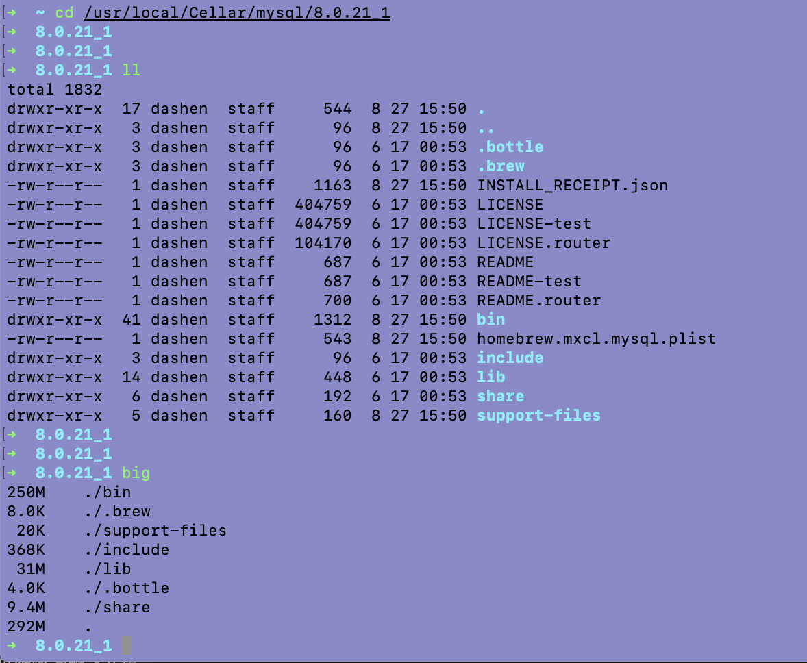

导出sql文件时,表记录多的对应的sql文件体积也大. 但查看mysql的安装目录,只有区区几百兆,

 

那mysql将这些数据文件存到了什么位置?

 

执行:

> show global variables like "%datadir%";

 

---

在 [InnoDB一棵B+树,可以存放多少行数据](https://dashen.tech/2019/07/29/InnoDB%E4%B8%80%E6%A3%B5B-%E6%A0%91-%E5%8F%AF%E4%BB%A5%E5%AD%98%E6%94%BE%E5%A4%9A%E5%B0%91%E8%A1%8C%E6%95%B0%E6%8D%AE/)中,提到了使用 **hexdump**命令, 在此深入研究,探究Innodb存储引擎

