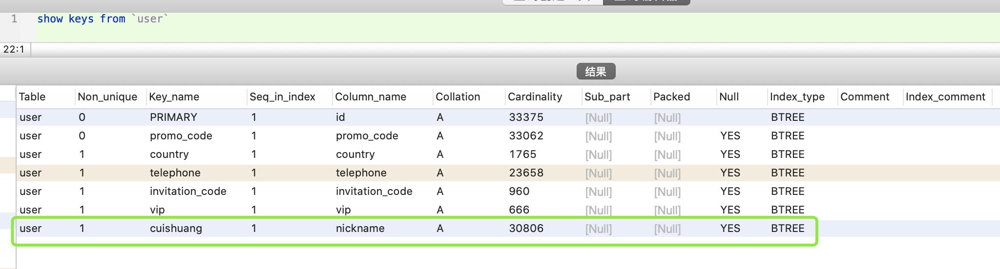
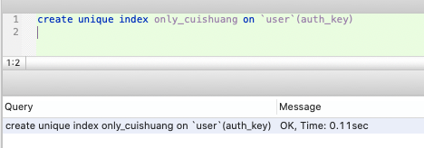
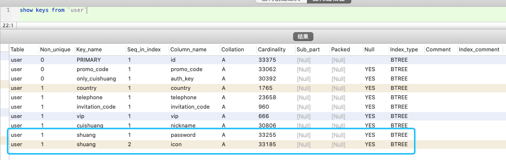

<br>

配合此工具体验更佳:

[查看数据库字段&索引简明信息的工具](http://www.dashen.tech/2017/03/14/%E6%9F%A5%E7%9C%8B%E6%95%B0%E6%8D%AE%E5%BA%93%E5%AD%97%E6%AE%B5-%E7%B4%A2%E5%BC%95%E7%AE%80%E6%98%8E%E4%BF%A1%E6%81%AF%E7%9A%84%E5%B7%A5%E5%85%B7/)

---


### <font color="blue">简介&优缺点</font>

> MySQL索引的建立对于MySQL的高效运行是很重要的，索引可以大大提高MySQL的检索速度。
<br>
打个比方，如果合理的设计且使用索引的MySQL是一辆兰博基尼的话，那么没有设计和使用索引的MySQL就是一个人力三轮车。
<br>
拿汉语字典的目录页（索引）打比方，我们可以按拼音、笔画、偏旁部首等排序的目录（索引）快速查找到需要的字。
<br>
索引分单列索引和组合索引。单列索引，即一个索引只包含单个列，一个表可以有多个单列索引，但这不是组合索引。组合索引，即一个索引包含多个列。
<br>
创建索引时，你需要确保该索引是应用在 SQL 查询语句的条件(一般作为 WHERE 子句的条件)。
<br>
实际上，索引也是一张表，该表保存了主键与索引字段，并指向实体表的记录。
<br>
上面都在说使用索引的好处，但过多的使用索引将会造成滥用。因此索引也会有它的缺点：虽然索引大大提高了查询速度，同时却会降低更新表的速度，如对表进行INSERT、UPDATE和DELETE。因为更新表时，MySQL不仅要保存数据，还要修改和维护索引表的信息。
<br>
建立索引会占用磁盘空间的索引文件。(索引本身也是表，因此会占用存储空间，一般来说，索引表占用的空间的数据表的1.5倍)


参考:

[添加索引](https://www.cnblogs.com/wuer888/p/9552497.html)


---

<br>

### <font color="blue">一些基本操作</font>


<br>

#### <font color="darkgreen">1.查看当前表的索引:</font>


```sql
SELECT * FROM INFORMATION_SCHEMA.STATISTICS
  WHERE table_name = '表名'
  AND table_schema = '库名'
  ```


**各字段的含义:**


或

```sql
show index from 表名;
```

or

```sql
show keys from 表名;
```


或

```sql
desc 表名;
```

(不推荐)


几种不同Key值的含义:

- PRI主键约束；**(主键)**

- UNI唯一约束；**(唯一键)**

- MUL可以重复 **(multiple的简写)**

[关于mysql：SQL键，MUL，PRI和UNI](https://www.codenong.com/5317889/)


<br>


#### <font color="darkgreen">2.创建索引:</font>

<br>

a1. 用`create index` 给某一列创建普通索引

```sql
create index 索引名 on 表名(字段名(长度,可省略))
```




a2. 用`create index` 给某一列创建唯一索引

对于**唯一索引**,索引列的值必须唯一, 但允许有空值. 如果是组合索引,则列值的组合必须唯一.

```sql
create unique index 索引名 on 表名(字段名(长度,可省略))
```

如果该列的值存在重复(且重复的值不是null),则会报错:

```sql
Error : Duplicate entry 'xxxxx' for key 'only_cuishuang'
```


如果该列的值全都不重复,则:




---

<br>

b. 用`alter table`来创建普通索引/唯一索引/主键索引

<br>

```sql
alter table 表名 add index 索引名(字段的列表);
alter table 表名 add unique 索引名 (字段的列表);
alter table 表名 add primary key (字段的列表);
```





- `字段的列表`(column_list)即想要对哪些列添加索引, 多列时各列之间用逗号分隔.

- `索引名`(index_name)可选, 缺省时, MySQL将根据第一个索引列为其赋一个名称.

- 另外, `alter table`允许在单个语句中更改多个表,因此可以在同时创建多个索引.(**不重要**)


<br>

<font color="orange"> 关于**主键索引**和**唯一索引**: </font>

<br>

如同正方形是一种特殊的矩形,主键索引是一种特殊的唯一索引.

- 给某一列创建`唯一索引`,则该列的值除null外,都必须是唯一的(即每一行都各不相同);<br>对于`单列唯一索引`，需要该单列不包含除null以外的重复的值; 对于`多列唯一性索引`, 需要这多个值的组合不重复

- 而`主键索引`,该列必须是唯一的,且不能有null值.


> PRIMARY KEY索引和UNIQUE索引非常类似. 事实上,PRIMARY KEY索引仅是一个名称为`PRIMARY`的UNIQUE索引(且该列无null值)----这也决定一个表只能包含一个PRIMARY KEY, 因为一个表中不可能具有两个同名的索引.


**注意:** 当给某个*看似存在许多null值的列*,建唯一索引时,可能会出现`Duplicate entry '' for key 'phone'`,这并不是上述结论有误,而是这些看似是null的列中,可能有很多是空值. 多个空值是不能建唯一索引的,会报错如上

这时的办法之一是将空值全部改为null.

参考:[mysql 中存在null和空时创建唯一索引的方法](https://blog.csdn.net/pzasdq/article/details/52476354)


<br>


#### <font color="darkgreen">3.删除索引:</font>

a. 用`drop index` 来删除某一列上的索引

```sql
drop index 索引名 on 表名;
```


<br>

b. 用`alter table` 来删除索引

```sql
alter table 表名 drop index 索引名
```


a,b两种方式等效

c. 删除`主键索引`

```sql
alter table 表名 drop primary key;
```


> 一张表只可能有一个`主键索引`,且就叫做`PRIMARY KEY`, 因此不需要也无法指定主键索引的索引名.  &nbsp;&nbsp; ~~如果没有创建PRIMARY KEY索引, 但表具有一个或多个UNIQUE索引, 则执行如上命令, MySQL将删除第一个UNIQUE索引.~~
<br>
<br>
如果表中删除了某列, 则索引会受到影响. 对于多列组合的索引, 如果删除其中的某列, 则该列也会从索引中删除; 如果删除组成索引的所有列,则整个索引将被删除.


因为主键索引所在的id字段设置了自动递增,故而删除时报错.


对某张主键索引所在字段没有设置自动递增的表,执行该命令可将主键索引删除

```sql
CREATE TABLE `my_test` (
  `id` int(11) NOT NULL,
  `name` varchar(255) DEFAULT NULL,
  `createtime` datetime DEFAULT NULL
) ENGINE=InnoDB DEFAULT CHARSET=utf8
```


为该表的name字段添加唯一索引


再执行

```sql
alter table my_test drop primary key
```


报错:
```sql
Error : Can't DROP 'PRIMARY'; check that column/key exists
```

说明 该结论错误
> ~~如果没有创建PRIMARY KEY索引, 但表具有一个或多个UNIQUE索引, 则执行如上命令, MySQL将删除第一个UNIQUE索引.~~


<br>

---


<br>


<br>

### <font color="blue"> 试验开始</font>

<br>

**控制变量:** &nbsp;&nbsp; 有一份user表,结构如下.~~分别存在本地mysql的两个不同库中,其一有3万多行记录,9977856 Byte(约9.5MB),记为S表; 另外一个~~ 有294万行记录,1121976320 Byte(约1070MB)~~,记为B表~~. 分别测试有索引/无索引情况下的查询效率


(上图可忽略)
<br>


```sql
CREATE TABLE `user` (
  `id` int(10) unsigned NOT NULL AUTO_INCREMENT,
  `wx_openid` varchar(80) DEFAULT NULL COMMENT '微信openid',
  `class` int(10) unsigned NOT NULL COMMENT '0学生1老师',
  `vip` bigint(10) unsigned DEFAULT '0' COMMENT '至尊VIP过期时间戳',
  `kdx_id` varchar(40) DEFAULT NULL COMMENT 'kds_id',
  `nickname` varchar(32) DEFAULT NULL COMMENT '昵称',
  `password` varchar(100) DEFAULT NULL,
  `province` int(10) DEFAULT NULL COMMENT '所属省份',
  `city` int(11) DEFAULT NULL COMMENT '所属城市',
  `county` int(11) DEFAULT NULL COMMENT '所属区县',
  `icon` varchar(255) DEFAULT NULL COMMENT '头像',
  `gender` tinyint(1) unsigned DEFAULT '2' COMMENT '性别,0女1男2未知',
  `birthday` date DEFAULT NULL COMMENT '生日',
  `autograph` varchar(800) DEFAULT '' COMMENT '个性签名',
  `telephone` varchar(12) DEFAULT NULL COMMENT '手机号码',
  `amount_coin` double unsigned DEFAULT '0' COMMENT 'S币',
  `invitation_code` varchar(20) DEFAULT NULL COMMENT '邀请码 表示这个客户是其他人推广发展的会员',
  `status` tinyint(1) DEFAULT '0' COMMENT '状态，0正常 1禁用',
  `registered_from` tinyint(1) unsigned DEFAULT NULL COMMENT '注册来源0pc网站 1手机网站 2微信网站 3android 4ios  5.微信小程序',
  `is_delete` tinyint(1) unsigned NOT NULL DEFAULT '0' COMMENT '0未删除1已删除',
  `update_time` int(10) unsigned NOT NULL,
  `create_time` int(10) unsigned NOT NULL,
  `education` varchar(255) DEFAULT NULL COMMENT '最高学历',
  `occupation` varchar(255) DEFAULT NULL COMMENT '职业',
  `auth_key` varchar(255) DEFAULT NULL,
  `gt_cid` varchar(32) DEFAULT NULL COMMENT '个推CID',
  `promo_code` char(20) DEFAULT NULL COMMENT '推广码',
  `name` varchar(40) DEFAULT NULL COMMENT '真实姓名',
  `use_video` int(1) NOT NULL DEFAULT '0' COMMENT '可否使用课程视频 0不可  1可以',
  `use_paper` int(1) NOT NULL DEFAULT '1' COMMENT '可否使用习题功能 0不可  1可以',
  `use_group` int(1) NOT NULL DEFAULT '1' COMMENT '可否使用班级功能 0不可  1可以',
  `grade` int(1) DEFAULT '1' COMMENT '年级 2-13年级',
  `is_show_grade` tinyint(1) DEFAULT '1' COMMENT '是否显示年级选择框, 1显示,0不显示',
  `education_subject` varchar(512) DEFAULT '' COMMENT '教学科目,#分隔',
  `total_payment` decimal(10,2) unsigned DEFAULT '0.00' COMMENT '支付总额',
  `total_recharge` decimal(10,2) unsigned DEFAULT '0.00' COMMENT '充值总额',
  `last_login_time` int(11) unsigned DEFAULT '0' COMMENT '最后登录时间戳',
  `question_video_open` tinyint(4) DEFAULT '0' COMMENT '录制题目视频权限,1开启,0关闭',
  PRIMARY KEY (`id`),
  UNIQUE KEY `promo_code` (`promo_code`),
  KEY `country` (`country`),
  KEY `telephone` (`telephone`),
  KEY `invitation_code` (`invitation_code`) USING BTREE,
  KEY `vip` (`vip`) USING BTREE
) ENGINE=InnoDB AUTO_INCREMENT=113715879 DEFAULT CHARSET=utf8 COMMENT='注册用户信息'
```


此处的Key字段中,`PRI`即说明该字段上面建有`主键索引`,`UNI`则说明该字段上有`唯一索引`,`MUL`说明该字段上有`普通索引`


#### <font color="green"> 使用 `explain` 查看是否使用索引</font>

> 　explain显示了MySQL如何使用索引来处理select语句以及连接表。可以帮助选择更好的索引和写出更优化的查询语句。简单讲，它的作用就是分析查询性能。
<br>
explain关键字的使用方法很简单，就是把它放在select查询语句的前面。
<br>
MySQL查看是否使用索引，简单的看type类型就可以。如果它是all，那说明这条查询语句遍历了所有的行，并没有使用到索引。

<br>

[MySQL的Explain关键字查看是否使用索引](https://www.cnblogs.com/acm-bingzi/p/mysqlExplain.html)

私有笔记-[MySQL 执行计划（即explain）](https://note.youdao.com/web/#/file/WEB9be9b66990383bfd305c44dfa828442a/note/WEBc1b193b82b8a76c7ef32ad22a076fbb2/)


因为MySQL有缓存机制,为使结果更为直观,建议暂时关闭缓存并重启服务,

```sql
SET GLOBAL query_cache_type = 0;
SET GLOBAL query_cache_size=0;

```

(实践发现,以上cache_type和cache_size均需设置,才能生效)

重启服务,再执行

```sql
SHOW VARIABLES LIKE 'query_cache_type';
```


~~或~~

~~在每次执行前先执行 `reset query cache;  `,~~


~~即:~~

```sql
reset query cache;  

explain select * from `user` where telephone=15882814328
```
(未生效)

~~也可以~~

```sql
explain select SQL_NO_CACHE * from `user` where nickname = "3DdcNw"
```
(未生效)


更多参考:

[清空 MySQL 查询缓存](https://hacpai.com/article/1450097976520)

<br>


```sql
type显示的是访问类型，是较为重要的一个指标，结果值从好到坏依次是：
system > const > eq_ref > ref > fulltext > ref_or_null > index_merge > unique_subquery > index_subquery > range > index > ALL ，一般来说，得保证查询至少达到range级别，最好能达到ref。

index: 扫描全部索引树

range: 扫描部分索引，索引范围扫描，对索引的扫描开始于某一点，返回匹配值域的行，常见于between、<、>等的查询

ref: 非唯一性索引扫描，返回匹配某个单独值的所有行。常见于使用非唯一索引即唯一索引的非唯一前缀进行的查找

eq_ref：唯一性索引扫描，对于每个索引键，表中只有一条记录与之匹配。常见于主键或唯一索引扫描

const, system: 当MySQL对查询某部分进行优化，并转换为一个常量时，使用这些类型访问。如将主键置于where列表中，MySQL就能将该查询转换为一个常量。system是const类型的特例，当查询的表只有一行的情况下， 使用system。

NULL: MySQL在优化过程中分解语句，执行时甚至不用访问表或索引

```

字段telephone上有一个索引, 但

`ALL`说明扫描了所有294万行记录,即没有使用到索引

参考这篇博客[谈谈索引失效](http://www.dashen.tech/2019/02/03/%E8%B0%88%E8%B0%88%E7%B4%A2%E5%BC%95%E5%A4%B1%E6%95%88/),其中有<br>
`4.如果列类型是字符串，那一定要在条件中将数据使用引号引用起来,否则不使用索引`,

再次查询:


此时type变为`ref`,只扫描了1行.

<font color="orange">一般来说，得保证查询至少达到range级别，最好能达到ref。</font>


<br>


#### <font color="green"> 查询没有建索引的字段</font>


对于没有加索引的字段,在查询时type一定是ALL


<br>

#### <font color="green"> 当查询涉及多表时,索引效果更加显著</font>

<br>

当数据量非常大时添加索引效果极佳, 而查询涉及多个表时, 使用索引往往也能使查询速度加快成千上万倍。


   > 例如，有3个未索引的表t1、t2、t3，分别只包含列c1、c2、c3，每个表分别含有1000行数据组成，指为1～1000的数值，查找对应值相等行的查询如下所示。
   <br> 
  SELECT c1,c2,c3 FROM t1,t2,t3 WHERE c1=c2 AND c1=c3
   <br>
   此查询结果应该为1000行，每行包含3个相等的值。在无索引的情况下处理此查询，必须寻找3个表所有的组合，以便得出与WHERE子句相配的那些行。而可能的组合数目为1000×1000×1000（十亿），显然查询将会非常慢。
   <br>
   如果对每个表进行索引，就能极大地加速查询进程。利用索引的查询处理如下。
   <br>
（1）从表t1中选择第一行，查看此行所包含的数据。
   <br>
（2）使用表t2上的索引，直接定位t2中与t1的值匹配的行。类似，利用表t3上的索引，直接定位t3中与来自t1的值匹配的行。
   <br>
（3）扫描表t1的下一行并重复前面的过程，直到遍历t1中所有的行。
   <br>
   在此情形下，仍然对表t1执行了一个完全扫描，但能够在表t2和t3上进行索引查找直接取出这些表中的行，比未用索引时要快一百万倍。
   <br>
   利用索引，MySQL加速了WHERE子句满足条件行的搜索，而在多表连接查询时，在执行连接时加快了与其他表中的行匹配的速度。

<br>


---

<br>

### <font color="blue"> 索引的原理</font>

<br>

参考:

[MySQL索引原理及慢查询优化](https://tech.meituan.com/2014/06/30/mysql-index.html)

[深入理解MySQL索引原理和实现——为什么索引可以加速查询？](https://blog.csdn.net/tongdanping/article/details/79878302)

[MySQL索引原理及实现](https://www.jianshu.com/p/3a1377883742)


[MySQL——索引实现原理](https://juejin.im/post/5bd7a97de51d45400d5d7b18)


[MySQL索引背后的数据结构及算法原理](https://blog.codinglabs.org/articles/theory-of-mysql-index.html)


[聚集索引与非聚集索引的总结](https://www.imooc.com/article/22915)

[mysql关于聚集索引、非聚集索引的总结](http://blog.itpub.net/30126024/viewspace-2221485/)

[聚集索引与非聚集索引的总结](https://www.cnblogs.com/s-b-b/p/8334593.html)


---


<br>


探索更多:


[Mysql性能调优与测试](https://segmentfault.com/a/1190000011687570)
