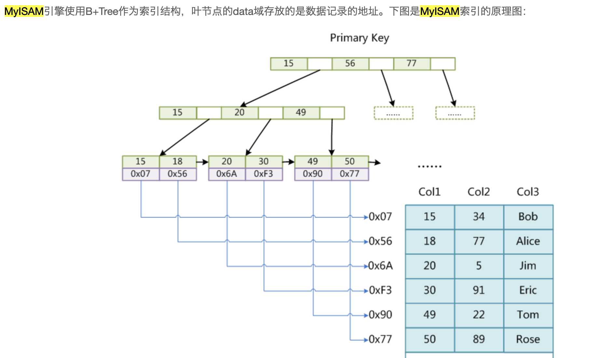
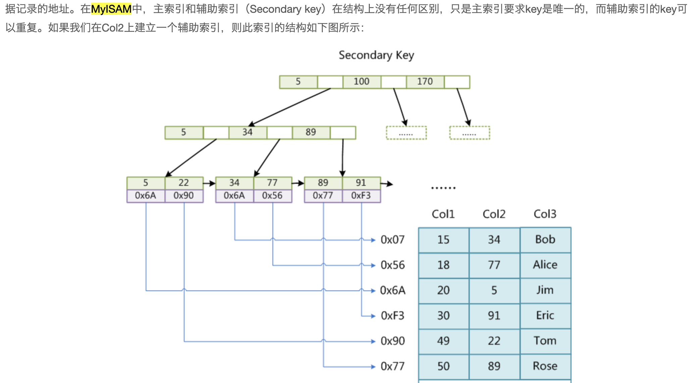
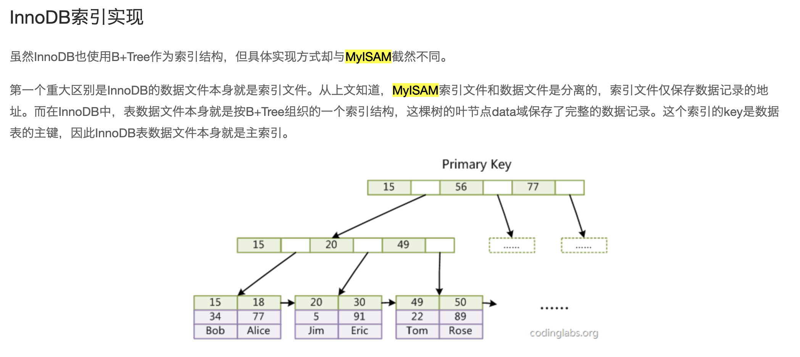
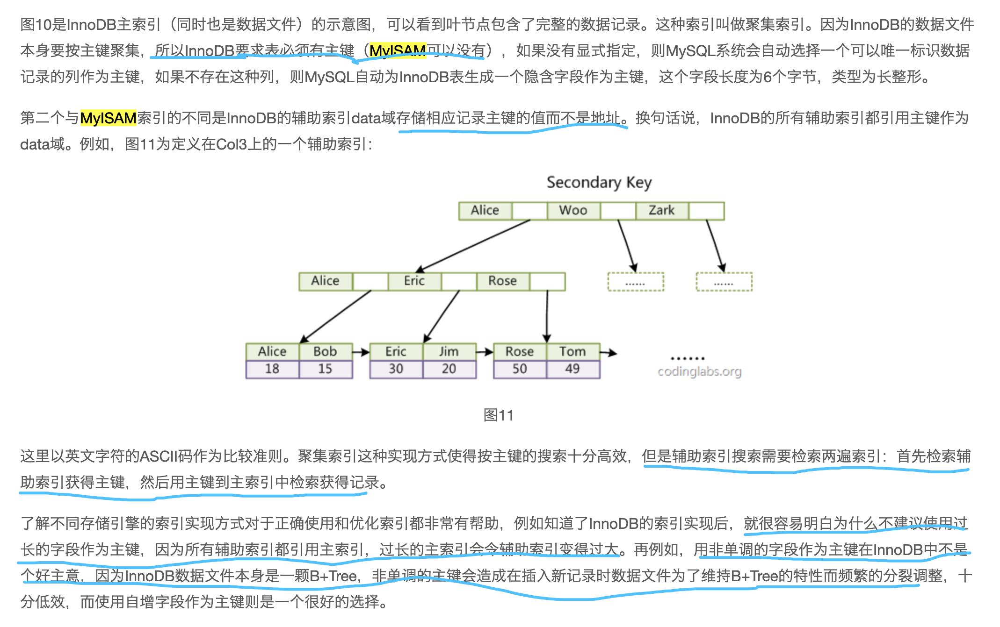
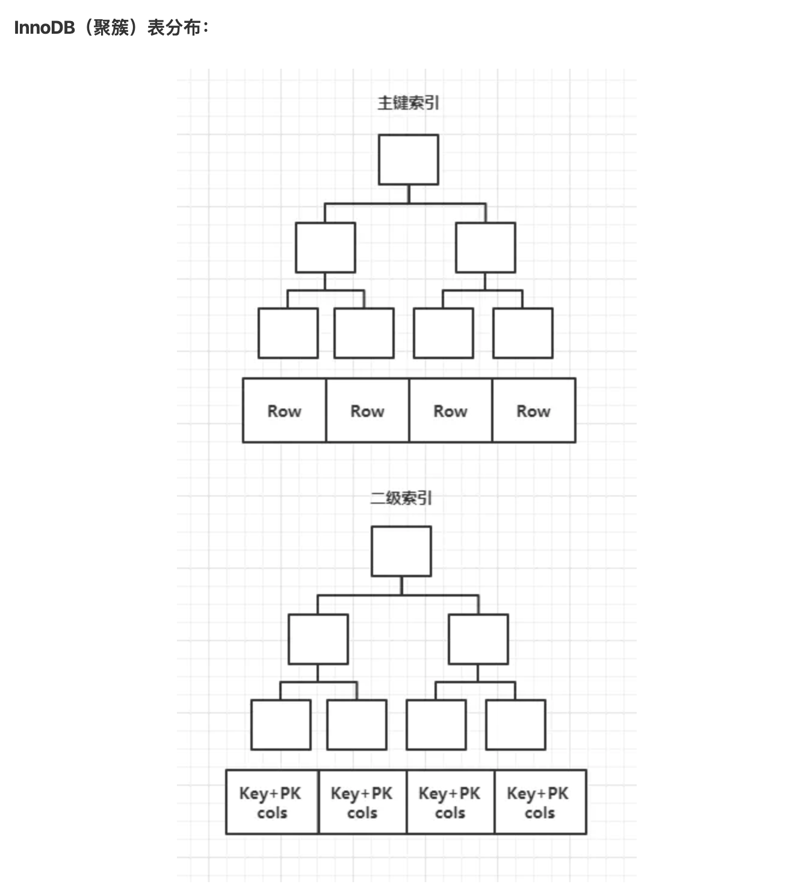
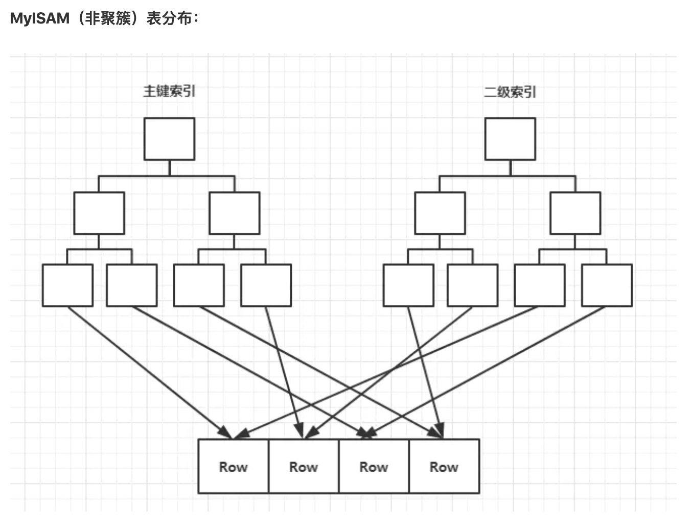

姊妹篇:

[谈谈索引失效](http://www.dashen.tech/2019/02/03/%E8%B0%88%E8%B0%88%E7%B4%A2%E5%BC%95%E5%A4%B1%E6%95%88/)


[索引使用策略](http://dashen.tech/2018/01/27/%E7%B4%A2%E5%BC%95%E4%BD%BF%E7%94%A8%E7%AD%96%E7%95%A5/)

---

### <font color="red">其各种索引</font>

<br>

- 主键索引
- 非主键索引

- 聚集索引
- 非聚集索引

- 一级索引
- 二级索引

---

- 正排索引
- 倒排索引

---


- 联合索引,覆盖索引,组合索引,多列索引
- 单列索引

---
- 前置索引

---

- 全文索引

---


### <font color="red">其聚集索引 & 非聚集索引，正排索引 & 倒排索引</font>

SQL主流的索引结构有B+树和Hash,聚集索引及非聚集索引基于B+树索引

而正排索引和倒排索引,是`Lucene`中的概念,Lucene用的是倒排索引 (暂不需深入探究)


[MySQL和Lucene索引对比分析](https://www.cnblogs.com/luxiaoxun/p/5452502.html)

更多关于 [`Inverted-index`](https://lengrongfu.github.io/2019/03/24/Inverted-index/)


<br>

**另外,必须要先明确是哪种存储引擎,然后才能再谈索引.**


#### <font color="orange">其聚集索引 & 非聚集索引</font>

聚集（clustered）索引，也叫聚簇索引,

> 定义：数据行的物理顺序与列值（一般是主键的那一列）的逻辑顺序相同，一个表中只能拥有一个聚集索引。

##### <font color="green">聚集索引=主键索引?</font>

参见stackoverflow上这个问答:[The relationship of Primary Key and Clustered Index](https://stackoverflow.com/questions/15051869/relationship-of-primary-key-and-clustered-index)

- 一张表是否可以有主键,但主键上没有聚集索引?
- 一张表是否可以有聚集索引,但不是主键字段?

答案是: `都可以!`


> A primary key is a logical concept - it's the unique identifier for a row in a table. As such, it has a bunch of attributes - it may not be null, and it must be unique. Of course, as you're likely to be searching for records by their unique identifier a lot, it would be good to have an index on the primary key.
<br>
A clustered index is a physical concept - it's an index that affects the order in which records are stored on disk. This makes it a very fast index when accessing data, though it may slow down writes if your primary key is not a sequential number.
<br>
Yes, you can have a primary key without a clustered index - and sometimes, you may want to (for instance when your primary key is a combination of foreign keys on a joining table, and you don't want to incur the disk shuffle overhead when writing).
<br>
Yes, you can create a clustered index on columns that aren't a primary key.

<br>

<font color="orange">

主键是一个*逻辑概念*`---`它是表中一行的唯一标识符。 因此，它具有许多属性---如不能为null，并且必须唯一。 当然，由于很可能会通过该唯一标识符来搜索相关记录(数据)，因此在主键上有一个索引会很好。

聚簇索引是一个*物理概念*`---`它是一个影响记录(数据)在磁盘上存储顺序的索引。 这使它成为访问数据时非常快的索引，但是如果您的主键不是序列号，它可能会减慢写入速度。

是的，一张表可以拥有一个不带聚集索引的主键。

是的，也可以在不是主键的列上创建聚簇索引。
</font>


<br>

> A primary key is a unique index that is clustered by default. By default means that when you create a primary key, if the table is not clustered yet, the primary key will be created as a clustered unique index. Unless you explicitly specify the nonclustered option.


<font color="purple">
主键是默认情况下聚集的唯一索引。 "默认情况"意味着在创建主键时，如果表尚未聚集，则主键将被创建为聚集的唯一索引。 除非明确指定非聚集选项。
</font>


<br>


在mysql的InnoDB存储引擎下,

- 如果我们定义了主键(PRIMARY KEY)，那么InnoDB会选择其作为聚集索引；

- 如果没有显式定义主键，则InnoDB会选择第一个不包含有NULL值的唯一索引作为主键索引；

- 如果也没有这样的唯一索引，则InnoDB会选择内置6字节长的ROWID作为隐含的聚集索引(ROWID随着行记录的写入而主键递增，这个ROWID不像ORACLE的ROWID那样可引用，是隐含的)。


总结一下就是:

```
1)  有主键时，根据主键创建聚簇索引

2)  没有主键时，会用一个唯一且不为空的索引列做为主键，成为此表的聚簇索引

3)  如果以上两个都不满足那innodb自己创建一个虚拟的聚集索引

```


一张表中`主键`最多只能有一个,`聚集索引`有且只能有一个,在SQLServer默认主键就是聚焦索引,但说"主键就是聚焦索引"其实是不太正确的..但大多数情况下,聚集索引就在主键这个字段上,所以`在 InnoDB中:`

- `主键索引`也称为`一级索引`,`主索引`（Primary key）

- `非主键索引`也被称为`二级索引`（secondary index）,也称为`辅助索引`,`辅索引`,可能又包括如"唯一索引","普通索引"等


对于 MyISAM,其`主索引`和`辅索引`结构是完全一样的,只是主索引要求字段的值不重复,而辅索引字段的值可以重复.





二者都是索引文件仅仅保存数据记录的行号, 然后通过此行号`回表查询`需要的数据; 其叶子节点存储的是数据的物理地址,而Innodb的叶子节点存储的是数据本身.


```sql
MyISAM同样也是使用B+树作为索引结构，叶子节点data域存储的是数据记录的地址,(Innodb直接存数据记录本身);

MyISAM的数据文件和索引文件是分别存储在xxx.MYD和xxx.MYI（xxx表示数据表名），索引文件xxx.MYI保存数据记录的地址
```

MyISAM的索引方式也叫做“非聚集”的，之所以这么称呼是为了与InnoDB的聚集索引区分。(很大原因也是因为MyISAM存储引擎下,数据文件和索引文件是分开的)


~~[参考](http://tommyhu.cn/T-SQL-suoyin/)
以及 [这篇](https://blog.csdn.net/bigtree_3721/article/details/51335479)~~


<br>


~~非聚集（unclustered）索引, 其实除了聚集索引以外的索引都是非聚集索引，只是人们想再细分一下非聚集索引，又将非聚集索引 分成`普通索引`，`唯一索引`，`全文索引`~~

> 定义：该索引中索引的逻辑顺序与磁盘上行的物理存储顺序不同，一个表中可以拥有多个非聚集索引。

```
MyISAM存储引擎采用的是非聚簇索引，非聚簇索引的主索引和辅助索引几乎是一样的，只是主索引不允许重复，不允许空值，他们的叶子结点的key都存储指向键值对应的数据的物理地址。

非聚簇索引的数据表和索引表是分开存储的。

非聚簇索引中的数据是根据数据的插入顺序保存。因此非聚簇索引更适合单个数据的查询。插入顺序不受键值影响。

只有在MyISAM中才能使用FULLTEXT索引。(mysql5.6以后innoDB也支持全文索引)

```

**最开始我一直不懂既然非聚簇索引的主索引和辅助索引指向相同的内容，为什么还要辅助索引这个东西呢，后来才明白索引不就是用来查询的吗，用在那些地方呢，不就是WHERE和ORDER BY 语句后面吗，那么如果查询的条件不是主键怎么办呢，这个时候就需要辅助索引了。**

[深入理解MySQL索引原理和实现——为什么索引可以加速查询？](https://blog.csdn.net/tongdanping/article/details/79878302)

Innodb存储引擎下,没有`非聚集索引`






引自:

[MySQL索引背后的数据结构及算法原理](https://blog.codinglabs.org/articles/theory-of-mysql-index.html)
版权归原作者所有,强烈推荐!


InnoDB的二级索引和聚簇索引很不相同。InnoDB的二级索引的叶子节点存储的不是行号（行指针），而是主键列。这种策略的缺点是二级索引需要两次索引查找，第一次在二级索引中查找主键，第二次在聚簇索引中通过主键查找需要的数据行。


> 画外音：可以通过我们前面提到过的`索引覆盖`来避免回表查询，这样就只需要一次回表查询，对于InnoDB而言，就是只需要一次索引查找就可以查询到需要的数据记录，因为需要的数据记录已经被索引到二级索引中，直接就可以找到。





 参考自:
 [MySQL——索引实现原理](https://juejin.im/post/5bd7a97de51d45400d5d7b18),强烈推荐!

---

另外:
```sql
InnoDB 支持事务，支持行级别锁定，支持 B-tree、Full-text 等索引，不支持 Hash 索引；
MyISAM 不支持事务，支持表级别锁定，支持 B-tree、Full-text 等索引，不支持 Hash 索引；
Memory支持 Hash 索引
```

<br>

---


##### <font color="green">聚集索引使用主键索引和二级索引 查询的区别</font>

<br>

主键索引的叶子节点存的是整行数据。在 InnoDB 里，主键索引也被称为聚集索引（clustered index）。

非主键索引的叶子节点内容是主键的值。在 InnoDB 里，非主键索引也被称为二级索引（secondary index）。


如果语句是 `select * from T where ID=500`，即 主键查询方式，则只需要搜索 ID 这棵 B+树 ；

如果语句是 `select * from T where k=5`， 即 普通索引查询方式，则需要先搜索 k 的 索引树，得到 ID的值为 500，再到 ID 索引树搜索一次。这个过程称为`回表`。

B+树为了维护索引有序性,在插入新值的时候需要做必要的维护,故而索引会提升读操作的效率,降低写入操作.


---

##### <font color="green">如何解决Innodb二级索引的二次查询问题(回表) --- 建立复合索引</font>

<br>

`复合索引`,也称`覆盖索引`,`联合索引`,`多列索引`,`组合索引`,

与之对应的是`单列索引`


参见:

[亲测体验mysql联合索引的失效](http://www.dashen.tech/2020/02/02/%E4%BA%B2%E6%B5%8B%E4%BD%93%E9%AA%8Cmysql%E8%81%94%E5%90%88%E7%B4%A2%E5%BC%95%E7%9A%84%E5%A4%B1%E6%95%88/)


[MySQL优化：如何避免回表查询？什么是索引覆盖？](https://www.cnblogs.com/myseries/p/11265849.html)

<br>

---


### <font color="red">其他索引 </font>


<br>


#### <font color="orange">前缀索引</font>

参见:

[前缀索引,一种优化索引大小的解决方案](http://www.dashen.tech/2019/02/08/%E5%89%8D%E7%BC%80%E7%B4%A2%E5%BC%95-%E4%B8%80%E7%A7%8D%E4%BC%98%E5%8C%96%E7%B4%A2%E5%BC%95%E5%A4%A7%E5%B0%8F%E7%9A%84%E8%A7%A3%E5%86%B3%E6%96%B9%E6%A1%88/)


#### <font color="orange">全文索引</font>

<br>

`fulltext`

某个字段含有大量文本,要找寻其中的某些内容, 用`like + %`匹配效率较差,而用`全文索引`可以比 `like + %`快很多倍.

```sql
MySQL 5.6 以前的版本，只有 MyISAM 存储引擎支持全文索引；
MySQL 5.6 及以后的版本，MyISAM 和 InnoDB 存储引擎均支持全文索引;
只有字段的数据类型为 char、varchar、text 及其系列才可以建全文索引。

MySQL 的全文索引最开始仅支持英语，因为英语的词与词之间有空格，使用空格作为分词的分隔符是很方便的。亚洲文字，比如汉语、日语、汉语等，是没有空格的，这就造成了一定的限制。不过 MySQL 5.7.6 开始，引入了一个 ngram 全文分析器来解决这个问题，并且对 MyISAM 和 InnoDB 引擎都有效。

```

<br>

#### <font color="orange">哈希索引</font>

<br>

`hash index`

只有 `Memory 存储引擎`显式支持哈希索引, 哈希所有也是 Memory 引擎的默认索引.

```sql
哈希索引数据并不是按照索引值顺序存储的，所以无法用来进行排序。

哈希索引只支持等值比较查询，包括 = 、IN()、 <=>。不支持范围查询。
```

因为这些限制, 哈希索引只适用于某些特殊的场合; 但一旦适合使用哈希索引, 带来的性能提升将非常显著.


参见 [MySQL哈希索引](http://xjwblog.com/?p=493)

<br>

### <font color="red">建索引的几大原则</font>

<br>

1.最左前缀匹配原则，非常重要的原则，mysql会一直向右匹配直到遇到范围查询(>、<、between、like)就停止匹配，比如a = 1 and b = 2 and c > 3 and d = 4 如果建立(a,b,c,d)顺序的索引，d是用不到索引的，如果建立(a,b,d,c)的索引则都可以用到，a,b,d的顺序可以任意调整。

2.=和in可以乱序，比如a = 1 and b = 2 and c = 3 建立(a,b,c)索引可以任意顺序，mysql的查询优化器会帮你优化成索引可以识别的形式。

3.尽量选择区分度高的列作为索引，区分度的公式是count(distinct col)/count(*)，表示字段不重复的比例，比例越大我们扫描的记录数越少，唯一键的区分度是1，而一些状态、性别字段可能在大数据面前区分度就是0，那可能有人会问，这个比例有什么经验值吗？使用场景不同，这个值也很难确定，一般需要join的字段我们都要求是0.1以上，即平均1条扫描10条记录。

4.索引列不能参与计算，保持列“干净”，比如from_unixtime(create_time) = ’2014-05-29’就不能使用到索引，原因很简单，b+树中存的都是数据表中的字段值，但进行检索时，需要把所有元素都应用函数才能比较，显然成本太大。所以语句应该写成create_time = unix_timestamp(’2014-05-29’)。

5.尽量的扩展索引，不要新建索引。比如表中已经有a的索引，现在要加(a,b)的索引，那么只需要修改原来的索引即可。