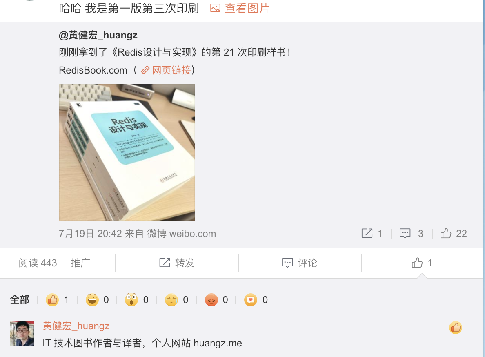
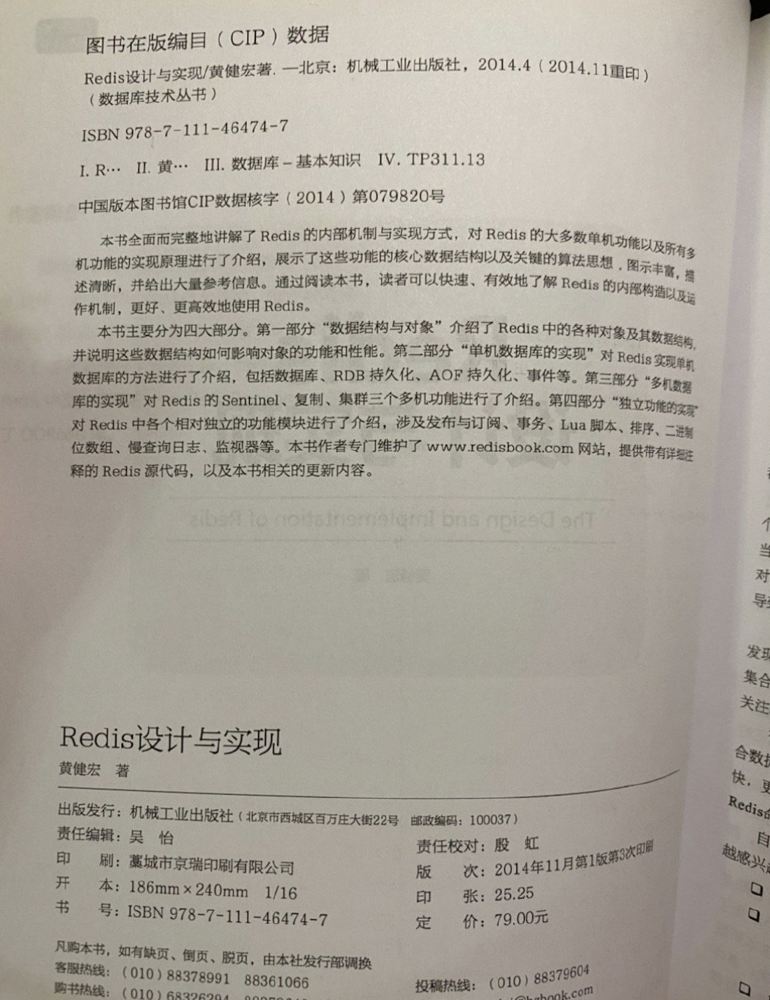

最近在看[huangz](https://blog.huangz.me/)大神的[Redis 设计与实现](http://redisbook.com/index.html).




说来惭愧,工作中一直有使用Redis,这本书也购置多时.MySQL相关的书籍看过好几本,而关于Redis的,这却是第一本.




<br>


第一部分**数据结构与对象**,分7章讲述了 <font color="red">简单动态字符串</font>,<font color="orange">链表</font>,<font color="yellow">字典</font>,<font color="green">跳跃表</font>,<font color="Cyan">整数集合</font>,<font color="blue">压缩列表</font>,<font color="Purple">对象</font>在Redis中的实现与应用.

<br>


本篇只简要记述SDS及其与C语言中字符串的区别.


---

<br>


> Redis 没有直接使用 C 语言传统的字符串表示（以空字符结尾的字符数组，以下简称 C 字符串）， 而是自己构建了一种名为简单动态字符串（**simple dynamic string**，SDS）的抽象类型， 并将 SDS 用作 Redis 的默认字符串表示。


<br>


SDS结构体如下:


```C
struct sdshdr {

    // 记录 buf 数组中已使用字节的数量
    // 等于 SDS 所保存字符串的长度
    int len;

    // 记录 buf 数组中未使用字节的数量
    int free;

    // 字节数组，用于保存字符串
    char buf[];

};
```

<br>


相比于C字符串,SDS优势如下:


<1>. **O(1)时间复杂度获取字符串长度**

<font size=1>

因为 C 字符串并不记录自身的长度信息， 所以为获取一个 C 字符串长度， 程序必须遍历整个字符串， 对遇到的每个字符进行计数， 直到遇到代表字符串结尾的空字符为止， 该操作的复杂度为 O(N) 

和 C 字符串不同， 因为 SDS 在 len 属性中记录了 SDS 本身的长度， 所以获取一个 SDS 长度的复杂度仅为 O(1) 。

</font>


<br>


<2>. **防止缓冲区溢出**

<font size=1>

C 字符串不记录自身长度带来的另一个问题是容易造成缓冲区溢出（buffer overflow）

与 C 字符串不同， SDS 的空间分配策略完全杜绝了发生缓冲区溢出的可能性： 当 SDS API 需要对 SDS 进行修改时， API 会先检查 SDS 的空间是否满足修改所需的要求， 如果不满足的话， API 会自动将 SDS 的空间扩展至执行修改所需的大小， 然后才执行实际的修改操作， 所以使用 SDS 既不需要手动修改 SDS 的空间大小， 也不会出现缓冲区溢出问题。

</font>

<br>


<3>. **减少修改字符串时带来的内存重分配次数**

<font size=1>

对于一个包含了 N 个字符的 C 字符串来说， 这个 C 字符串的底层实现总是一个 N+1 个字符长的数组（额外的一个字符空间用于保存空字符）。

因为 C 字符串的长度和底层数组的长度之间存在着这种关联性， 所以每次修改(增长或者缩短)一个 C 字符串， 程序都总要对保存这个 C 字符串的数组进行一次内存重分配操作

而内存重分配涉及复杂的算法， 并可能需要执行系统调用， 所以通常是一个比较耗时的操作：

- 在一般程序中， 如果修改字符串长度的情况不太常出现， 那么每次修改都执行一次内存重分配是可以接受的。

- 但是 Redis 作为数据库， 经常被用于速度要求严苛、数据被频繁修改的场合， 如果每次修改字符串的长度都需要执行一次内存重分配的话， 那么光是执行内存重分配的时间就会占去修改字符串所用时间的一大部分， 如果这种修改频繁地发生的话， 可能还会对性能造成影响。
为了避免 C 字符串的这种缺陷， SDS 通过未使用空间解除了字符串长度和底层数组长度之间的关联： 在 SDS 中， buf 数组的长度不一定就是字符数量加一， 数组里面可以包含未使用的字节， 而这些字节的数量就由 SDS 的 free 属性记录。

</font>


<br>


<4>. **二进制安全**

<font size=1>

C 字符串中的字符必须符合某种编码（如 ASCII）， 且除了字符串末尾之外， 字符串里不能包含有空字符， 否则最先被程序读入的空字符将被误认为是字符串结尾 —— 这些限制使得 C 字符串只能保存文本数据， 而不能保存像图片、音频、视频、压缩文件这样的二进制数据。


虽说数据库一般用于保存文本数据， 但使用数据库来保存二进制数据的场景也不少见， 因此， 为了确保 Redis 可以适用于各种不同的使用场景， SDS 的 API 都是二进制安全的（binary-safe）： 所有 SDS API 都会以处理二进制的方式来处理 SDS 存放在 buf 数组里的数据， 程序不会对其中的数据做任何限制、过滤、或者假设 —— 数据在写入时是什么样的， 它被读取时就是什么样。

这也是将 SDS 的 buf 属性称为字节数组的原因 —— Redis 不是用这个数组来保存字符， 而是用它来保存一系列二进制数据。

</font>


<br>


<5>. **兼容部分 C 字符串函数**

<font size=1>

SDS 的 API 一样遵循了 C 字符串以空字符结尾的惯例： 这些 API 总会将 SDS 保存的数据的末尾设置为空字符， 并且总会在为 buf 数组分配空间时多分配一个字节来容纳这个空字符， 这样就可以让那些保存文本数据的 SDS 能够重用一部分 <string.h> 库定义的函数， 从而不需要重写，避免不必要的代码重复。

</font>


<br>


---


参考:

[SDS 与 C 字符串的区别](http://redisbook.com/preview/sds/different_between_sds_and_c_string.html)


[redis sds和c的string区别](https://www.google.com/search?newwindow=1&sxsrf=ALeKk010YJDdbdI0s4Sag5yYYeg-nLjHag%3A1594344492740&ei=LMQHX6TpLIzG-gTI5L_wBA&q=redis+sds%E5%92%8Cc%E7%9A%84string%E5%8C%BA%E5%88%AB&oq=redis+sds%E5%92%8Cc%E7%9A%84string%E5%8C%BA%E5%88%AB&gs_lcp=CgZwc3ktYWIQAzoECCMQJzoGCAAQBxAeOgIIADoECAAQDDoECAAQHjoFCCEQoAFQgZCNAVj9iY4BYPWKjgFoBHAAeAKAAckEiAHnR5IBCjItNi4xMy40LjOYAQCgAQGqAQdnd3Mtd2l6&sclient=psy-ab&ved=0ahUKEwikr46JxMHqAhUMo54KHUjyD04Q4dUDCAw&uact=5)