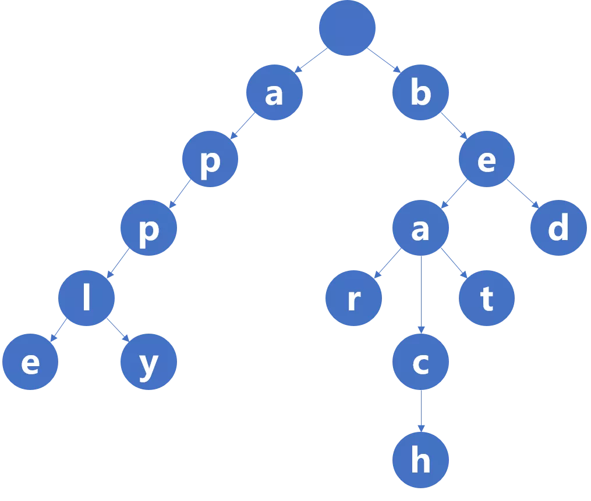
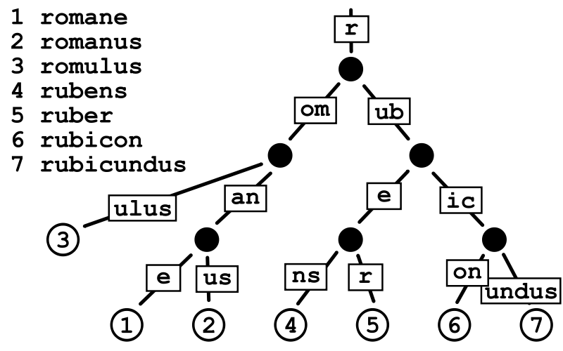
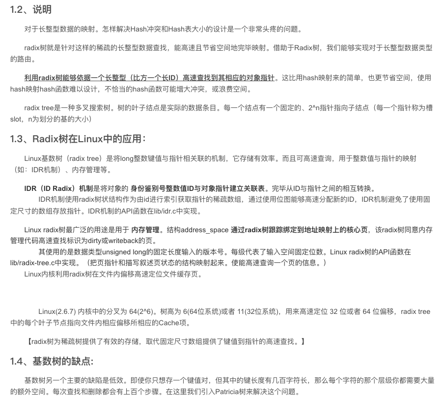
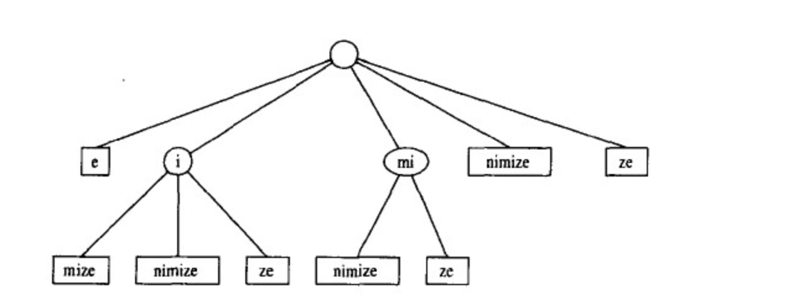

 

相关博客

[前缀树(字典树)/Trie](https://dashen.tech/2015/02/01/%E7%AE%97%E6%B3%95%E5%88%9D%E6%AD%A5/#font-color-darkgreen-%E5%89%8D%E7%BC%80%E6%A0%91-%E5%AD%97%E5%85%B8%E6%A0%91-Trie-font)

[Rust-vs-Go-常用语法对比-8 之 Trie](https://dashen.tech/2021/09/09/Rust-vs-Go-%E5%B8%B8%E7%94%A8%E8%AF%AD%E6%B3%95%E5%AF%B9%E6%AF%94-8/#159-font-color-0c0a3e-Trie-font)

力扣相关题目：

[leetcode上的字典树问题](https://leetcode-cn.com/tag/trie/)

[leetcode-208 实现 Trie (前缀树)]()
[leetcode-212 单词搜索II]()
[leetcode-336 回文对]()

 

---

 

### 导引

 

[Trie](https://zh.wikipedia.org/wiki/Trie) 树，又称**前缀树**或**字典树**，(也有称*单词查找树*)。主要应用在信息检索中进行模式匹配和前缀匹配

>「用空间换时间」,最大限度地减少无谓的字符串比较，使得查询高效率，再利用共同前缀来提高查询效率。

Trie这个术语来自于re**trie**val。trie的发明者Edward Fredkin将其读作/ˈtriː/ "tree" ； 但是，其他作者读作/ˈtraɪ/ "try；

一般也多称为 try 树

 

除去标准的trie树,还有两种常见的变体， 压缩Trie(即基树树)和后缀Trie，有种说法将三者统称为*Trie三兄弟*

[Trie三兄弟——标准Trie、压缩Trie、后缀Trie](https://www.iteye.com/blog/dsqiu-1705697)

 

---

 

标准Trie

 

如有待匹配的字符串apple,apply,bed,bear,beat,beach等，

如果不考虑空间开销，第一大目标是能够快速匹配，则是前缀树的典型使用场景

 Trie树 的三个特点

- 根节点不包含字符，除根节点外每一个节点都只包含一个字符

- 从根节点到某一节点，路径上经过的字符连接起来，为该节点对应的字符串

- 每个节点的所有子节点包含的字符都不相同

> Trie的核心思想是空间换时间，利用字符串的公共前缀来降低查询时间的开销以达到提高效率的目的。
 
> 假设字符的种数有m个，有若干个长度为n的字符串构成了一个 Trie树 ，则每个节点的出度为 m（即每个节点的可能子节点数量为m），Trie树 的高度为n。很明显浪费了大量的空间来存储字符，此时Trie树的*最坏空间复杂度*为$O(m^n)$。 也正由于每个节点的出度为m，所以才能够沿着树的一个个分支高效的向下逐个字符的查询，而不是遍历所有的字符串来查询，此时Trie树的*最坏时间复杂度*为O(n)。

更多关于Trie树的构造，插入，查询和删除，可参见

[吴师兄学编程-看动画轻松理解「Trie树」](https://www.cxyxiaowu.com/1873.html)

[前缀树](https://mp.weixin.qq.com/s/6i3Mf7J-Ppr8LA51n7aEwA)

 

---

 

### 基数树/压缩前缀树/Radix Trie

 

基数树（Radix Trie，也叫基数特里树或压缩前缀树）, 是一种比标准Trie更节省空间的数据结构

其中作为唯一子节点的每个节点都与其父节点合并，边既可以表示为元素序列又可以表示为单个元素。 

因此每个内部节点的子节点数最多为基数树的基数r ，其中r为正整数，x为2的幂，x≥1，这使得基数树更适用于对于较小的集合（尤其是字符串很长的情况下）和有很长相同前缀的字符串集合

即 不再遵循标准Trie树 每一个节点都只包含一个字符的特点，即如上图这样，更省空间

 

其全部特点如下：

- 一般由根节点、中间节点和叶子节点组成。
- 每个节点可以包含一个或多个字符。
- 树的叶子结点数即是数据条目数。
- 从根节点到某一节点经过路径的字符连起来即为该节点对应的字符串。
- 每个节点的所有子节点字符串都不相同。

 

基数树支持插入、删除、查找操作。查找包括完全匹配、前缀匹配、前驱查找、后继查找。

所有这些操作都是O(k)复杂度，其中k是所有字符串中最大的长度。

 

Radix Trie相比于入门款的标准Trie，有更多的使用

包括httprouter库中用于快速路由，Linux和Go中用于更快的内存分配 

[Linux 内核中的数据结构：基数树(radix tree)](https://www.cnblogs.com/schips/p/10674697.html)

[数据结构之Radix Tree](https://ivanzz1001.github.io/records/post/data-structure/2018/11/18/ds-radix-tree)

[如何克服字典树(Trie Tree)的缺点?](https://www.zhihu.com/question/30736334?sort=created)

 

> 这使得基数树更适用于对于较小的集合（尤其是字符串很长的情况下）和有很长相同前缀的字符串集合。

> 基数树的查找方式也与常规树不同（常规的树查找一开始就对整个键进行比较，直到不相同为止），基数树查找时节点时，对于节点上的键都按块进行逐块比较，其中该节点中块的长度是基数r； 当r为2时，基数树为二进制的（即该节点的键的长度为1比特位），能最大程度地减小树的深度来最小化稀疏性（最大限度地合并键中没有分叉的节点）。 当r≥4且为2的整数次幂时，基数树是r元基数树，能以潜在的稀疏性为代价降低基数树的深度。

[相关论文](http://qikan.cqvip.com/Qikan/Article/Detail?id=26924091)

其实还有一种数据结构 Patricia Tree(简称 PAT tree)，也能减少额外减少额外的节点，节点个数严格的和插入的元素个数相同，且Patricia trie算法中只有一种节点，不存在中间节点和叶子节点的区别

[Patricia Trie与Radix Trie的不同](https://blog.csdn.net/zhangzhengyi03539/article/details/115394168)

 Patricia Tree经常和Merkle Tree(即Hash Tree)混合成为一种新的数据结构`---`MPT(Merkle Patricia Tree)树,提供了一个基于加密学的，自校验防篡改的数据结构，用来存储键值对关系

 [树形结构-基数树、Patricia树、默克尔树、梅克尔帕特里夏树( Merkle Patricia Tree, MPT)](https://blog.csdn.net/dilv4062/article/details/101597498)

 

#### gin中用到的httprouter库

 

> The router relies on a tree structure which makes heavy use of common prefixes, it is basically a compact prefix tree (or just Radix tree). Nodes with a common prefix also share a common parent. 

如果沿着从树根到叶的路径穿过树，则会得到完整的路径

> Since URL paths have a hierarchical structure and make use only of a limited set of characters (byte values), it is very likely that there are a lot of common prefixes. This allows us to easily reduce the routing into ever smaller problems. Moreover the router manages a separate tree for every request method. For one thing it is more space efficient than holding a method->handle map in every single node, it also allows us to greatly reduce the routing problem before even starting the look-up in the prefix-tree.

由于URL路径具有层次结构，并且仅使用有限的字符集（字节值），因此很可能存在许多公共前缀。这使我们可以轻松地将路由减少到越来越小的问题中。此外，路由器为每种请求方法管理一棵单独的树。一方面，它比在每个单个节点中保存method-> handle map更加节省空间，它还使我们甚至可以在开始在前缀树中查找之前极大地减少路由问题。

gin框架的路由，用的就是[httprouter](https://github.com/julienschmidt/httprouter/blob/master/README.md)库，该库底层用的数据结构是 压缩前缀树(即基数树，Radix树) (还加入了优先级)

[go路由httprouter中的压缩字典树算法图解及c++实现](https://blog.csdn.net/qq_17308321/article/details/89736691)

[为什么 Gin 这么流行？一探 gin 框架路由和中间件的秘密](https://mp.weixin.qq.com/s/gt0YW9e-LvFgDCSg-u0U6w)

[Gin 框架的路由结构浅析](https://segmentfault.com/a/1190000016655709?_ea=4726697)

 

#### Go内存管理中的使用

 

 

---

 

### 后缀Trie

 

即 字符串集合是由指定字符串的后缀子串构成的

完整字符串"minimize"的后缀子串组成的集合S分别如下：

 

         s1=minimize

         s2=inimize

         s3=nimize

         s4=imize

         s5=mize

         s6=ize

         s7=ze

         s8=e

 然后把这些子串的公共前缀作为内部结点构成一棵"minimize"的后缀树

 

