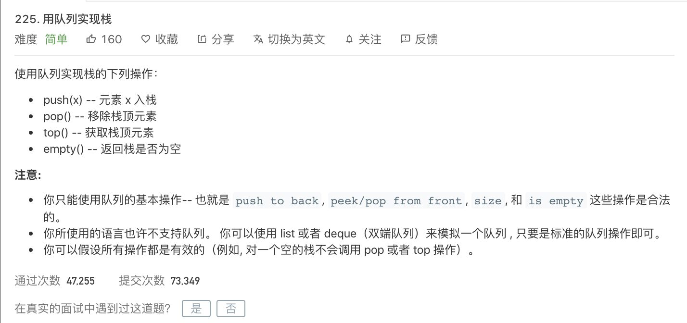

---

姊妹篇:

[leetcode-232 用栈实现队列](http://www.dashen.tech/2015/03/01/leetcode-232-%E7%94%A8%E6%A0%88%E5%AE%9E%E7%8E%B0%E9%98%9F%E5%88%97/)

---

<br>


[225. 用队列实现栈](https://leetcode-cn.com/problems/implement-stack-using-queues/)


难度:  <font color="green">**简单**</font>





<br>

---

<br>

已经有部分实现好的代码:

```go
type MyStack struct {

}


/** Initialize your data structure here. */
func Constructor() MyStack {

}


/** Push element x onto stack. */
func (this *MyStack) Push(x int)  {

}


/** Removes the element on top of the stack and returns that element. */
func (this *MyStack) Pop() int {

}


/** Get the top element. */
func (this *MyStack) Top() int {

}


/** Returns whether the stack is empty. */
func (this *MyStack) Empty() bool {

}


/**
 * Your MyStack object will be instantiated and called as such:
 * obj := Constructor();
 * obj.Push(x);
 * param_2 := obj.Pop();
 * param_3 := obj.Top();
 * param_4 := obj.Empty();
 */
```


<br>


完整代码:

```go

```
