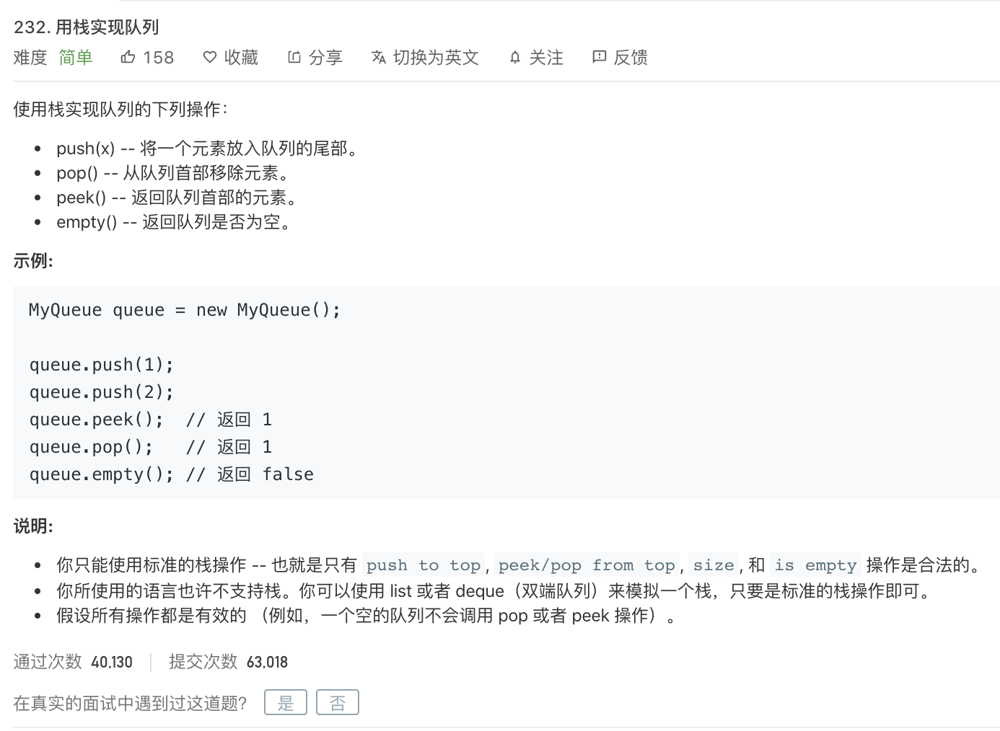

---

姊妹篇:

[leetcode-225 用队列实现栈](http://www.dashen.tech/2015/03/01/leetcode-225-%E7%94%A8%E9%98%9F%E5%88%97%E5%AE%9E%E7%8E%B0%E6%A0%88/)

---

<br>


[232. 用栈实现队列](https://leetcode-cn.com/problems/implement-queue-using-stacks/)


难度:  <font color="green">**简单**</font>




<br>


类似"负负得正"..

所以要用两个Stack,比如一个叫input,一个叫output,

入input,出和查看元素从output.


只要有pop(移除)和peek(看)操作,就


---

<br>

已经有部分实现好的代码:

```go
type MyQueue struct {

}


/** Initialize your data structure here. */
func Constructor() MyQueue {

}


/** Push element x to the back of queue. */
func (this *MyQueue) Push(x int)  {

}


/** Removes the element from in front of queue and returns that element. */
func (this *MyQueue) Pop() int {

}


/** Get the front element. */
func (this *MyQueue) Peek() int {

}


/** Returns whether the queue is empty. */
func (this *MyQueue) Empty() bool {

}


/**
 * Your MyQueue object will be instantiated and called as such:
 * obj := Constructor();
 * obj.Push(x);
 * param_2 := obj.Pop();
 * param_3 := obj.Peek();
 * param_4 := obj.Empty();
 */
 ```

<br>


- Push:入队列
- Pop: 出队列
- Peek: 查看队列的最后一个元素


<br>


完整代码:

```go
type MyQueue struct {
	Stack1, Stack2 *stack
}

// Constructor Initialize your data structure here.
func Constructor() MyQueue {
	return MyQueue{
		Stack1: newStack(),
		Stack2: newStack(),
	}
}

// Push element x to the back of queue.
func (queue *MyQueue) Push(x int) {
	queue.Stack1.push(x)
}

// Pop Removes the element from in front of queue and returns that element.
func (queue *MyQueue) Pop() int {
	if queue.Stack2.isEmpty() {
		//优化: 栈a中留一个元素供pop,可以少一次操作
		for queue.Stack1.len() > 1 {
			queue.Stack2.push(queue.Stack1.pop())
		}
		return queue.Stack1.pop()
	}
	return queue.Stack2.pop()
}

// Peek Get the front element.
func (queue *MyQueue) Peek() int {
	res := queue.Pop()
	//队列为空
	if res != -1 {
		queue.Stack2.push(res)
	}
	return res
}

// Empty Returns whether the queue is empty.
func (queue *MyQueue) Empty() bool {
	return queue.Stack1.isEmpty() && queue.Stack2.isEmpty()
}

// stack defines Stack1 stack
type stack struct {
	nums []int
}

// newStack creates a empty stack
func newStack() *stack {
	return &stack{
		nums: []int{},
	}
}

func (s *stack) push(n int) {
	s.nums = append(s.nums, n)
}

func (s *stack) pop() int {
	if s.isEmpty() {
		return -1
	}
	res := s.nums[len(s.nums)-1]
	s.nums = s.nums[:len(s.nums)-1]
	return res
}

func (s *stack) len() int {
	return len(s.nums)
}
func (s *stack) isEmpty() bool {
	return s.len() == 0
}
```