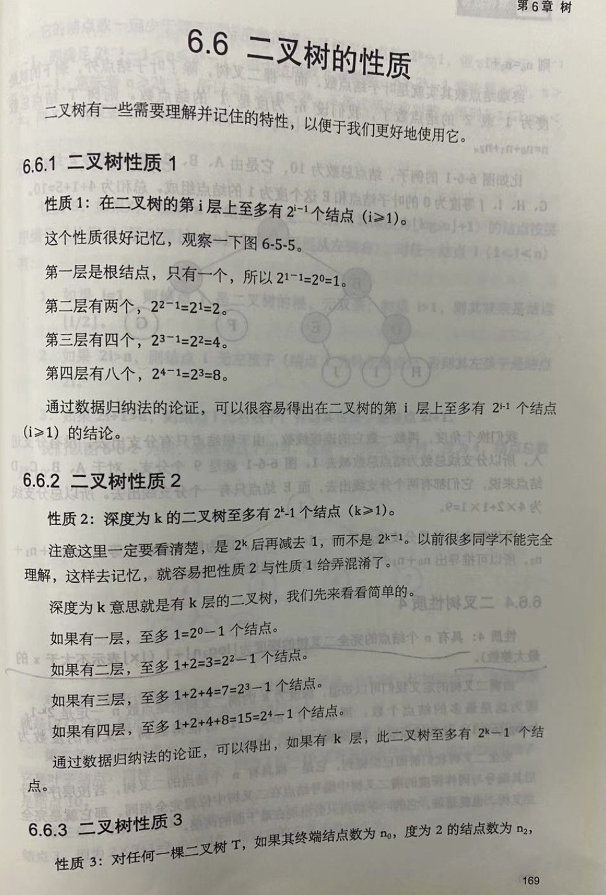
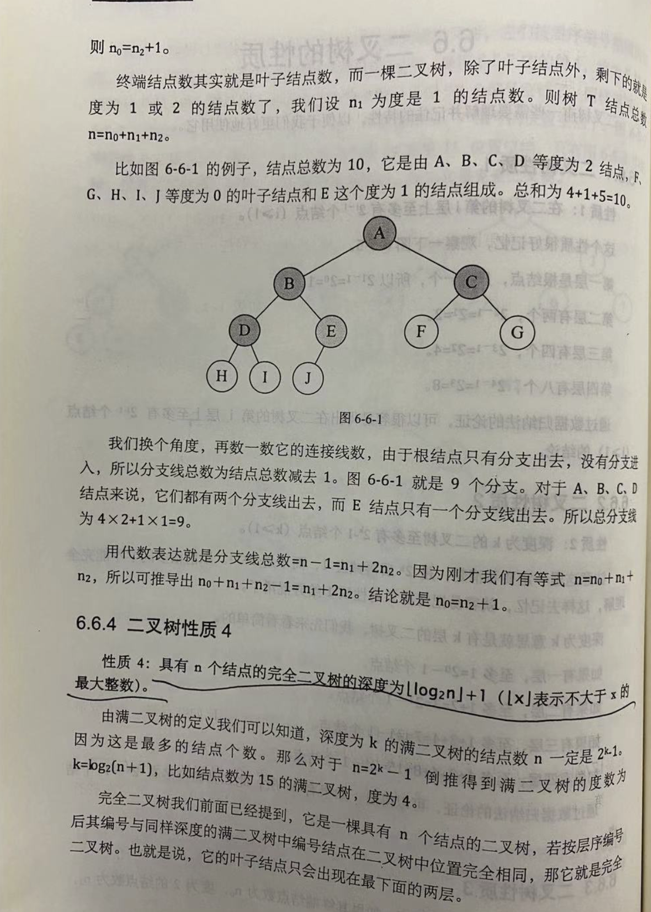
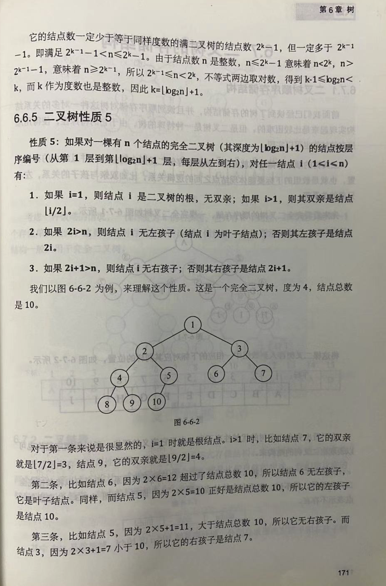

“二叉树中的度“是指树中最大的结点度，叶子结点是终端结点，是度为 0 的结点。

二叉树的度是指树中所有结点的度数的最大值。二叉树的度小于等于2，因为二叉树的定义要求二叉树中任意结点的度数（结点的分支数）小于等于2 ，并且两个子树有左右之分，顺序不可颠倒。

叶子结点就是度为0的结点，也就是没有子结点的结点叶子。如n0表示度为0的结点数，n1表示度为1的结点，n2表示度为2的结点数。在二叉树中：n0=n2+1；N=n0+n1+n2（N是总结点）。

 

叶子结点计算方法：

例：一棵树度为4，其中度为1，2，3，4的结点个数分别为4，2，1，1，则这棵树的叶子节点个数为多少？

解：因为任一棵树中，结点总数=度数*该度数对应的结点数+1，所以：

n0+4+2+1+1 = （0*n0 + 1*4 + 2*2 + 3*1 + 4*1）+1

则：n0=8

其中：n0表示叶子结点。

 

