<br>


## <font color="red">0.算法功底决定Offer质量</font>


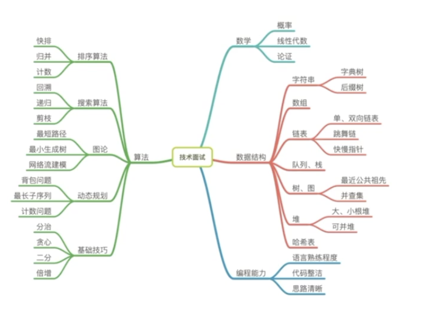

- 算法能力能够准确判别一个程序员的技术功底是否扎实

- 算法能力是发掘程序员学习能力与成长潜力的关键手段

- 算法能力能够协助判断程序员分析并解决突发问题的能力

- 算法能力是设计一个高性能系统的必备基础


<br>

---

<br>


## <font color="orange">1.掌握实用的数据结构</font>

数据结构是算法的基石,算法是否足够优秀,往往取决于使用的数据结构是否恰到好处


### <font color="orange">1.1 常用数据结构和技巧/Common Data Structure</font>

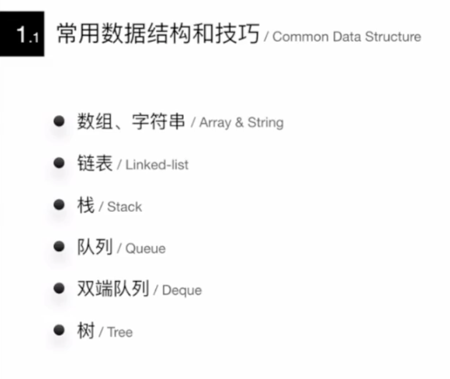

<br>

---


#### <font color="darkgreen">数组,字符串/Array&String</font>

<br>

翻转字符串: 用两个指针,最开始分别指向首尾,相互交换..而后向中央靠拢,直到相遇为止


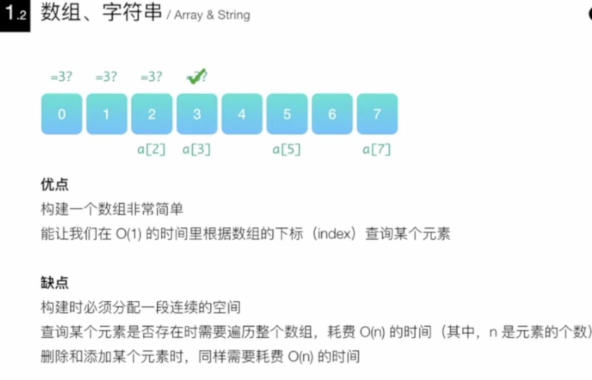

[leetcode-242 有效的字母异位词](http://www.dashen.tech/2015/03/26/leetcode-242-%E6%9C%89%E6%95%88%E7%9A%84%E5%AD%97%E6%AF%8D%E5%BC%82%E4%BD%8D%E8%AF%8D/)


<br>

#### <font color="darkgreen">链表/Linked List</font>

<br>


- 优点:
```
灵活地分配内存空间

能在O(1)时间内删除或者添加元素
```

缺点:

```
查询元素需要O(n)时间,即需要从头开始遍历
```

相比于数组,链表可以不需要开辟一段连续的内存空间,但同时不能通过下标进行查询.如果需要经常查询和遍历的场景,不是太合适优先考虑链表

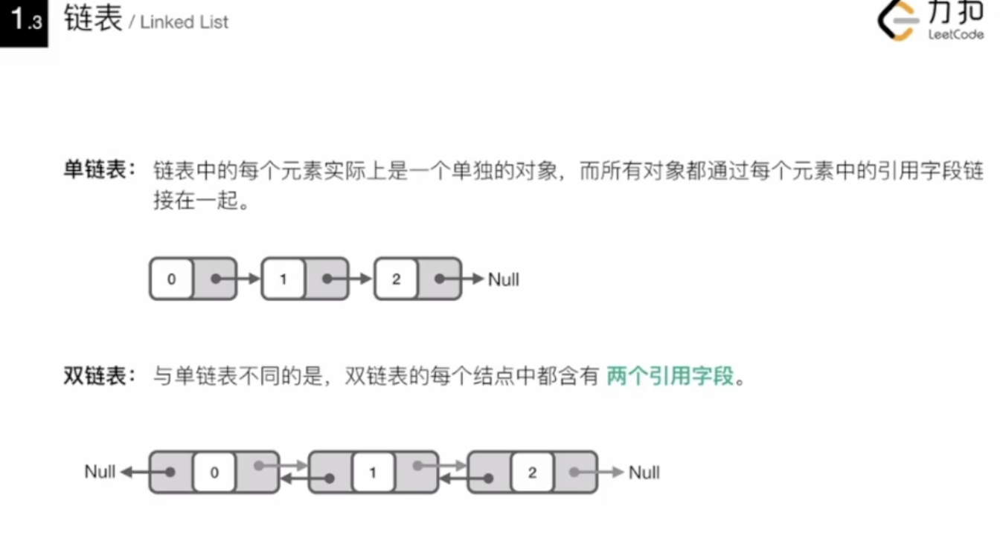


而如果数据的元素个数不确定,而且频繁需要`写操作`,链表较合适.

而元素个数确定,删除/插入操作并不多,则数组更为适合


**解题技巧**:

1. 利用快慢指针(有时甚至需要用到三个指针),

- 如链表的翻转,
- 寻找第K个元素,
- 寻找链表中中间位置的元素,
- 判断链表是否有环等


2. 构建一个虚假的链表头,一般用需要返回一个新的链表的题目中

- 如 两个已排好序的链表,进行整合排序
- 将链表的奇偶数按原定顺序分离,生成前半部分为奇数,后半部分为偶数的链表

如果不用一个虚假的链表头,那么在创建新链表的第一个元素时,都需要判断链表的头指针是否为空,即需要多写一条if else语句. 比较简洁的写法是创建一个新的链表头,直接往其后面添加元素即可.最后返回这个空的链表头的下一个节点

<br>

**如何训练该技巧**:

<br>

在纸上或者白板上画出节点之间的相互关系.

画出修改的方法.

凭空想象非常困难

[leetcode-21 合并两个有序链表](http://www.dashen.tech/2015/03/18/leetcode-21-%E5%90%88%E5%B9%B6%E4%B8%A4%E4%B8%AA%E6%9C%89%E5%BA%8F%E9%93%BE%E8%A1%A8/)

[leetcode-25 K个一组翻转链表](http://www.dashen.tech/2015/03/20/leetcode-25-K%E4%B8%AA%E4%B8%80%E7%BB%84%E7%BF%BB%E8%BD%AC%E9%93%BE%E8%A1%A8/)


<br>

---


数组和链表为`物理数据结构`,下面的是`逻辑数据结构`,其实现都是基于数组或链表


<br>

#### <font color="darkgreen">栈/Stack</font>


<br>

**leetcode中等偏上题目经常用到的数据结构**


后进先出(LIFO)

所有操作,都是在栈顶部完成的,

**如何实现:**

可以用一个单链表来实现`栈`这种**逻辑数据结构**


**何时用到栈:**

只关心最近一次的操作,且在操作完成后,需向前查找更前一次的操作

[leetcode-22 括号生成](http://www.dashen.tech/2015/03/01/leetcode-22-%E6%8B%AC%E5%8F%B7%E7%94%9F%E6%88%90/)

(利用一个栈,不断地往里面压左括号,一旦遇到一个右括号,就把栈顶的左括号弹出来,表示这是一个合法的组合..直到最后,判断栈里还有无左括号剩余)

[leetcode-739 每日温度](http://www.dashen.tech/2015/03/01/leetcode-739-%E6%AF%8F%E6%97%A5%E6%B8%A9%E5%BA%A6/)

(最直观的做法,就是针对每个温度值,向后进行一次搜索,找到比当前温度更高的值,O(n的平方)...这种办法做了许多重复的对比)

(利用一个堆栈stack,从头扫描T,如果当天的温度比堆栈顶端那一天的温度还要高,那就知道结果了..O(n) )


<br>

#### <font color="darkgreen">队列/Queue</font>


<br>

先进先出(FIFO)


只允许在队尾查看和添加数据,在队头查看和删除数据.

**如何实现队列:**

用一个`双链表`,其头指针(front)允许在队头查看和删除数据,尾指针(rear)允许在队尾查看和删除数据


**何时用到队列:**

需要按照一定得顺序处理数据,而数据在不断的变化...

广度优先搜索,是运用队列最多的地方


<br>

#### <font color="darkgreen">双端队列/Deque</font>


<br>

队列的头尾两端,能在O(1)的时间内进行数据的查看,添加和删除


**如何实现双端队列:**

用一个`双链表`


**何时用到双端队列:**

实现一个长度动态变化的窗口或者连续区间,而`动态窗口`这种数据结构,在许多题目里都用应用

[leetcode-239 滑动窗口最大值](http://www.dashen.tech/2015/03/01/leetcode-239-%E6%BB%91%E5%8A%A8%E7%AA%97%E5%8F%A3%E6%9C%80%E5%A4%A7%E5%80%BC/)

拿到一道题目时,先想想最直观的做法,然后考虑对其进行优化

暴力解法: O(n*k)


优化解法:

可以用一个双端队列来表述这个窗口,双端队列保存当前窗口中最大的那个数的下标,双标队列新的头,总是当前窗口中最大的那个数..同时,有了这个下标,可以很快的知道新的窗口是否已经不再包含原来那个最大的数,如果不再包含,就把原来那个旧的最大的数从双端队列的头部删除..不管窗口的长度k多长,因为数组里的每个数,都分别被压入和弹出双端队列一次,所以可以优化到O(n)的时间复杂度


会频繁进行两个操作:

1. 将新的数据加到窗口的尾部,

2. 将旧的数据从窗口头部删除


双端队列可以使如上量操作在O(1)内完成


<br>

#### <font color="darkgreen">树/Tree</font>


<br>

**树的共性:**

- 结构直观

- 通过树问题 来考察`递归算法`掌握的熟练程度, 即一棵树要满足某种性质,往往要求每个节点都满足. 例如在定义一颗二叉搜索树时,每个节点也都必须是一棵二叉搜索树...故而树的问题和对递归的考察紧密相连

<br>

**常考的树的形状有:**

- 普通二叉树

- 平衡二叉树

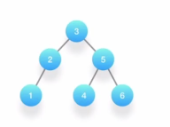

- 完全二叉树

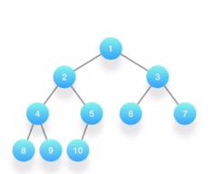

- 二叉搜索树

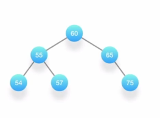

- 四叉树

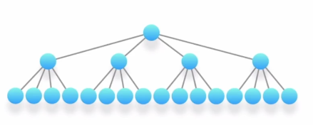

- 多叉树

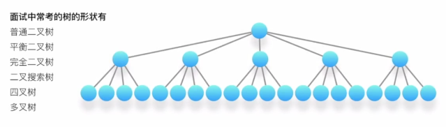


<br>

**特殊的树:(不需花费太多精力)**

- 红黑树

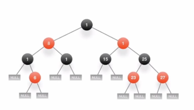


- 自平衡二叉搜索树

---

<br>

*对于树的考察,无非就是`树的遍历`和`序列化`*

<br>

**遍历**


- 前序遍历(Preorder Traversal)

> 先访问根节点,然后左子树,再右子树;

> <font color="red">  主要用于在树里`进行搜索`,以及`创建一棵新的树`</font>

<br>

- 中序遍历(Inorder Traversal)

 > <font color="red"> 主要用于 `二叉搜索树`,因为二叉搜索树的特点就是左孩子小于根节点,根节点小于右节点</font>

<br>

- 后序遍历(Postorder Traversal)

[leetcode-250 统计同值子树](http://www.dashen.tech/2015/03/01/leetcode-250-%E7%BB%9F%E8%AE%A1%E5%90%8C%E5%80%BC%E5%AD%90%E6%A0%91/)

> <font color="red"> 对某个节点进行分析时,需要用到左子树和右子树的信息,即所需要的信息,是从树的底部不断向上进行..好比修剪一棵树的叶子,方法是从外面将叶子不断修剪掉</font>


---

<br>


掌握好这三种遍历的递归写法和非递归写法,及分析它们的时间复杂度和空间复杂度...

掌握好树,说明对`递归`有很好的认识,可以帮助学习图论; `二叉搜索树`尤其是热门考点(中序遍历尤其爱考,因为节点被遍历到的顺序,是按照数值大小的顺序排列好的--仅仅针对BST,普通二叉树并不满足)..

如:


[leetcode-230 二叉搜索树中第K小的元素](http://www.dashen.tech/2015/03/01/leetcode-230-%E4%BA%8C%E5%8F%89%E6%90%9C%E7%B4%A2%E6%A0%91%E4%B8%AD%E7%AC%ACK%E5%B0%8F%E7%9A%84%E5%85%83%E7%B4%A0/)

中序遍历一遍,访问到第K个元素时,返回结果即可;

还可以问求解第K大的元素,对这个二叉搜索树进行反向的中序遍历


<br>

---

<br>


## <font color="red">2 (相对)高级的数据结构 Advanced Data Structure</font>

解决一些中等难度以上的题目


<br>

<b>优秀的算法往往取决于你采用的数据结构</b>


其实现比常用数据结构要复杂很多,在处理一些复杂问题的过程中,多拥有一把利器.掌握好其性质和所适用的场合,在分析问题时回归本质,很多问题即可迎刃而解


<br>


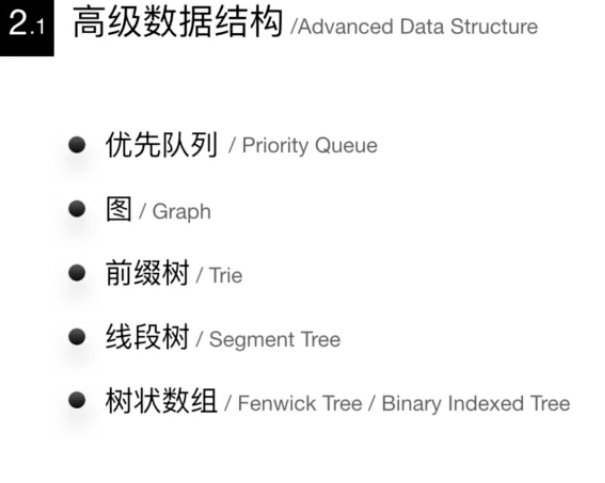


<br>

---

#### <font color="darkgreen">优先队列/Priority Queue</font>

<br>

**与普通队列的区别:**

- 保证每次取出的元素是队列中优先级最高的

- 优先级别可自定义

<br>

**最常用的场景:**

从一堆杂乱无章的数据中,按照一定的顺序(或优先级)筛选(部分或全部)数据

如找出一个数组前K大的数,最直接的办法是排序,然后依次输出前K大的数..依据快速排序,时间复杂度为O(n*logn)..而如果借用`优先队列`,就可以将时间复杂度优化至O(K+n*logK),当数据量n很大,而K相对较小时,可以大为降低时间复杂度..


<font color="red">其本质在于,要找出前K大的数,并不需要对所有的数进行排序</font>


`优先队列`的本质,是一个二叉堆结构,堆在英文里叫做<font color="orange">Binary Heap</font>,

是利用一个数组结构来实现的完全二叉树; 换句话说,`优先队列`的本质是一个数组,数组里的每个元素,既有可能是其他元素的父节点,也有可能是其他元素的子节点,而且每个父节点只能有两个子节点.


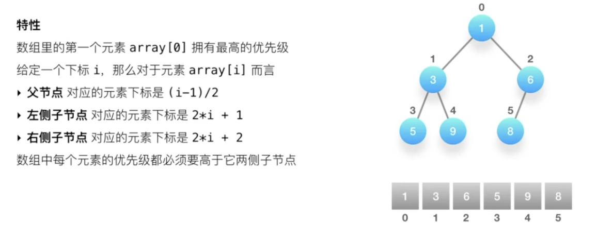


<br>

**最基本的操作就是两个:**


- 向上筛选 (sift up / bubble up)
 - 由于二叉堆是一棵完全二叉树,且堆的大小为K,从下面往上爬,就需要O(logK)的时间,

- 向下筛选 (sift down / bubble down)
 - - 由于二叉堆是一棵完全二叉树,且堆的大小为K,从上面往下,也是需要O(logK)的时间


<br>

**另一个重要的时间复杂度: 优先队列的初始化**

初始化一个大小为n的堆,时间复杂度为O(n). 不需要推导


[leetcode-347 前K个高频元素](http://www.dashen.tech/2015/03/01/leetcode-347-%E5%89%8DK%E4%B8%AA%E9%AB%98%E9%A2%91%E5%85%83%E7%B4%A0/)


看到"前k个"这样的字眼,就应该很自然地想到用优先队列.

优先级别如何选定呢?可以由出现的次数来决定..

统计词频的最佳数据结构,是哈希表


<br>

---

#### <font color="darkgreen">图/Graph</font>

<br>

图是所有数据结构中,知识点最丰富的一个:


- 阶,度(又分出度和入度)

- 树,森林,环

- 有向图,无向图,完全有向图,完全无向图

- 连通图,连通分量

- 图的存储和表达方式: 邻接矩阵,邻接链表

<br>

围绕图的算法,也是各式各样:

- 图的遍历: 深度优先,广度优先

- 环的检测: 有向图,无向图

- 拓扑排序

- 最短路径算法: Dijkstra,Bellman-Ford,Floyd Warshall

- 连通性相关算法: Kosaraju,Tarjan,求解孤岛的数量,判断是否为树,图的着色,旅行商问题(Traveling Salesman Problem),TSP)等


不需要对每一个都一一掌握,需要有的放矢


<br>


**必须熟练掌握的:**

- 图的存储和表达方式: 邻接矩阵,邻接链表

- 图的遍历: 深度优先,广度优先

- 二部图的检测(,又称二分图,Bipartite),树的检测,环的检测(包括有向图和无向图)

- 拓扑排序

- 联合-查找算法(Union-Find)

- 最短路径: Dijkstra,Bellman-Ford(能区分不同,知道在不同场景该用哪个即可)


"二部图的检测(Bipartite),树的检测,环的检测(包括有向图和无向图)","拓扑排序",都是基于图的遍历,尤其是深度优先遍历.遍历可以在邻接矩阵或邻接链表上进行


[leetcode-785 判断二分图](http://www.dashen.tech/2015/03/01/leetcode-785-%E5%88%A4%E6%96%AD%E4%BA%8C%E5%88%86%E5%9B%BE/)


<br>


---

#### <font color="darkgreen">前缀树(字典树)/Trie</font>

<br>

被广泛地应用于字典查找中


**什么是字典查找?**

例如: 给定一系列构成字典的字符串,要求在字典当中找出所有以"ABC"开头的字符串

- 方法一:暴力搜索法
 - 假设要匹配的开头长度为m,则该方法时间复杂度为O(m*n)

- 方法二: 前缀树
 - 时间复杂度O(x),x标识字典里单词最长的那个单词的字符个数. 在大多数情况下,字典里的单词个数n,是远远大于x的


**前缀树的经典应用:**

- 搜索框输入搜索文字,会罗列以搜索词开头的相关搜索


- 汉语拼音输入法的联想输出(输入内容为"cuis")

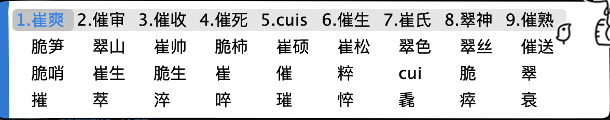


<br>

**重要性质:**

每个节点至少包含两个基本属性:
- children: 数组或集合,罗列出每个分支当中包含的所有字符

- isEnd: 布尔值,表示该节点是否为某字符串的结尾

前缀树的根节点是空的.即只利用到了这个节点的children属性,

除了根节点,其他所有节点都可能是单词的结尾,叶子节点一定都是单词的结尾

<br>


**最基本操作:**

1. 创建

遍历一遍输入的字符串,对每个字符串的字符进行遍历.

从前缀树的根节点开始,将每个字符加入到节点的children字符集当中

如果字符集已经包含了这个字符,跳过

如果当前字符是字符串的最后一个,则把当前节点的isEnd标记为真

<br>


**前缀树真正强大之处在于,每个节点还能用来保存额外的信息,**

**如用来记录拥有相同前缀的所有字符串,这样当用户输出某个前缀时,就能在O(1)的时间内给出全部推荐字符串**


2. 搜索

(创建完成后,搜索实际非常简单了)

从前缀树的根节点出发,逐个匹配输入的前缀字符

如果遇到了,继续往下一层搜索,

如果没遇到,立即返回

[leetcode-212 单词搜索II](http://www.dashen.tech/2015/03/01/leetcode-212-%E5%8D%95%E8%AF%8D%E6%90%9C%E7%B4%A2II/)

使用深度优先算法(想象成走迷宫)

<br>


---

#### <font color="darkgreen">线段树/Segment Tree</font>

<br>


**由来:**
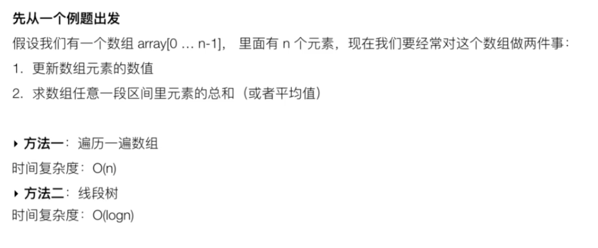


**什么是线段树:**
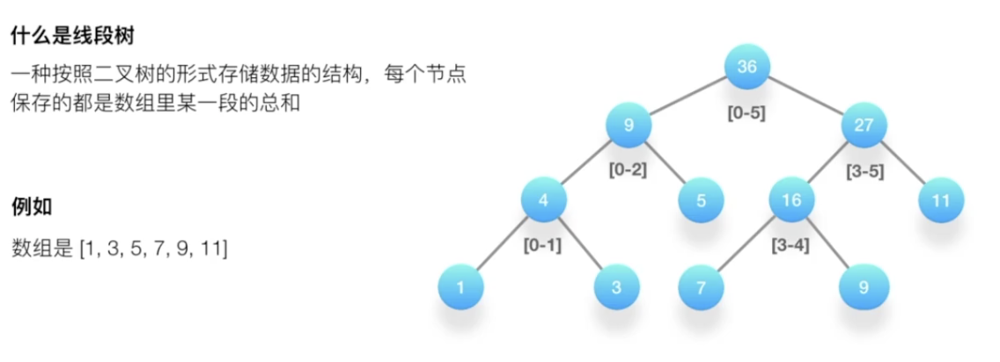


线段树的实现,在书写起来有些繁琐,需要不断练习,才能加深印象..


[leetcode-315 计算右侧小于当前元素的个数](http://www.dashen.tech/2015/03/01/leetcode-315-%E8%AE%A1%E7%AE%97%E5%8F%B3%E4%BE%A7%E5%B0%8F%E4%BA%8E%E5%BD%93%E5%89%8D%E5%85%83%E7%B4%A0%E7%9A%84%E4%B8%AA%E6%95%B0/)

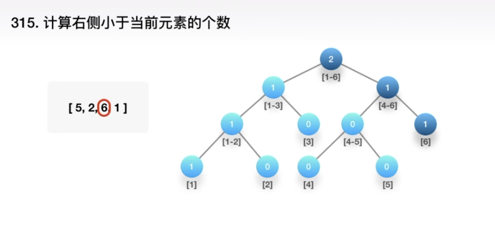


<br>

---

#### <font color="darkgreen">树状数组(Fenwick树, 二叉索引树)/Fenwick Tree,Binary Indexed Tree</font>

<br>

`树状数组`又称`芬威克树`,`二叉索引树`，概念上是树状，实际上是使用数组实现的，表现为一种隐式数据结构

<br>

**由来:**

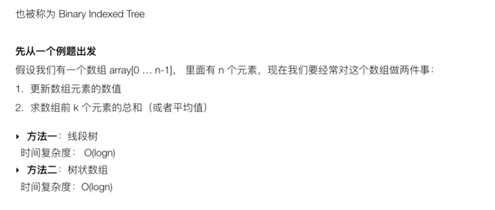


因为只需要求解前K个元素的总和,不需要是任何一个区间,而树状数组的实现比线段树更容易


参考:

[树状数组](https://subetter.com/algorithm/binary-indexed-tree.html)


<br>

**重要的基本特征:**


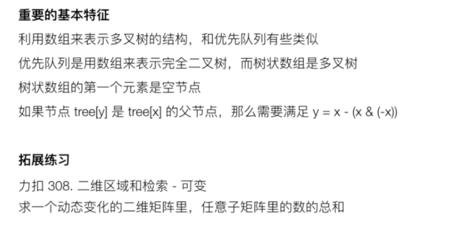


[leetcode-308 二维区域和检索-可变](http://www.dashen.tech/2015/03/01/leetcode-308-%E4%BA%8C%E7%BB%B4%E5%8C%BA%E5%9F%9F%E5%92%8C%E6%A3%80%E7%B4%A2-%E5%8F%AF%E5%8F%98/)

<br>

---


####  <font color="darkgreen">总结:</font>

<br>


- 优先队列: 经常考察,但其实现比较繁琐.许多编程语言都有其实现,届时直接"拿来主义"使用即可...(但还是建议自己实现一个优先队列)

- 图:大数据问题常常都得使用图论

- 前缀树: 一般出现在面试的难题中,往往需要自己实现一棵前缀树

- 线段树和树状数组: 应用场合比较明确


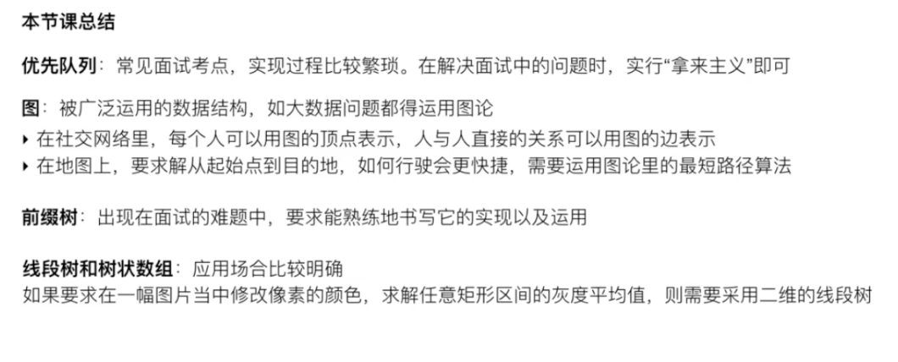


---


