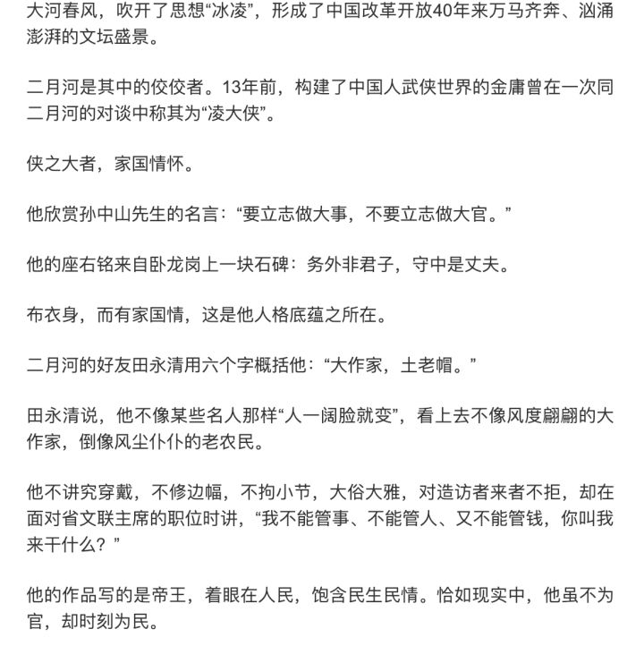

 

“不愿当官”的作家二月河去世了

在几部<大秦帝国>问世并搬上银幕前，康乾三部曲堪称历史帝王作品之最。

青年福临爱妃早殁一念成佛，少年玄烨被孝庄推上前台，擒鳌拜，削三藩，平云南，收台湾，剿灭葛尔丹，合围雅克萨，从年少无知到精于驭人，成一代圣主。穿插其间的“老祖宗”，苏麻，指代曹寅的魏东亭，小毛子，周培公，姚启圣，李光地，还有争斗一生在狱中又相会的索明二相，大阿哥与太子的互相倾轧，以及让人唏嘘不已的容妃和蓝琪儿（初中时我尊敬不已的那位学识渊博的男性历史老师，认为将康熙众多妃嫔子女具象为容妃和蓝琪儿为败笔，我也这样认为，但局限于主线除此取舍无更佳选择，<贞观长歌>中嫁与夷男的安康公主，和蓝琪儿被迫远嫁葛尔丹剧情如出一辙）。

<雍正王朝>起于康熙末期吏治腐败，焦晃的老年康熙慈眉善目威而不怒，挖掘机学校哪家强的中年雍正老成持重身有城府，兼有被最近些年穿越剧一再刻画的八王，年少有勇的老十四，兄弟情深忠心耿耿的老十三，还有历史上无数次翻版重演的年羹尧（竟然和演侯君集的系同一人，今其子承父业，亦有板有眼）。雍正在民间“得位不正”的质疑声中，在“父以子贵”的看法中登台，焚膏接晷宵衣旰食，短短十几年，却承上启下。

及至乾隆，虽是盛世之巅，同样也是跌落之始，这个“十全老人”和地球那边伟大的华盛顿同年去世，渔阳鞞鼓动地来，半个世纪后，来自西洋英吉利的坚船利炮，敲开了帝国故步自封的自信和自负。

从影响力说，三部曲承下行递减之势，尤其最后，<乾隆王朝>堪称断崖式跌落。但恰恰我认为最经典一句出自最后:痴子，世界原是大戏台，毋须掬泪；傻子，戏台本来小世界，且宜佯疯。

