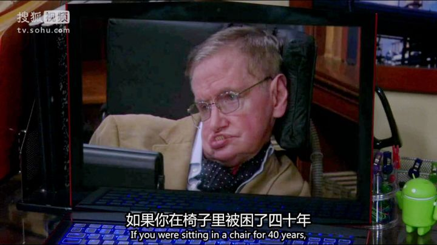
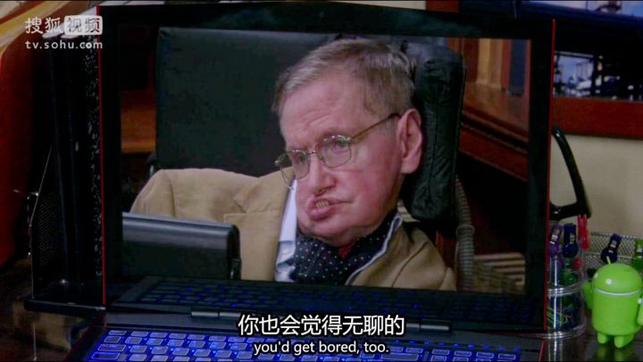
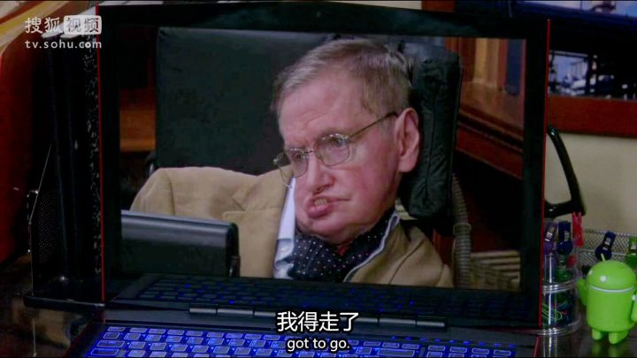
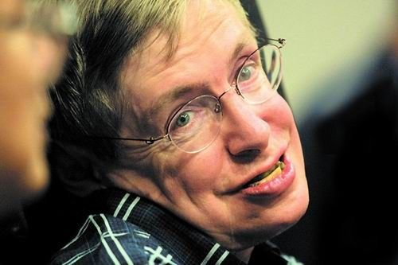

 
一年后的今天，这家全球最大搜索引擎和最酷公司的首页，可能将不再是圆周率日，而是纪念一位逝去的残疾科学家——这似是刻意而为又或是冥冥之中注定，他一生是如此传奇，即便离去也与众不同。

我曾无数次想爱因斯坦理论实现成真，一定先回300年前牛顿那个时代，做一个陪读的书童或侍从，而终究飘忽难至渺然已远。

牛顿墓碑上刻着“人类啊，你们应该欢呼，你们应该荣幸，曾经存在并与这样一位伟大的人类之光同处一个时代”。放眼望去，大师去后，在这个“后基础科学”时代，当世能担此厚赞者，寥寥几人而已。

我曾测天高，而今量地深。

灵魂归天国，身影没尘土。

这是许多年前，我对自然科学兴趣正酣，从一本书上读到的开普勒的墓志铭，这与笛卡尔的“大梦谁先觉，我思故我醒”一样让人印象深刻，而今，用在这里同样合适。这位“天际立法者”一生不顺，死后也未得安息，因为战争尸骨无存。而斯人虽去，斯世虽落寞多舛，却在身后逾400年光阴中，活在人类这个物种最优秀人群的头脑中，出现在中学物理课本，几乎会与这个星球同寿。

“人类花费了几千年才从神话的朦胧走向理性的澄明”。

“虽然身体受到许多限制，但精神却能自由探索整个宇宙。即使把我关在果壳之中，仍然自以为无限宇宙之王。”

“在我 21 岁时，我的期望值变成了零。自那以后，一切都变成了额外津贴。”

“我的手指还能活动，我的大脑还能思维；我有终身追求的理想，我有爱和爱我的亲人朋友；对了，我还有一颗感恩的心。”

