 

[维基百科 2020年逝世人物列表](https://zh.wikipedia.org/wiki/2020%E5%B9%B4%E9%80%9D%E4%B8%96%E4%BA%BA%E7%89%A9%E5%88%97%E8%A1%A8)

 

---

 

###  科比 1978.08.23-2020.01.26

 

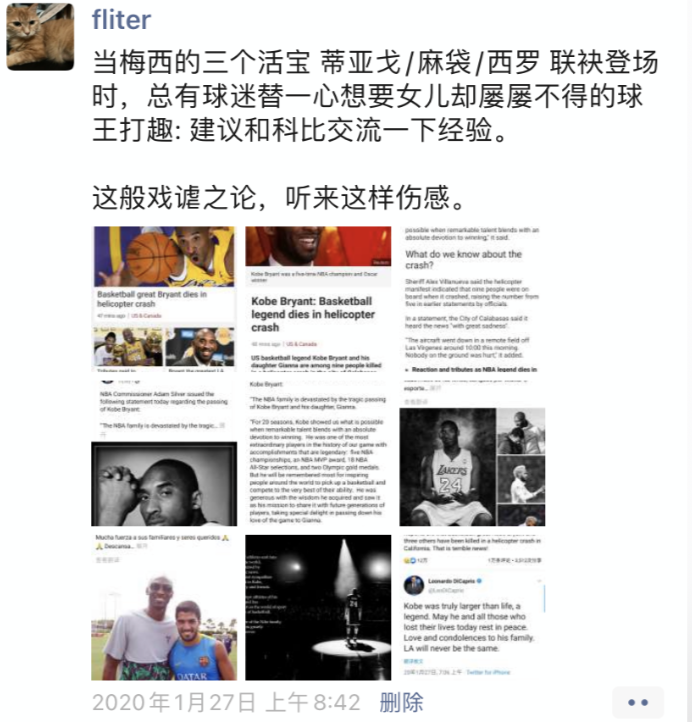

 

 

---

 

###  斯坦利·科恩 1922.11.17-2020.02.05

 

美国生物化学家,1986年诺贝尔生理学或医学奖获得者.

出生在美国的布鲁克林,父母是犹太移民后裔

 

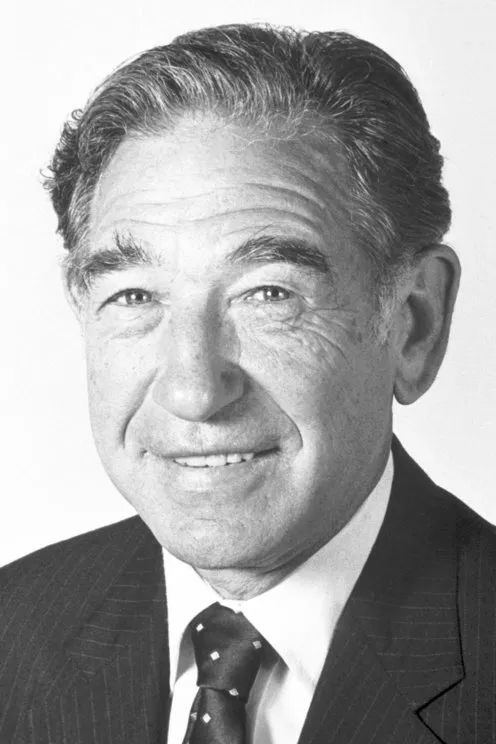

 

[Stanley Cohen-TheNobelPrize](https://www.nobelprize.org/search/?s=Stanley+Cohen)

[纪念斯坦利·科恩：他发现了细胞生长的奥秘](https://www.163.com/dy/article/F88KO6VH05349C3E.html)

 

---

 

###  拉里·泰斯勒 1945.04.24-2020.02.17

 

美国计算机科学家, 与同事Tim Mott一同开发了复制和粘贴功能

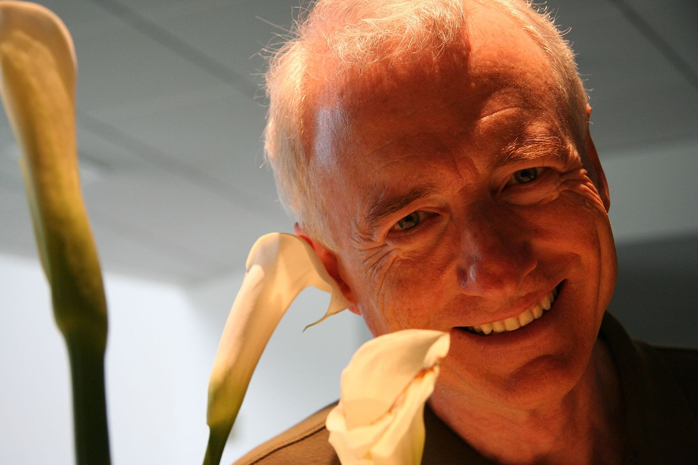

 

[Larry Tesler](http://www.nomodes.com/Larry_Tesler_Consulting/Home.html)

 

---

 

###  哈维尔·佩雷斯·德奎利亚尔 1920.01.19-2020.03.04

 

秘鲁外交官，曾任联合国第五任秘书长等职务

 

[哈维尔·佩雷斯·德奎利亚尔](https://www.un.org/sg/zh/content/javier-perez-de-cuellar)

 

---

 

###  我的奶奶 1932-2020.05.21

 

[近泪无干土,低空有断云](https://dashen.tech/2020/05/22/%E8%BF%91%E6%B3%AA%E6%97%A0%E5%B9%B2%E5%9C%9F-%E4%BD%8E%E7%A9%BA%E6%9C%89%E6%96%AD%E4%BA%91/)

[罢絮光阴萍满池,春风吹鬓白成丝](https://dashen.tech/2020/05/23/%E7%BD%A2%E7%B5%AE%E5%85%89%E9%98%B4%E8%90%8D%E6%BB%A1%E6%B1%A0-%E6%98%A5%E9%A3%8E%E5%90%B9%E9%AC%93%E7%99%BD%E6%88%90%E4%B8%9D/)

 

---

 

###  法兰·艾伦 1933.08.04-2020.08.04

 

计算机科学家, 编译器优化领域的先驱, 成就主要包括编译器的基本原理、代码优化和并行编译等.

2006年图灵奖得主,第一位获得此奖的女性

 

---

 

###  沃恩·琼斯 1952.12.31-2020.09.06

 

新西兰裔美国数学家,以在冯·诺依曼代数和扭结多项式上的研究而闻名.

1990年被授予菲尔茨奖

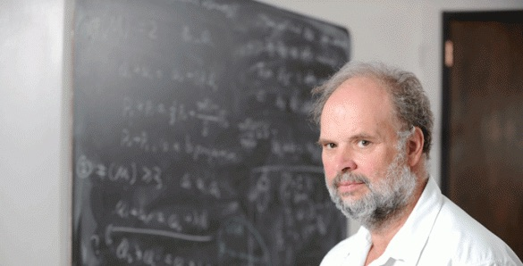

 

[1990年菲尔兹奖得主沃恩·琼斯因病逝世](https://www.thepaper.cn/newsDetail_forward_9146083)

[著名数学家沃恩·琼斯逝世，曾穿橄榄球队服领菲尔兹奖，陶哲轩发文悼念](https://zhuanlan.zhihu.com/p/234902221)

 

---

 

###  阿瑟·阿什金 1922.09.02—2020.09.21

 

美国物理学家，在贝尔实验室和朗讯工作，2018年诺贝尔物理学奖得主。

他在1960年代后期开始研究使用激光操纵微观粒子，于1986年发明光镊。此外，他开创光学捕捉方法，其可以被用来操纵原子、分子和生物细胞，这方法主要是利用光的辐射压来移动微观粒子，阿瑟·阿什金因此被认为是光镊之父。

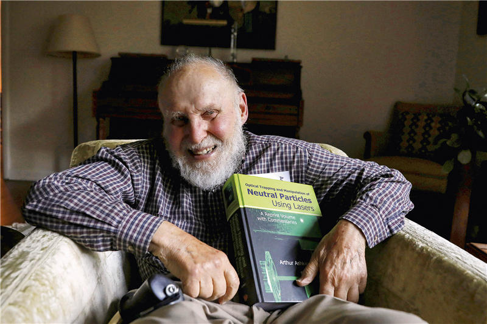

 

[阿瑟·阿什金：生物学领域可能会因为用光镊做出的伟大工作而获得一次诺贝尔奖](https://www.cas.cn/zt/sszt/2018nobelprize/wlxj/201810/t20181010_4665676.html)

[年龄最长的诺贝尔奖得主阿瑟·阿什金：我觉得我被诺贝尔奖遗忘了](https://zhuanlan.zhihu.com/p/45869328)

 

---

 

###  欧阳中石 1928.10-2020.11.05

 

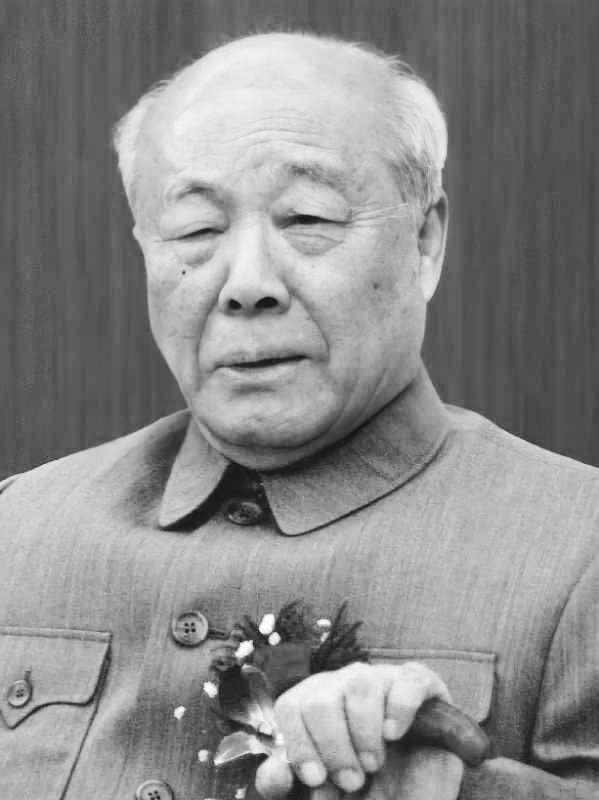

[学生追忆欧阳中石：淡泊名利，谦让一生](https://news.bjd.com.cn/culture/2020/11/20/22036t161.html)

 

---

 

###  小柴昌俊 1916.09.19-2020.11.12

 

日本物理学家.

1987年，小柴在超级神冈探测器完成人类史上首次的中微子发生观测。2002年，小柴与户冢洋二、梶田隆章三人同获潘诺夫斯基实验粒子物理学奖。同年因其“在天体物理学领域做出的先驱性贡献，其中包括在探测宇宙中微子和发现宇宙X射线源方面的成就”而获得诺贝尔物理学奖。

首位“双博士”头衔的日本人诺贝尔奖得主，此外亦是日本人第2位诺贝尔奖暨沃尔夫奖双料得主。他的老师朝永振一郎、门生梶田隆章也都是诺贝尔物理学奖得主。

幼时曾梦想当军人或音乐家，但在12岁忽然罹患小儿麻痹症，其后遗症造成右臂残疾，致使梦想破灭。然而，就在他住院期间，导师送了他一本爱因斯坦的书，却使他从此走上了物理研究的道路。

 

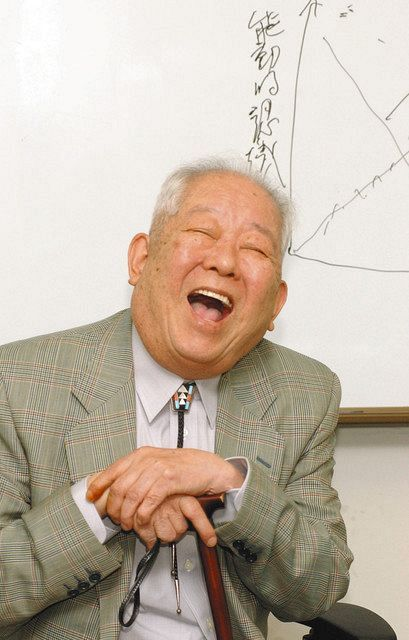

 

---

 

###  马拉多纳 1960.10.30－2020.11.25

 

生于阿根廷布宜诺斯艾利斯，昵称“世纪球王”、“球场上帝”，阿根廷足球运动员和教练，是世界足球史上传奇球星之一，也是最具争议的球员之一。

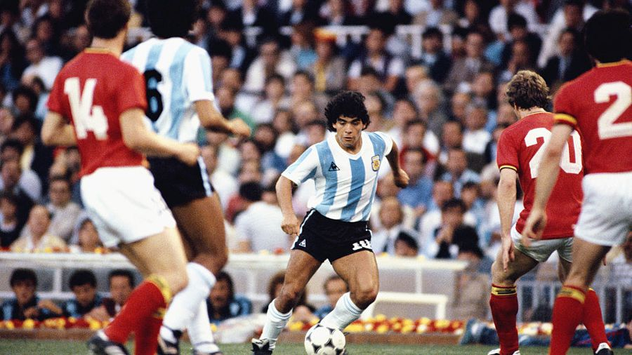

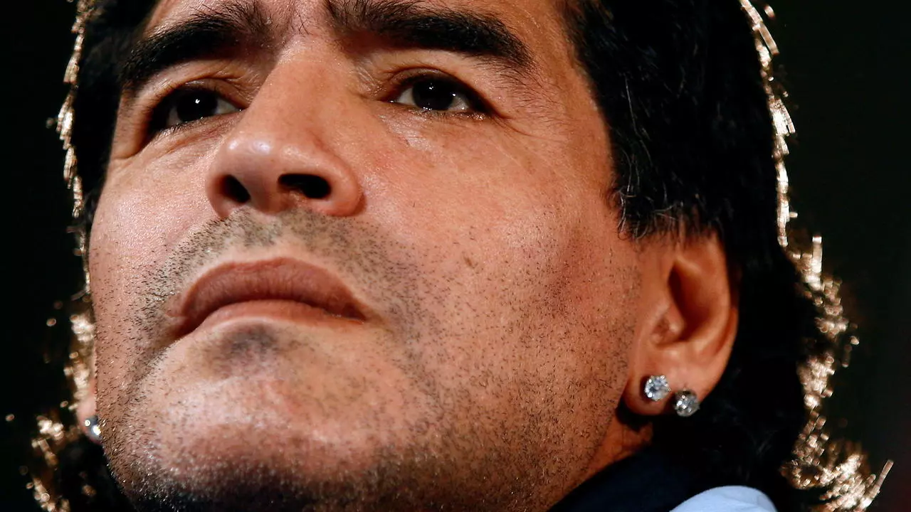

 

---

 

###  爱猫黄橙橙 2016-2020.11.28

 

[黄橙橙生平记](https://dashen.tech/2020/12/28/%E9%BB%84%E6%A9%99%E6%A9%99%E7%94%9F%E5%B9%B3%E8%AE%B0/)

 

---

 

###  诺曼·艾布拉姆森 1932.04.01-2020.12.01 

 

美国计算机科学家,开发出ALOHAnet无线通讯系统

 

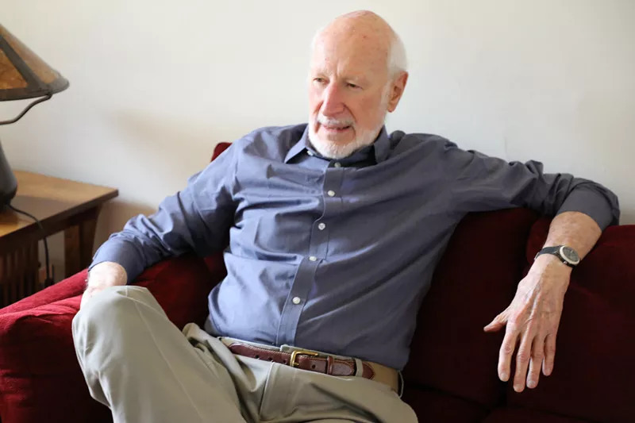

 

[当我们自由上网时，应该想到他，Wi-Fi 之父诺曼 · 艾布拉](https://finance.sina.com.cn/tech/csj/2020-12-12/doc-iiznezxs6531313.shtml)

 

---

 

### 爱德蒙·克拉克 1945.07.27-2020.12.22

 

美国计算机科学家。2007年，他与艾伦·爱默生和约瑟夫·斯发基斯一起因在模型检查取得的杰出贡献而获得图灵奖

 

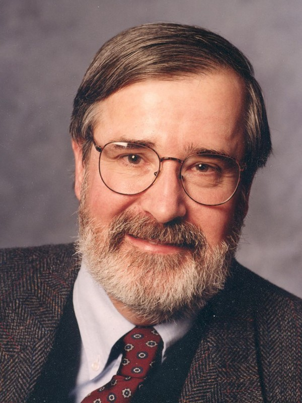

 

[巨星陨落！图灵奖得主Edmund Clarke感染新冠逝世](https://finance.sina.com.cn/tech/csj/2020-12-24/doc-iiznctke8239034.shtml)

 

---

 

