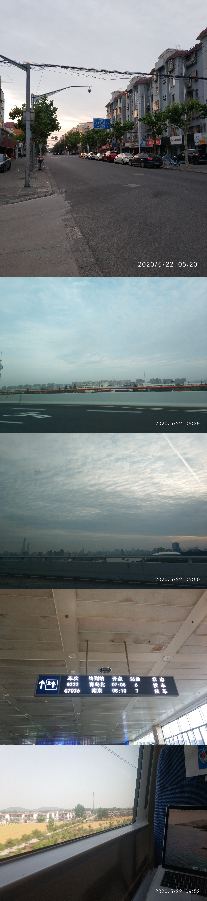
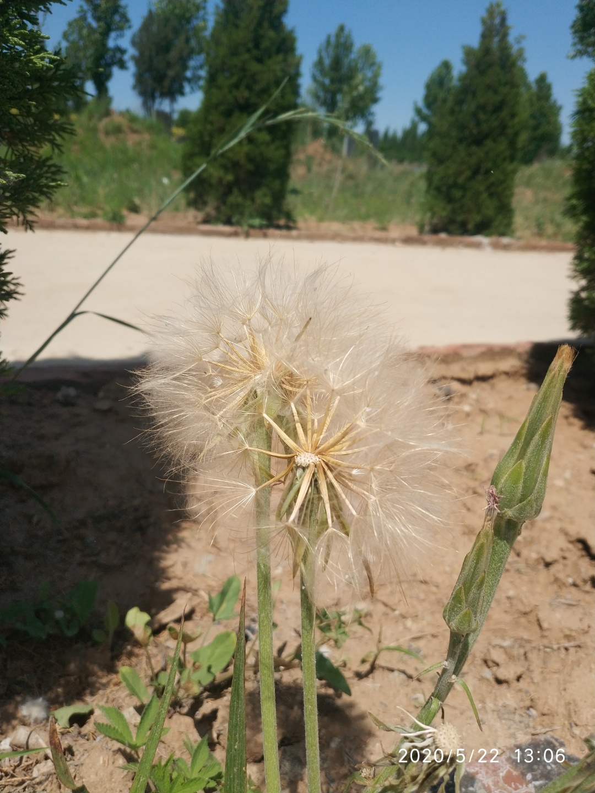
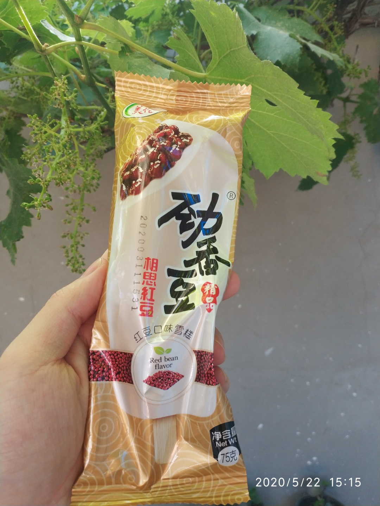
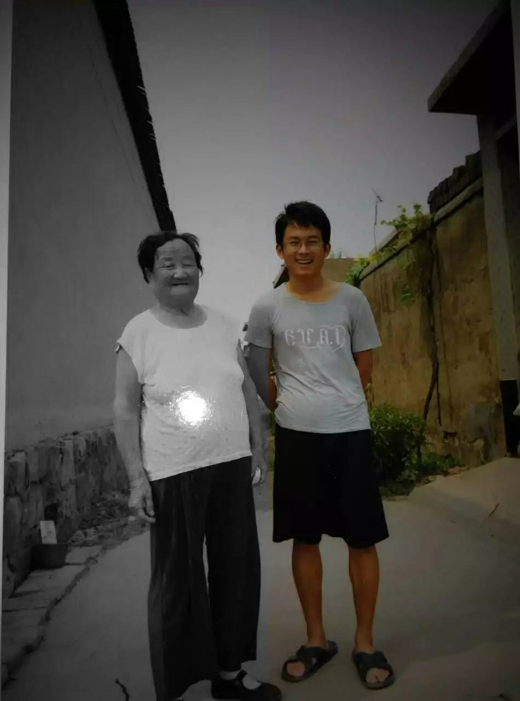

<table><tr><td bgcolor=black>

星夜归故里，晨来动征铎，却还是紧赶慢赶迟了一步，更确切说，只差有一个小时。大概是激进的殡葬改革，再兼疫情期间从简:下午离开的逝者，必须在第二天正午前，完成一系列『注销社会身份』的操作，包括形体消失，寿盒入土。或许政有其因，但从亲属角度看，这规定冰冷而不人道。

</td></tr></table>

<table><tr><td bgcolor=black>

在青砖修葺的“通天银行”前，坚定的唯物主义者认知土崩瓦解，我只动也不动守在坛前，机械接过递来的一沓沓纸钱。带有余温的灰烬扑簌簌升腾飘出，不做闪避，只感到眩晕，像是一个时代的落幕。

在成行翠柏间，发现一株蒲公英，弯身细细打量。“吊影分为千里雁，辞根散作九秋蓬”，这是1000多年前，生逢经乱阻饥年代的白乐天，写他离散各地的同根兄弟。今四海承平，叔侄兄姊，在京在沪在杭在邹，也似这辞根而去各寻新乡的种子。“共看明月应垂泪，一夜乡心五处同”，而今以后，这座举头可见的青青北山，将有别样意义。那是亲情聚集的渊薮，也希望是一甲子后我结束旅途，[最终的归宿](http://www.dashen.tech/2017/01/27/%E5%B2%81%E6%9C%88%E6%97%A0%E7%97%95/)。

</td></tr></table>

<table><tr><td bgcolor=black>

下山后，大人们讨论人情往来，需到各户人家门外致意。听着各种与我父伯相近的名字，却大多无法对应起鲜活的形象。我离乡太早，又只假期偶来，伴随一代人芳华故去，即便再坚持“望京村第一程序员”称号，却知再过数十载，蓬头稚子 笑问客来的场景，将必然发生。

小侄子喊着要吃冰激凌，堂哥带他出去，不多时带回一袋雪糕。这个不谙世事的孩童，听命取出一支送将过来。我低头接下，竟是『美伦』劲香豆---- “[颖乎尔诚能，无以冰炭置我肠](http://www.dashen.tech/2019/08/15/%E9%A3%8E%E8%BF%87%E5%8E%9F%E9%87%8E/)”。

</td></tr></table>

<table><tr><td bgcolor=black>

自古以来，红豆就是中国人表达相思寄托思忆的载体，在温庭筠和牛希济的诗文里，在晏几道和黄庭坚的新词间，在周密刘过和纳兰性德的篇章里。

“红豆不堪看，满眼相思泪”，“几度相思，红豆都销，碧丝空袅”，这是有情人之间离别的郁闷愁苦;而“红豆生南国，春来发几枝”，则是诗画音律皆通的全才王维，思念被流放江南的乐师挚友李龟年。

</td></tr></table>

<table><tr><td bgcolor=black>

而我捏着这小小一支雪糕，盯着包装的文字，则是另一种情愫。

我起身走到庭院葡萄藤下，小满时节万物生长，亭亭如盖。而再几个节气到白露秋分，又将如常硕果压枝。一过霜降，“紫葡萄化为深秋露水，枯藤凄凉凝霜”，如此周而复始。

光束透过叶隙打在手上，闪转腾挪似如无痕之流苏，我盯着浆果上忙碌的蚁虫，回荡着庄生“夏虫不可语秋”，和帕斯卡“人是有思想的苇草”，“怜我世人，忧患实多;喜乐悲愁，皆归尘土”，“来如流水兮去如风，不知何处来兮何所终”。我想到山中老人和波斯明教，想到幽邃瑰凄的李贺那些匠心独运的思索。等意识回流，人生观又像是经过一次重构:

君言百年弹指，白驹过隙，
且看光阴流飞，劝酒一杯。
难识青天之高，黄土之厚，
唯见月寒日暖，来煎人寿。

</td></tr></table>

