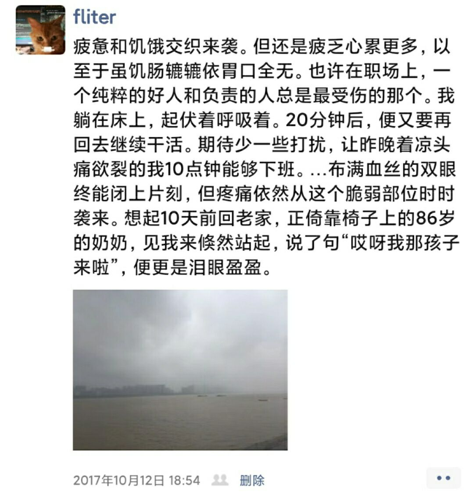
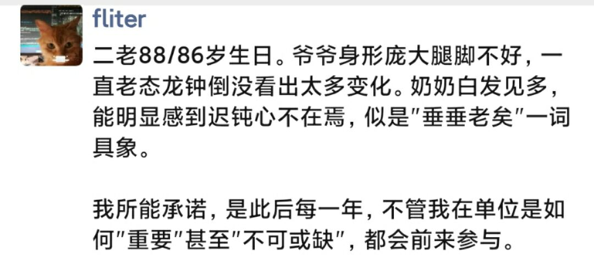
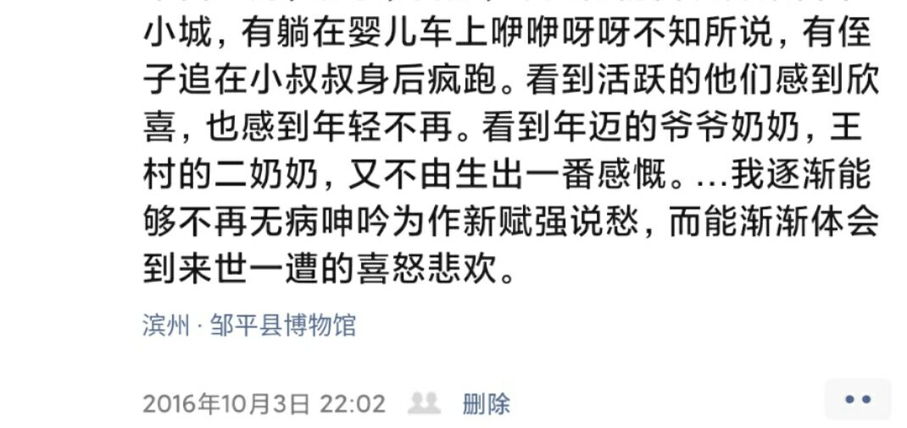

 

 

---

 

  

<table><tr><td bgcolor=black>

我乜斜倚在车座，连日晚睡早起的丝丝倦意来袭。渐昏的暮夜，摇摇拽拽的长途巴士，在降噪耳机舒畅低缓的钢琴声中，不多时陷入梦乡，抱着书包沉沉睡去。

不知是过了几分钟还是数小时，夹层里手机的振铃声将我惊起。拿开发现是我爸，对话很简短，他告知: 奶奶下午过世了。

前刻还处休眠状态，瞬时气血上涌目眦尽裂，错愕之余，本想再多说些什么。心有万语千言，到嘴边却期期艾艾上下打颤。嘱咐我和叔叔商议坐哪班高铁回来，匆匆几句后便挂了电话。

去年暑假的一个周末，我从科技城CBD一处餐馆饱食出门，沿着沁有凉气的河边惬意走着，想起按往常，该和家里视频了。拨通后，爸放暑假，在老家照看抱恙的爷爷。我让奶奶接过手机，指着后面霓彩恢煌的金融城，中气十足说:奶奶，我宅子就在这里，你看看你看看。大概是网络延迟，也有她反应已见迟钝，“响应”总要隔上片刻。与向往街的通明灯火截然相反，那边如豆的灯盏，只隐约映衬出轮廓。说了半晌，最后却还是错认成堂哥，我只当口误，心里不太痛快。

暑假过后，国庆节前，意外摔倒卧病在床，意识还是清醒，身体却不受驱使，难以正常饮食，日渐憔悴消瘦。我在楼梯间接到爸的电话，只感天旋地转后蓦然泪下。向隅而泣到涕泗横流，在半年多前那刻几乎用尽了，知道盈亏有数终有一日。但当到来，当最后一段对话，永远永远定格在隔着屏幕的那个夏日夜晚，有些愁眉不展，有些怅然若失，有些说不出的遗缺抱憾。

…

我有清晰记忆的这15年来，和奶奶交流总不用刻意，感到很自然而舒服。5年前，未能去北境高寒之地继续“深造”，却令她欣慰不已: 你爷爷年轻时去那打过勺子，冰天雪地，举目无亲，不去是最好。我转而南下开始闯荡，她叮嘱处在同城的叔叔:他也还是个孩子，你也多照顾。

那年春节回去，饶有趣味问我工作。回答是在一家o2o洗衣公司，她惊讶，“你给人洗衣服？你会吗？”。我咧嘴笑过，说都是机器洗。接着又问“那你给人算账？”我说也不是，倒腾电脑，进而解释何为“o2o”。实在有太多前因后果需要铺垫，我几乎从雅虎和瀛海威起头，滔滔不绝，串联起风险投资，各种所谓的“商业模式”。这些对一个平生从未触网的耄耋老人，当浑如天书云里雾里。但惊讶是，能大致听下去，并恰到好处不时发问。

…

最近几年，老态明显。曾立flag，无论“如何繁忙”，不管“多么重要”，纵有万难，也不再缺席ta们的每一个生日。可惜自那以后，物是人非约空许，连一次机会也不再有。

两年前姥爷姥姥离世，支撑我幼年世界观大厦的两根台柱已然颓倒。不复有天崩地坼的惶惑，眼见宽 心渐大，那个躲在冰糕箱和胡同里的幼童，始终要脱离庇护，迎受属于自己的风浪。而对一路相伴关怀备至的长辈，总有最深的敬意和绵长无尽的思念。

------------------

</td></tr></table>

