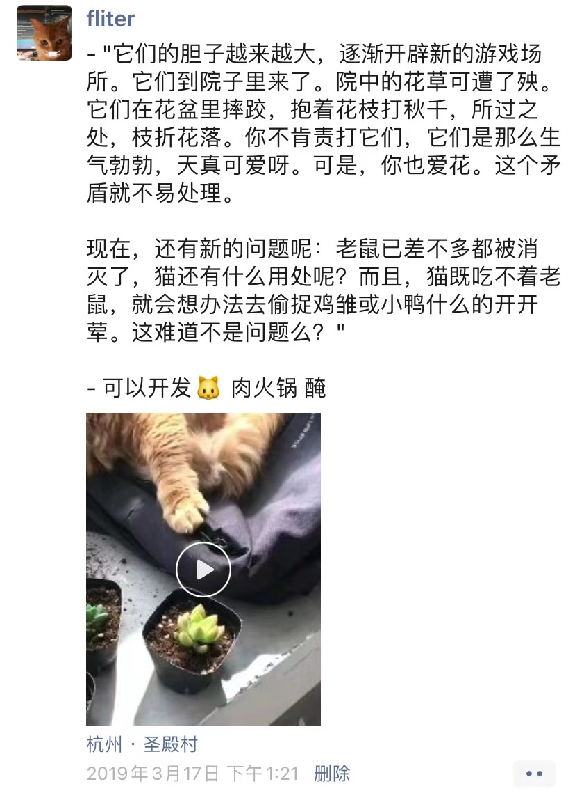
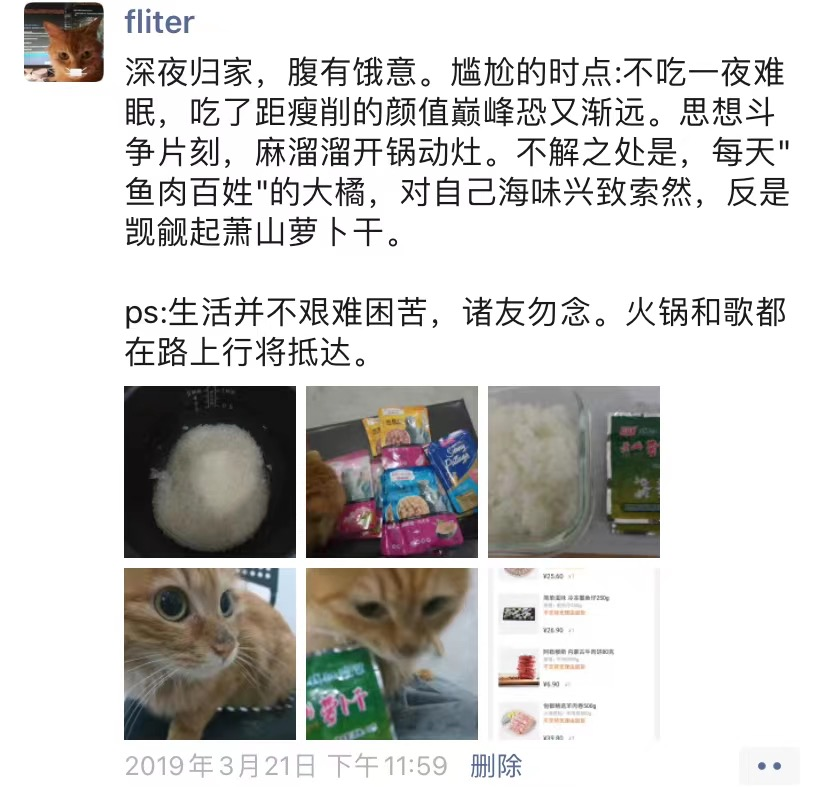
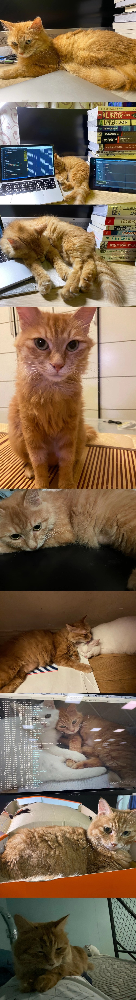

 

找黄橙橙的原主人，大致缕清了其生平 `---` 在还活蹦乱跳，没失去她之前，我其实是不太care她的生平过往。现在，这成了我最想获取知道的信息.

16年年底从外面捡到，浑身跳蚤，瘦弱无肉。长毛，有些混血——据说流浪猫大多如此。

两次怀孕生小猫，都是跳门而出。有孕后再回来。第一胎在2017年8月，当时黄橙橙也就8-9个月大。生了5只小猫。第二胎是第二年，生了3只。

我是18年国庆前后领养。当时主人说，也是跳门逃了出去，后来其母亲散步时遇到，跟着回了家。以为又有了小猫，临走时嘱托我如果有就让其生下来。但是并没有。

陪我在古荡湾新村一幢农民别墅一楼北面潮湿的房间，度过了最艰难的三个月。而后坐在自行车筐里，和我去赴科技城。

2019年10月，随我离杭来沪。2020年5月初，做了绝育，之后短暂胖了一阵。

2020年10月，随我从浦东川沙搬到宝山高境。

2020年11月初，我楼下学习。短暂功夫，上去发现门户大开，喵已不见。刹时血涌，前前后后几个小时，在院中草丛发现。跑到楼梯下杂物堆，死命抓住不放松，抓ta归案！更新筑防线，怕其再次夺门而去。

2020年11月最后几天，健康直转直下。少吃，嗜睡，精神不佳。以为只是季节变换，未多留意。某次呕吐严重，带来医院。第二天医治无效去了喵星。

此刻，我无心上班，来到医院，找接诊医生，确认死因。更试图复盘，看看何时发现，能有一线之机。看毛发，大概年初时还是康健。8月份已见凌乱，或是肇始。医生或是宽慰，有钱难买命，可以释怀。这就是她短暂又传奇的一生。

 

---

 

我终于还是失去了你

 

 

昔日戏言身后意，今朝都到眼前来。

我原以为，之前或会丢掉她的那煎熬的几个小时，是后半年最丧的时刻。其实那还远远不是

 

 

感恩780多个日日夜夜的相守陪伴。在我最落魄不得志时刻，予我最温润熨帖的告慰。这两年多来，你是孤身在外的失意青年，最亲密无间的伙伴。

2020.11.28 永失我爱

 

这几年我惯于长夜，晚睡晚醒。只有少数时刻拂晓便辗转反侧，忧悒难寐。而此情境下披衣出门，寒宵中独立踯躅，还是在近两年前。年底的变故，成了压垮一年诸多无奈的稻草，那是最近些年一段最艰难的时光。从几多仅自己可见的状态，还能一感当日胸中块垒郁结，压得透不过气。也只在砭人肌骨的南方冬晨，在老和山和余杭塘河间一圈又一圈。至亲不在身旁，而我本就没有太多朋友，更鲜少可以诉说。

也是那时，领养不过一两月，刚从生疏变熟络的一只橘猫，或是趴在胸口，泰山压顶岿然不动。或是喵喵叫着，四肢活动踩我衣袖。无论是睡是醒，出门时多相送，归来时必相迎。在坎坷困顿时刻，那是沙漠泓泉，那是凛冬雪碳。在倍觉失意百无聊赖当口，她用粉嘟嘟肉垫抓挠剐蹭，告诉我人间很值得，我的奋斗依然大有意义。

几年来的四处奔走，我安之如素，体验并享受。却是遗漏或视而不见知而不闻，太过频繁地更迭住所甚至城市，于你们都是一次考验，需要比我更长时间的适应。这是第一次想，如果不离开杭州，我们就在自己的房子里，安安稳稳，情况会不会好。…而我要的虚无缥缈的未来，究竟是什么，又是在哪里。我记得离开时放你进笼子，那惶惑不安的眼神，大白天瞪起乌溜溜的黑眼珠。对着你同我一起，一钉一锤拼起，又如此拆卸的家具床铺，和从一室狼藉变得整洁复又一地狼藉的居室。我也有些惶惑，眺望远方如此相慰：存人失地，人地皆得。过几年我们还会回来，也许还有你的女主人。

有你在时觉得理所应当，失去时才发觉生活一角塌方。…我还想等我有了孩子，幼小的ta和年迈的你，一处眼神相会，才是你完成历史使命，可以回喵星之时。

我曾懊恼为何后知后觉，亲友相劝：自有定数，喵具灵性，自知时日无多，会拼命出走，不在家中羽化。月初遁逃，或已膏肓。原主人亦告，此猫天生体弱。愈是这般，愈觉未珍惜最后时光，以为永远如常。

此刻，我又独立寒宵，留下这些无关痛痒的图文，以悼曾陪伴我艰难岁月的挚友。此刻，也许你已在高温下泯为灰烬，消散四方，于世只残存我保存下的一团毛发，几缕白须，和烙印在我大脑皮层的痕迹。我的生活还要继续，你却不能再有这样的出镜率。

喵星苦寒，吃胖一点。几十年后还会再相见。

 

你永远留在了2020,但我还会带着你的一颦一笑,走很远很远.