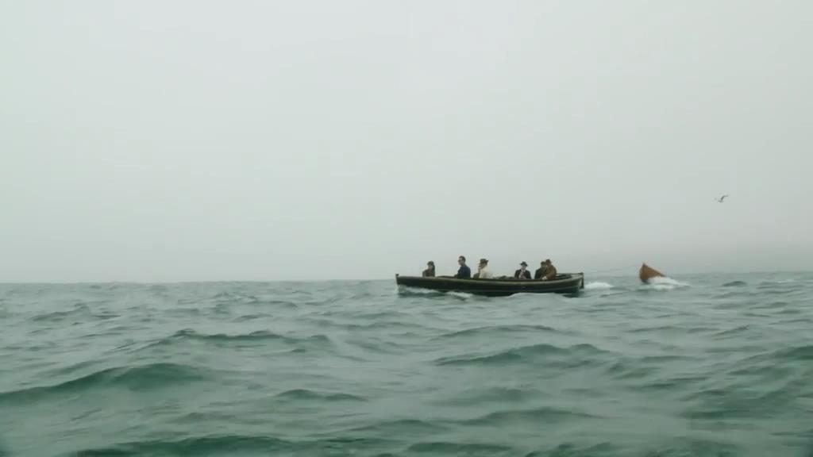

我的个人技术网站[www.dashen.tech](www.dashen.tech)正式上线了。今后，你可以在全世界任何一个角落，用任何一台可联网的设备进行访问。

此刻，我难掩内心的激动，不单单因为这个几乎不需要任何技术即可搭建完成的网站，而是因为互联网，因为这个时代。

1998年，在中学工作的爸爸，用一沓一面已经使用的穿孔纸，操作着双飞燕滚轮鼠标，将他用办公室那台浪潮电脑下载的《阿里巴巴与四十大盗》打印出来。此后的许多个午后，阳光透过老家阳台的玻璃打在脸庞，我躺在床上暖洋洋十分惬意。爸用他那并不算标准的普通话，开始给我讲阿里巴巴的故事。我不时提出不解与疑问，直至昏昏沉沉地睡去。今天，那沓已破旧不堪的故事集，仍完好压在我床榻之下，阿里巴巴的故事也一直深藏在心里。后来偶尔翻看，还能在页脚看到新浪字样。

我当然不会知道，几乎与此同时，在遥远的浙江，一个毫不懂技术的英语老师，持有了[alibaba.com](http://alibaba.com)。十八罗汉的故事将在多年后为人所熟知，但在当时，这个坚信互联网将深刻改变商业的浙江人，还在别人的嘲笑中执拗地艰难前行。16年前，从新浪下载到的阿里巴巴的故事，成为互联网给我的第一份惊喜；16年后，另一个阿里巴巴不仅成为新浪的大股东，还以BAT三巨头的姿态深刻改变着人们衣食住行方方面面。对于一个现代人，他们提供的网络服务，已经如同水和电，深深嵌进每个人的生活。

1999年，幼儿园一个放假的周末，我随二大爷去他所在的城里小住，那里有一台小叔辗转带来的组装电脑。姐姐用一个叫“金山画王”的东西，几分钟内就画出了一只鲜艳漂亮的蝴蝶，让我惊讶并佩服不已。当我接过鼠标操纵笔和橡皮尝试作画，问的第一个问题是“姐姐，这块橡皮会用完吗？用完了要再从哪里买？”

我也是许多年后才知道，开发出金山画王的金山公司，有位年纪轻轻的IT劳模。在10多年前的90年代前后，初上大学的他在图书馆读到了一本《硅谷之火》 ，书中讲述的的故事让他心潮澎湃，绕着操场转了一圈又一圈。20年后，我切身领会到了当年他的激动。而这时他已抓住移动互联网风口，意欲实现当年夙愿。我的第一部智能手机，即拜其所赐。这个普通话和口才极差的工科男，不太会表露自己的内心情怀。但当那年我在中部一省份边陲的群山之中，看到当地居民拿着他新出的千元机，虽然依然不会用淘宝不会用来看新闻，但还是让我感慨不已。信息平等，是实现社会平等最起码的前提。

有人在20几年前已经深刻领会到这一点。在山西阳泉，一个自认技术不错的少年前去太原参加编程大赛，最后却惨败而回。当他路过省城的新华书店，疑惑一扫而光，里面有鳞次栉比的编程书籍，这和他家乡的资源形成强烈反差，自此，一颗种子就埋在了他心中，并在若干年后长成参天大树。“让每个人平等的提升自我”，这是我认为最直白却最震撼人心的品牌宣言。

2000年，还是用那台浪潮电脑，爸借来同事新买的30万像素的索尼数码相机作为摄像头，又从老家接来爷爷奶奶，在一个上午，不知如何操作居然看到了远在美国东海岸康涅狄格州的小叔。能看到屏幕上大洋彼岸亲人的一举一动，不要说对爷爷奶奶，这让我都感觉像是在梦中，在变魔术。后来我知道，这个让我认为是在变魔术的神奇东西，叫做“雅虎通”。

也是那一年，我在南北寺中学财务处外的那片草坪，扮演着洪七公和王欢扮演的东邪过招，玩的正欢。我回办公室去喝水，问在电脑旁的表哥在做什么。当我听到"在聊天"的回答后，他继续问我要不要也“注册”一个，并刻意补充“不要钱”。我说那好吧。我对他的问题“你想让昵称叫什么”又表示不解：“什么是昵称”？他说“小猫小狗都可以，叫小狗吧”。听到这个回答立马打消了我“注册”的想法，因为那时，我崇拜的是东邪北丐这样的英雄。匆匆喝过几口白水，又拿起打狗棒撒腿跑到草坪再战。后来，这个当时还叫做QICQ的东西，成为改变亿万中国人交流方式的工具。

2003年的非典是一场浩劫，但灾难的同时也在孕育着新生的力量。如同300多年的那场黑死病，60岁的黑格尔不幸而去，而23岁的英国剑桥大学三一学院学生伊萨克·牛顿，则迎来了自己的春天。

这一年，在杭州湖畔花园，一个叫淘宝的东西即将诞生。当年那个英语老师，已然小有名气，但在三剑客统治互联网江湖的时代，他仍然还只是配角。但这时，互联网纵深化发展的趋向已可见一斑，互联网的作用将不再只是看看新闻，玩玩游戏。

同样在这前后，出身苏北农村的吊丝青年刘强东，不得已结束在中关村的实体生意，开始新的尝试。这个毕业于中国人民大学社会学专业的前学霸，因对专业的失望，在大学期间自学了编程。

2004年，印尼苏门答腊海域发生地震并引发特大海啸，最终造成20余万人丧生。那是一个冬季的下午，我坐在邹平一中一间办公室的沙发上，看着当时的齐鲁晚报。“中国首富丁磊捐款1000万给海啸灾区”，这让我疑惑，丁磊是何方神圣？当我得知首富居然是互联网行业，不禁愕然，因为在我看来，看得见却摸不着的互联网，怎么会产生首富？首富不该是属于钢铁、汽车，乃至石油化工行业？后来，这个打出网聚人的力量的前首富，成为独树一帜的互联网门派之一。他辞掉家乡公务员南下广州的惊人之举，与在深圳那杯啤酒，在今天同样为人所津津乐道。当年那杯啤酒的另一位主角，正是我最崇拜的互联网英雄，我多年前拒绝注册的他的产品，在今天已然覆盖大半个中国。

这是时代机遇，也是个人选择。有几个大学老师会下海经商，有几个人大毕业生愿去中关村摆摊，有几个大学生会辞去家乡稳定工作南下闯荡？或者试想，那个长相英俊的阳泉青年如果真选择去唱戏，或当已在美帝过起舒适中产生活乐不思蜀，就不会有百度的出现。那个酷爱天文的潮汕青年选择去南京大学学地理，也许今天会是一位优秀的学者。那个已然位列成功人士的IT劳模，没有雄心壮志，不会选择置成功声誉于度外再次创业。

2004年后，我和网的关系已经无需再说。 它已经在我有意识或无意识间，不可逆转地一步步沁入我的生活。这一年，由两个斯坦福学生创办的搜索引擎在纳斯达克上市，并最终让被认为不可打败的微软头疼不已。同样这一年，又有一个哈佛大学学生辍学，开启了自己的传奇。...

此时此刻，在距我所在上海长宁不远的浙江乌镇， 一年一度的互联网大会正如期举行，包括国家最高领导人在内的政商领袖齐聚一堂，共商网事。而今，互联网再不是一个geek们之间炫技的工具，它也不单再是承载太多青年希望的创富工具，它让信息更透明，它让每个人都能发声，它将掀起一场影响深远的和平革命。

在我听完《阿里巴巴与四十大盗》的故事许多年后，《一千零一夜》的其他几个故事我隔了好几年才读到，对那个年纪的我诉说当时正在发生着的传奇，却会觉得是“天方夜谭”。几年后，我读完《辛伯达航海记》，被故事里辛伯达7次航海的奇遇痴迷不已，并认为比阿里巴巴和阿拉丁更让我神往。

500多年前，人类的大航海及与之俱来的地理大发现第一次从空间上让全球连为一体。而500年后的互联网革命，则被认为是继大航海后人类又一次深刻改变信息的传递与联系。

大航海是让每一个心有梦想的弄潮儿激动的，旅途的闻所未闻的奇花异草与所见所闻，更让人悸动难奈。作为一个从业者，我们所走的每一步都是前人未曾做过的，我们鲜有经验无章可循，这让我们担心，但更人激动。我们所走的每一步，也许都在创造着历史。

***

当我在高中第一次真正开始思考自己未来从事的工作，那时对数理痴迷不已的我毅然想要从事纯理科，我想做牛顿，做欧拉和高斯，做麦克斯韦。然而，当我对数学老师稍稍透露这个想法，他回答“如果早生几百年，也许很可能。但现在很难有那样的发现了。”这句他平淡说出的话于我不啻惊雷，我想了许多。而后西配楼卫生区经逢的事情发酵让我深陷痛不欲生的纠结，无暇或已无力再奢求再多想许多。2013年，我陪化学工程师的二大爷去一化工厂，厂长热情招待了我们。他问及我专业时我不疼不痒地说出，对方听到，也感慨地说了一句“还是让孩子学点这东西好（指化工），这玩意学无止境啊！”

说者无心听者有意，“这玩意学无止境”，这句话让我不再自欺欺人，我开始承认，我与生适合做一名工程师，即便当时，我已经是文理俱佳并以半geek自居的互联网爱好者。我对各家历史如数家珍，却对技术粗略知晓。

2013年6月，在又一个迷茫无措时刻，我决定做一些事情转移心中无法排解的万千块垒，那时我注册了一个域名，学了html，最后却因为学校的不支持而不了了之。

2015年，我处在5年来最兴奋最踏实最满意的一段时期，过往萦绕心间的羁绊，能解则解，不能释怀就先压在心底。我要发至内心感谢互联网，感谢`**`，感谢`**`。

在最后，我仍然想以那段著名的腾云杂志创刊词结尾。在我有关网络的多如牛毛的文章的结尾，我总是情不自禁想到它：

>1988年3月，中山大学哲学系教授刘小枫写下哲理散文《我们这一代人的怕和爱》。与此同时，一项名为“中国计算机科技网”（CANET）的项目启动，希望将中国的大学和研究机构中的计算机与世界范围内的其他计算机网络相联。
23年后的今天，我们借用这句话，雕琢出《腾云》这本刊物的宗旨：“面对未来，我们的怕与爱”。此时此刻，搜索引擎、电子商务、社交网站、移动互联网等基于网络的创新，让包括中国网民在内的全球20亿以上互联网用户的生活变得更加多姿多彩。面对人生和世界，我们“怕与爱”的基本情绪没有改变，但整体视角已经从过去和现在转投向了未来。这正是过去20多年间互联网在全世界崛起蔓延的深刻后果之一：爆炸的科技和信息对世界的祛魅使得“现在”越来越透明，“未来”却越来越混沌。
所有关心世界如何运转的人，同样甚至更加关心那个激动人心却充满不确定性的未来。这也是我们策划《腾云》最初与最终的目的。
这本读物是腾讯在茫茫人海中寻找思想伙伴，共同探索未来世界的持续努力之一。需要特别说明的是，《腾云》不承载任何传播腾讯企业资讯的使命，
我们所关心的命题只有三：1，互联网的未来将走向何方？2，中国的未来将走向何方？3，人类社会的未来将走向何方？
很明显，这样的思考远远超出了腾讯一家公司的视野和能力。所以，我们采行了一种特别的编辑策略：以文章的推荐者为核心，借助他们的远见卓识和宽广视野，将解读不确定未来的线索交付到读者手中。而这些推荐者，就是我们的“云中智库”。
套用一句刘小枫在《我们这一代人的怕和爱》中所说的：只有品尝过怕和爱的生活的灵魂，才会懂得由怕和爱的生活本身用双手捧出的这颗灵魂。《腾云》所追求的不是对未来虚幻的想象，而是未来在当下的映照与投射，是我们对之充满了怕与爱的未来本身。

***
此刻，我万分荣幸成为互联网这艘大船上万千水手中的一员。