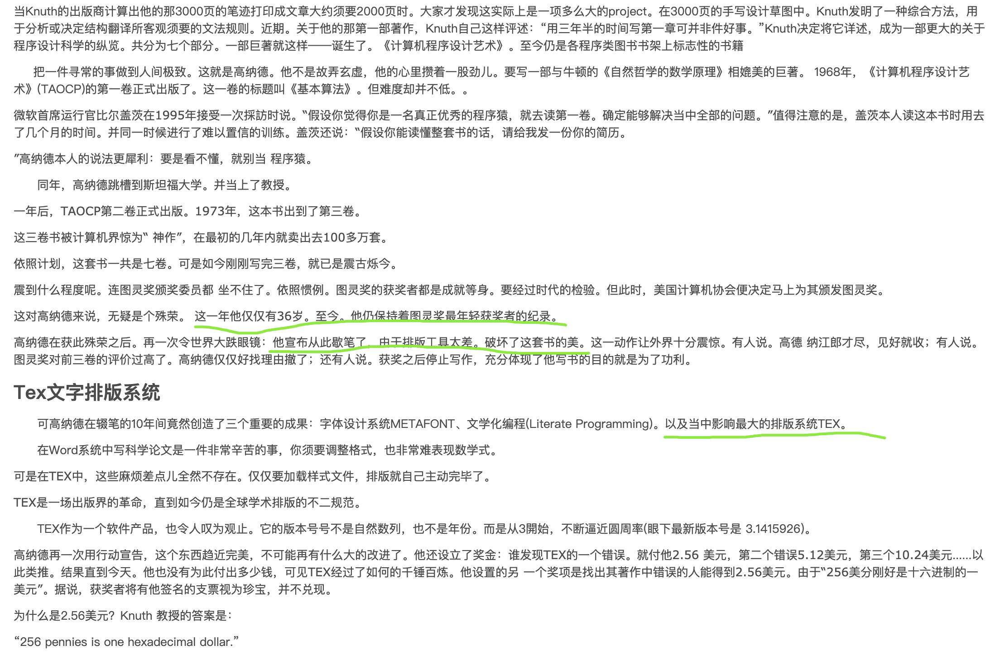
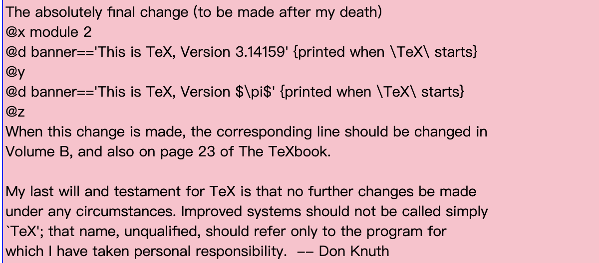
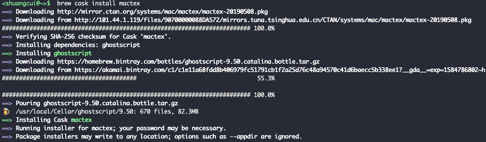
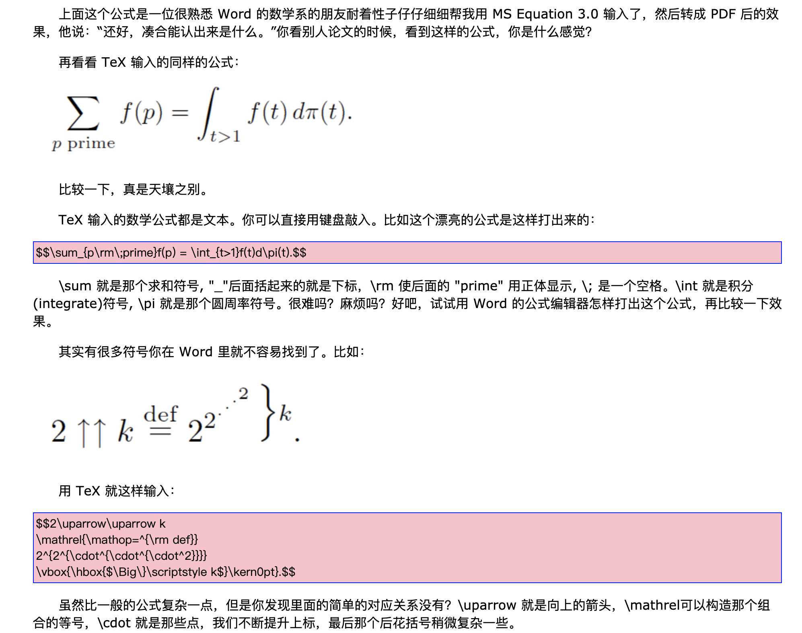

 

### 历史渊源---出身显赫

 

"世界上只有一个TeX程序，它就叫做 "tex", 它是由计算机科学家 [D. E. Knuth]() 设计并且实现的。TeX 不仅是一个排版程序，而且是一种程序语言。

LaTeX 就是用这种语言写成的一个“TeX 宏包”，它扩展了 TeX 的功能，使我们很方便的逻辑的进行创作而不是专心于字体，缩进这些烦人的东西。

TeX 还有其它的大型宏包，它们和 LaTeX 一起都被叫做 "format"，现在还有一种常用的format叫做 ConTeXt, 用它能方便的作出极其漂亮的幻灯片，动态屏幕文档…… 

**我们通常用 TeX 都是在用 LaTeX, ConTeXt, 因为 TeX 的底层需要更多的知识才能了解，一般人不需要自己设计自己的格式。**"

更多关于TeX的内容,参见[TeX — Beauty and Fun](http://www.ctex.org/documents/shredder/tex_frame.html)

---

 

### 安装 & 使用

 

### 输入数学公式

 

[VS Code 与 MacTex](https://www.jianshu.com/p/d2c1ae324951)

[macOS 下基于 VS Code 的 LaTeX 环境配置](https://www.jianshu.com/p/c09b3409317f)

[Latex mac vscode](https://www.baidu.com/s?ie=utf-8&f=8&rsv_bp=1&srcqid=4033423253207855203&tn=50000021_hao_pg&wd=Latex%20mac%20vscode&oq=Latex%2520mac&rsv_pq=81e1356000229fd2&rsv_t=c717ZXa1wOPCt9a9GSksCk2u2NNv5gohLhJEFpGsl%2FXiXEO57mXVKMvuc1sSkSf63q%2F65pvm&rqlang=cn&rsv_enter=1&rsv_dl=tb&inputT=1975&rsv_sug3=14&rsv_sug2=0&rsv_sug4=1975)

[数学公式](https://latex.91maths.com/)

 

###  基于LaTeX书写简历

 

部分资源:

[中英文通吃的 LaTeX 简历排版作品](https://www.latexstudio.net/index/details/index/mid/622.html)

[非常实用漂亮的求职LaTeX简历模板](https://latexstudio.net/index/details/index/mid/380.html)

---

 

参考:

[如何优雅的编辑数学公式？LaTeX公式入门](https://latexstudio.net/index/details/index/mid/380.html)

[LaTeX公式编辑器](https://www.latexlive.com/)

http://www.xiaomaidong.com/?p=1169