 

### 代码调试

使用go module且生成vendor,想要(临时)修改用到的第三方包的代码,go run/go build时改动的代码是无效的.. 
当确实需要修改第三方的包,这个问题该怎样较好解决的?

 

---

 

在2019-09-24 19:09:10 说:

### 一致性算法

最近在看『一致性算法』,主要是Raft,事实上其已取代过去十年几乎是分布式领域一致性协议代名词的Paxos。后者以晦涩艰深出名,而Raft在设计之初,就是要解决Paxos难于理解的痛点,故而其以『Understandable』自居。

其核心为『leader election』和『log replication』(safety勉强也算)。前者是有一个时间不等的倒计时,后者则类似两阶段提交(2PC)…

[具体细节可见](https://github.com/maemual/raft-zh_cn/blob/master/raft-zh_cn.md)

基于这两种协议实现的最知名产品,即ZooKeeper和etcd名字取得都非常有意思----像“动物园饲养员”一样有条不紊并行不悖,被三只猫折腾得天翻地覆的我,表示这个期许实在不低;

而“etcd”表示分布式的 etc 目录,我用它来在分布式系统中做配置中心,而至于etc目录----/etc:系统主要的配置文件几乎都放置到这个目录内,例如人员的账号密码文件、各种服务的起始文件等。一般来说,这个目录下的各文件属性是可以让一般用户用户查阅的,但是只有root有权利修改。FHS(绝大多数linux采用的文件组织形式)建议不要放置可执行文件(binary)在这个目录中。比较重要的文件有:

 

- /etc/inittab,
- /etc/init.d/,/
- etc/modprobe.conf,
- /etc/x11,
- /etc/fstab,
- /etc/sysconfig/等。

http://thesecretlivesofdata.com/raft/

[个人笔记](https://note.youdao.com/web/#/file/WEB79355adb43661e7fe9c6f0d6884a35bf/note/WEB6da865a5f25b5786669dcdb3dfaf39d6/)

---

 

在2019-08-07 23:09:10说:

### <小议使用英文词汇的准确性>

下午分享讲到NFV和SDN,瞥了眼其英文全称,中规中矩不过如此。在讲到主干网络和分支网络拓扑时,又扫了眼ppt,一时在极速思考:此处的“主干”,用哪个单词更为贴切形象?main吗?作为go或java等开发者恐怕已经不想用这个烂大街的词汇。当图像翻到下页,看到结果是“spine”,脊椎,脊柱之意,大呼生动准确。

在我最近几年的职业生涯中,还曾有两次这样的“被
惊艳瞬间”:

1.有道云笔记之前某个版本,可以观看广告视频,完毕后弹出三个礼盒,你可选其中一个,获取1-10M空间。某天我突发奇想,这三个盒子里的空间数量,会不会早已经算好放在里面,只待你“拆开”?虽然换位思考,我不会这样设计,而会采用更合理的点击时服务端依据随机算法即时生成。抱着试试看看心态,抓包查验。果不其然,无法通过此伎俩,提前获悉哪个盒子里的空间数最大。但意外之喜,是好奇弹出礼盒的这个接口,如无记错叫做“Cerberus”,是希腊神话里的一只三头怪物。换成我,大概率会用“threebox”。

2.之前遇到一个“分润”bug,此前我一直不清楚何为“分润”。搜索到对应词是distribution,但该词更多用作“分配,分布,分销”。原代码中用到的词是refund,即退款,返还款,貌似已较贴切。直到某天无意看到支付宝的接口文档,叫做distribute_royalty。

这感觉,似是“初极狭才通人,复行数十步豁然开朗”。更像出恭中的阎公,听闻“落霞与孤鹜”句拍腿叫绝。

*于2019-09-21 21:05:12修正:*

之前全网寻找上图不得,现在又出现该功能,果断抓包查看接口名称。

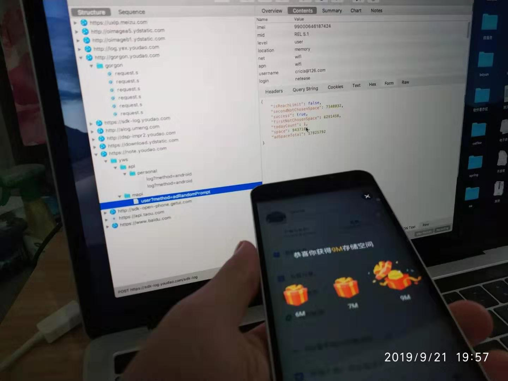

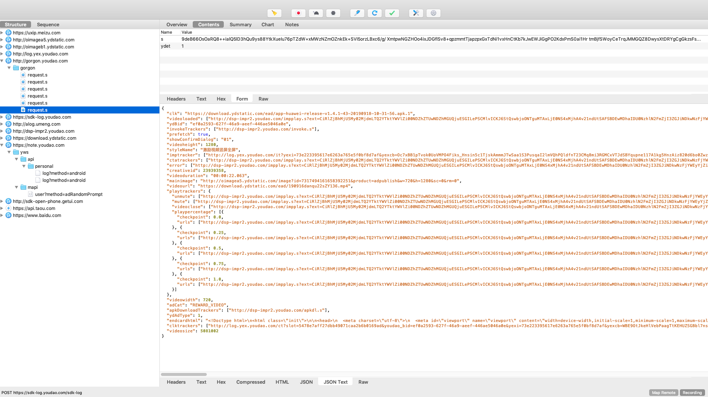

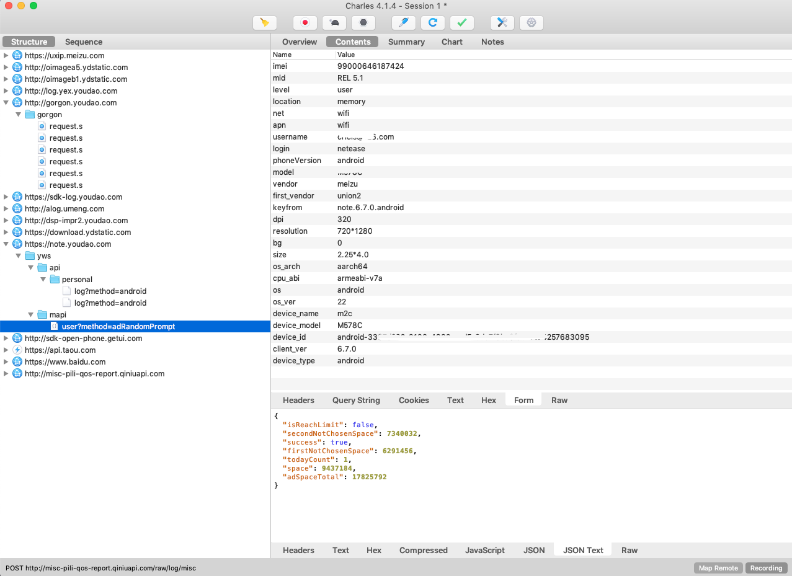

实际上不是叫『Cerberus』,而为『Gorgon』。是三个姐妹,通常情况头生毒蛇,睹其真颜者将会石化。

除去历史上赫赫有名的符(彦卿)家三姐妹,独孤(信)家三姐妹,近现代的宋(嘉树)家三姐妹,以及文学史上的夏洛蒂三姐妹,又get到神话里的福耳库斯三姐妹,且有一个专属词汇“Gorgon”

 

---

 

### 关于"哨兵"

 

「sentinel」，在软件领域，有“带哨兵节点的链表”，“redis的哨兵模式”，还有某些公司开发的中间件。

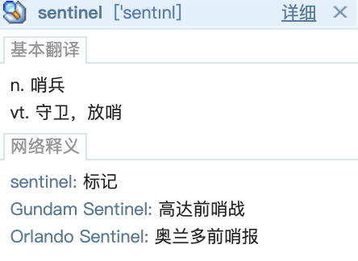

但这个词在不同场景下，其实含义有所差异。在list中，更好的翻译实则是“标记节点/标志节点”，就像边界线，像孙悟空给唐僧画的那个圈。（理解成水位线，多少也有点哨兵的意思）

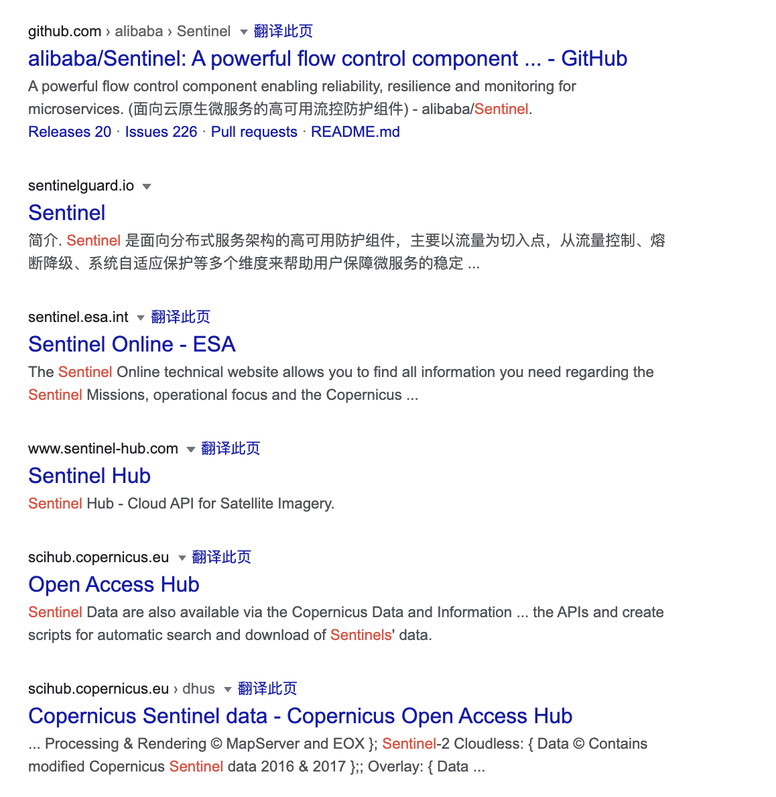

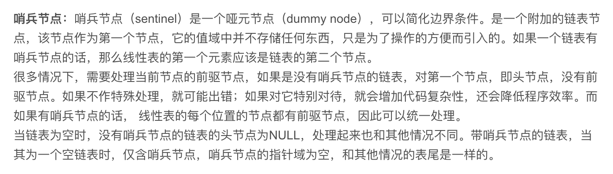

而redis的这个“哨兵”，才是真正意义上的哨兵。它会监控集群状态，当主服务器宕掉，会自动将某台从服务器扶正，并通知其他从服务器。

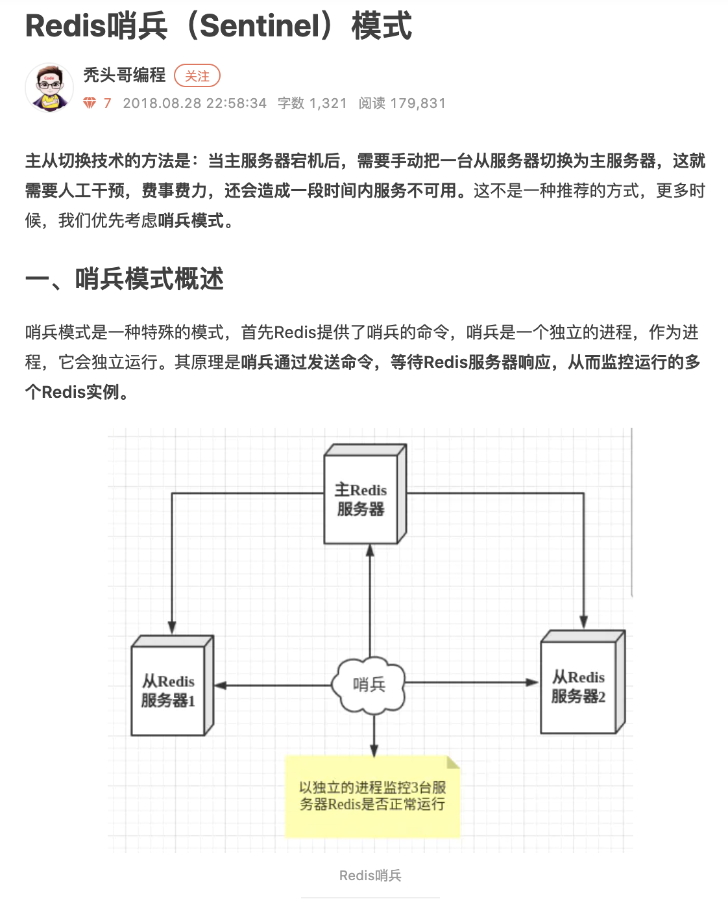

 

---

 

### 逆波兰表达式

 

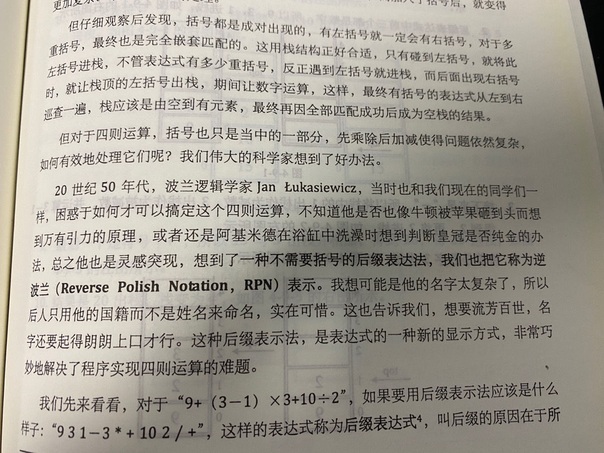

Lukasiewicz一般被译作“卢卡西维奇”。

“烈士暮年”的当世第一中锋莱万多夫斯基，其波兰语原称是Lewandowski。

10年前死于空难的波兰时任总统 卡钦斯基，原称是Kaczynski。

 

---

看到“抖动”, 我首先想到的，是垃圾回收时STW，或者是某些非渐进式扩容的哈希，在扩容时对程序的影响。

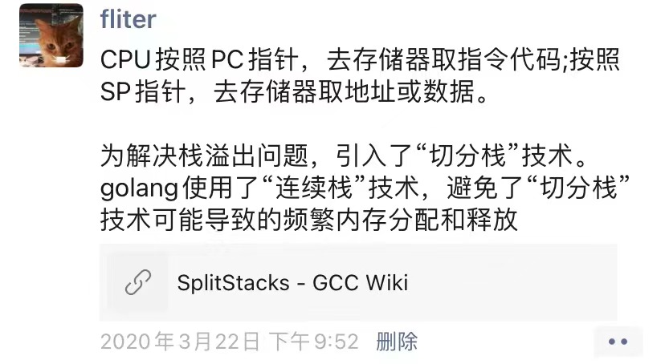

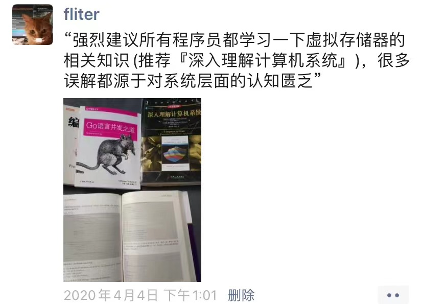

而把**Thrash**，把这个酷似“Trash”的词在此处被译作“抖动”，真的是不够妥当。

这里场景是，数据块始终缓存不命中，即高速缓存反复地加载和驱逐相同的高速缓存块的组。「使得性能下降。这种情况称为抖动（Thrash）」

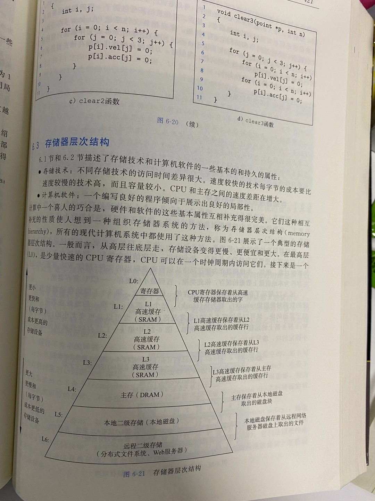

用其本意“激烈扭动，翻来覆去”，只是表征和模拟了“反复加载和驱逐”。其实thrash还有一层引申义“白忙”，类似竹篮打水，狗熊掰棒子。但译者中文词汇有限，找不到一个更贴合词汇，也没有魄力与能力，为此新造一个词。

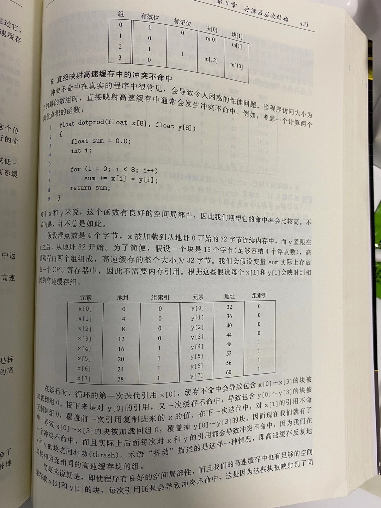

我相信，这里实际意义的“抖动”，都和绝大多数读者以为的有所出入。

 

---

 

