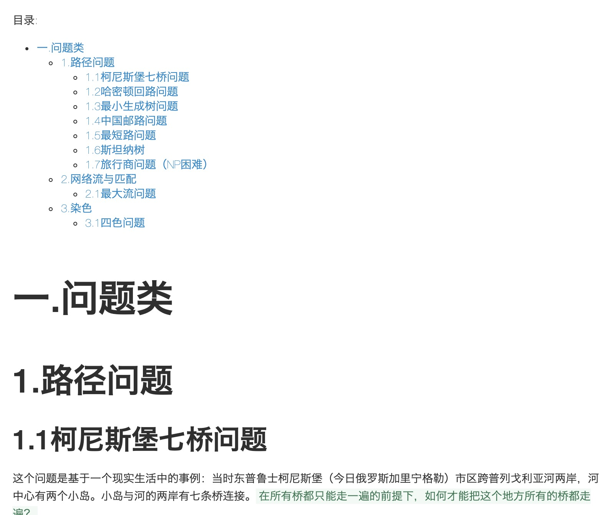

 

看『左耳朵耗子』这篇[UNIX 50 年：KEN THOMPSON 的密码](https://coolshell.cn/articles/19996.html)，意外获知KEN，DMR，RMS之外，能够拥有三位字母简称，且在极客圈中得到广泛认可的另一位大神——BWK。同样是贝尔实验室出来的研究员，当初跟着K&R开发unix。另外，awk中的“k”，那本C语言经典<C程序设计语言>作者K&R中的“k”，均指此人 `---` 所以，K&R在分指Unix和C时，“K”竟然有不同涵义…

 

有关BWK的资料明明整整十分详细，但他的两项研究成果， graph partitioning 和 travelling salesman problem——都有一位疑似华人的『Shen Lin』参与，但却无有这么一位重要人物的词条，知之者怕更是鲜有。

这位Shen Lin，我能搜到的资料，是被诺基亚收购后的贝尔实验室研究员。遍查全网，只有一位同名研究戏剧的学者，与之匹配度最高，但又显然不是。

 

 

两个理论中，前者在当下机器学习中提供重要理论支撑，后者则是运筹学图论中必学，我更习惯翻译为“流动商贩问题”，结果搜索结果全是城管如何如何…

 

---

 

Ken的这个回复，及Unix这个社区的“极简风格”，让我想起Linus在Ted上的“rant”:如果被困孤岛，做个页面就能获救，那他选择死在岛上

[KEN](https://github.com/ken)的github

追忆者为[DMR](https://github.com/dmr-1941-2011)建的github

