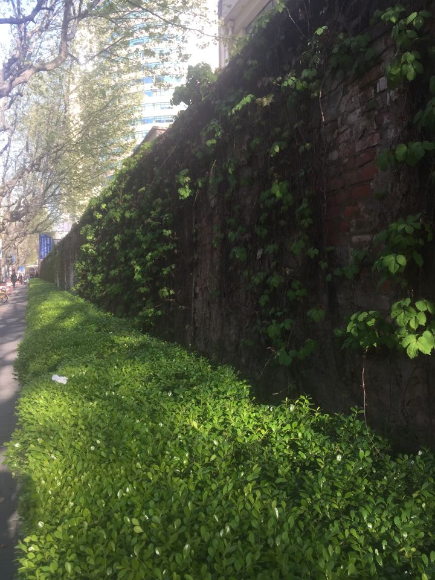

 
这座斑驳的覆满爬山虎的老墙，见证了过去639天里，许多次的离别与邂逅。只是今天，我成为了主角。

这段我来来往往，走过足有3000次的仙霞路，不久后将被绿茵笼罩。川流的人群里未曾有我，但夜半时分，依稀的车辆，交织的霓虹，醉酒的浪人，侍酒的女郎，当这些再如寻常那般出现，已没有一个戴着耳机哼着曲儿，思考着慢跑着冷冷睥睨而去的违和者，出现在略显凄冷的街头。

我如风卷残云，一口气退掉了所有工作相关的群，感到神清气爽。这是我职业生涯第一阶段的结尾，我实在清楚，此后的10-20年，我还要再经历不下15次这样的场合，这样的聚散。此刻的依依惜别，在那时已是轻车熟路微微一笑。

我想酣眠一场，醒来世上已历廿年。我45岁，春秋鼎盛，依旧豪气干云。有些积蓄，几套房产，家境中上，一儿一女。女如妻笑靥如花，儿似我聪明勤奋。我结束了漫长的职业生涯，开始找寻儿时的许多兴趣。或跋山涉水实践“现代徐霞客”，或自立门户，得偿许些缩龙成寸的未竟之志。

我的呓语被格格冷笑打断。我起身倚在床榻，方察南柯之下，一枕黄粱。20年会有太多的起伏跌宕，太多的不如人意。

清宵梦醒，一晌贪欢。而后我又要踏上前方充满未知的路，或是康庄，或如羊肠，影影绰绰间，天上的星辰和心中的道德律，在明暗中给予方向。

过去20年，我遇到过许多人，经逢过不算太多的一些事。今天往后的20年，我依旧如飘荡在时光之河的一钱槐叶，在势不可挡的流逝中，体验一份生活和生命赋予的喜怒悲欢。

2017.04.13。于古北路新疆烧烤店，等羊肉串间隙。

感谢我的兄弟们~我会默默贮在心里，许多年后，依然会记得

