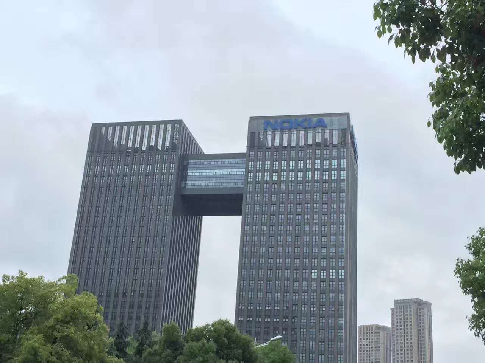

 

去时只是水露濛濛，归程却逢暴雨乍至。我站在一公共自行车棚下，无聊地注视着周遭从淅淅沥沥到滂沱漫漶。雨天青草花树散发独特气息，像不展的芭蕉和丁香，点点上心。

昨晚独走钱塘江滨，璀璨的灯光，让我想起走过无数些次的苏州河，从北新泾到古北路桥段，那里幽雅安逸，静谧着绚烂。我在盛开着迎春花的木板路上跑过好多次，在临河的椅子上或坐或躺，抬头仰着飘荡在夜空中的层云与月光。眼下却不知再见是何年何月，竟一时伤从中来：我去国离乡一千五百里，来一外省省会，用最宝贵青春建设他乡，这般作何？   如我家乡，无论琴岛泉城，有此间一半工作机会，民营经济有此1/3活跃，官本位能稍稍放低姿态，掌握着大小权力的人能再多与时俱进更具现代意识一些，那我马上订票返乡，让我的热血和激情挥洒在家乡土壤，即便ta现在贫瘠，如40年前南海边的小县宝安。

初来业务不熟，同事更还只是点头点赞之交。新的框架，从未写过的接口，急迫的任务，高负荷的工作时长，都让我感到不适。像猝不及防的临战，必然要遭受以逸待劳的对方几次蓄谋多时的攻击。渡过这段需持续一月的战略防守，换气缓神，国庆前后便可千里跃进大别山，而三大战役和渡江战役，可在不远的明年如期。又可闲庭信步，我将离开再转战新的战场，正是山花烂漫时，ta在丛中笑。最困难的自然是伊始这段艰难时光。

目视着这无尽头的雨丝，想来呆等终究不是办法。于是趁着见小，骑车再又上路。路途一远，短裤T恤也便湿透。雨又渐大，我也不再为意，径自悠哉悠哉骑着。待至网易路口，住处已在近旁，分分钟可到，不期后面一位骑电动车的50来岁大爷，减速要给我雨衣。我未及开口，他便说“正好多一套，看你…”，后面声音渐低吞吐未说，形同落汤鸡的我自是明白。随即把掖在后座上的一件雨衣交于我手，便要骑车离去。我只有几句“多谢”，目送其身影远去。

而这可能是我一年里唯一一次需要雨衣，过后如下雨我便撑伞步行上下班，我逼仄狭小的空间，实在不愿多这样一件留之无用弃之可惜的物件。但在冰冷的雨天，陌生的城市，当我从一个素味平生而又别无所图的生人手里接过来时，它分明带有温度。对这座一直有些抵触的城市刹那间好感倍增。

22年前，也是在这座车会让人的城市，看到路边“偷”井盖的三五彪形大汉，身形瘦弱籍籍无名的一位马姓青年骑车路过，厉声要求放回去，传为一段美谈。

有形物件终会损坏遗失，人或默默无闻或叱咤一时也都会烟消云落。希望这份温度，这种精神能够延续传承。
